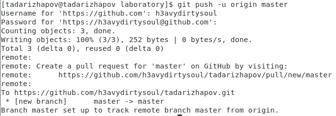

---
# Front matter
lang: ru-RU
title: "Лабораторная работа №3"
subtitle: " "
author: "Тимур Андреевич Дарижапов"

# Formatting
toc-title: "Содержание"
toc: true # Table of contents
toc_depth: 2
lof: true # List of figures
lot: true # List of tables
fontsize: 12pt
linestretch: 1.5
papersize: a4paper
documentclass: scrreprt
polyglossia-lang: russian
polyglossia-otherlangs: english
mainfont: PT Serif
romanfont: PT Serif
sansfont: PT Sans
monofont: PT Mono
mainfontoptions: Ligatures=TeX
romanfontoptions: Ligatures=TeX
sansfontoptions: Ligatures=TeX,Scale=MatchLowercase
monofontoptions: Scale=MatchLowercase
indent: true
pdf-engine: lualatex
header-includes:
  - \linepenalty=10 # the penalty added to the badness of each line within a paragraph (no associated penalty node) Increasing the value makes tex try to have fewer lines in the paragraph.
  - \interlinepenalty=0 # value of the penalty (node) added after each line of a paragraph.
  - \hyphenpenalty=50 # the penalty for line breaking at an automatically inserted hyphen
  - \exhyphenpenalty=50 # the penalty for line breaking at an explicit hyphen
  - \binoppenalty=700 # the penalty for breaking a line at a binary operator
  - \relpenalty=500 # the penalty for breaking a line at a relation
  - \clubpenalty=150 # extra penalty for breaking after first line of a paragraph
  - \widowpenalty=150 # extra penalty for breaking before last line of a paragraph
  - \displaywidowpenalty=50 # extra penalty for breaking before last line before a display math
  - \brokenpenalty=100 # extra penalty for page breaking after a hyphenated line
  - \predisplaypenalty=10000 # penalty for breaking before a display
  - \postdisplaypenalty=0 # penalty for breaking after a display
  - \floatingpenalty = 20000 # penalty for splitting an insertion (can only be split footnote in standard LaTeX)
  - \raggedbottom # or \flushbottom
  - \usepackage{float} # keep figures where there are in the text
  - \floatplacement{figure}{H} # keep figures where there are in the text
---

# Цель работы

 Изучить идеологию и применение средств контроля версий

# Задание

  Сделайте отчёт по предыдущей лабораторной работе в формате Markdown.
  В качестве отчёта просьба предоставить отчёты в 3 форматах:pdf,docxиmd(в архиве,поскольку он должен содержать скриншоты,Makefile ит.д.)

# Выполнение лабораторной работы
1.Настройка git 

{ width=100% }

Создаём локальный репозиторий

{ width=100% }

{ width=100% }

Регистрируемся на github.com. Переходим в Settings–SSHkeys.Вставляем  в  поле  наш  публичный  ключ  с  помощью  команды cat~/.ssh/id_rsa.pub

{ width=100% }

{ width=100% }

2.Создаём репозиторий на сайте github.com. Делаем его публичным.

{ width=100% }

Создаём README.md. Печатаем в нём описание. Делаем первый commit.

{ width=100% }

Отправляем на github.com.

{ width=100% }

{ width=100% }

3.Добавляем файл лицензии и шаблон игнорируемых файлов.

{ width=100% }

Добавляем два новых файла, совершаем commitи отправляем на сайт.

{ width=100% }

{ width=100% }

4.В первой лабораторной работе было сказано установить образ операционной системы CentOS. В лабораторной работе есть команды только для Gentooи Ubuntu. Ни одна из этих команд не помогла мне установить gitflow.Посмотрев в интернете, решения этой проблемы я не нашёл.

{ width=100% }

# Выводы

 Я  изучил применение  средств  контроля  версий  и  их идеологию, научился на начальном уровне пользоваться git.
