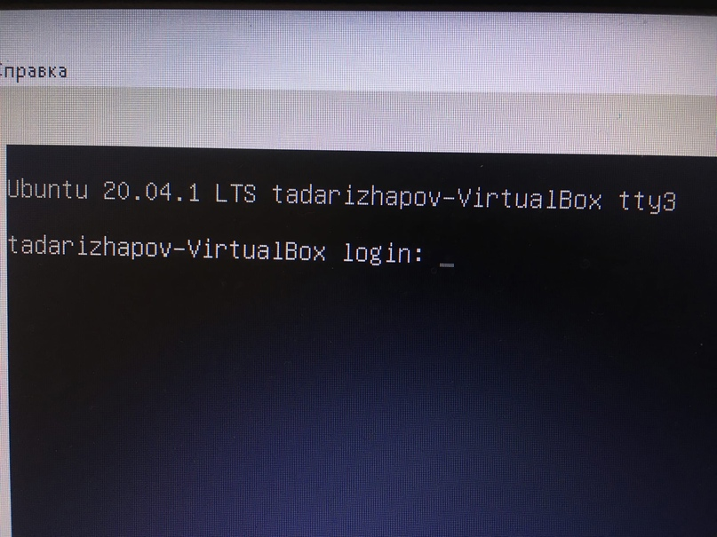
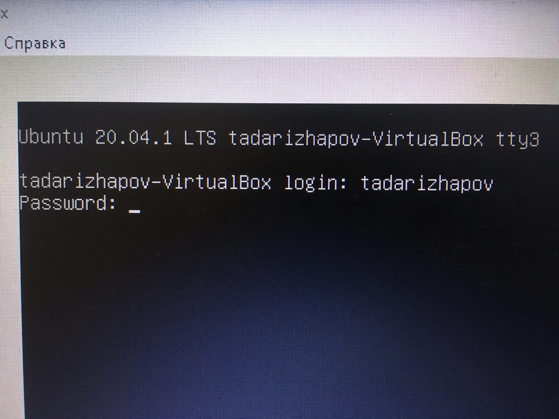
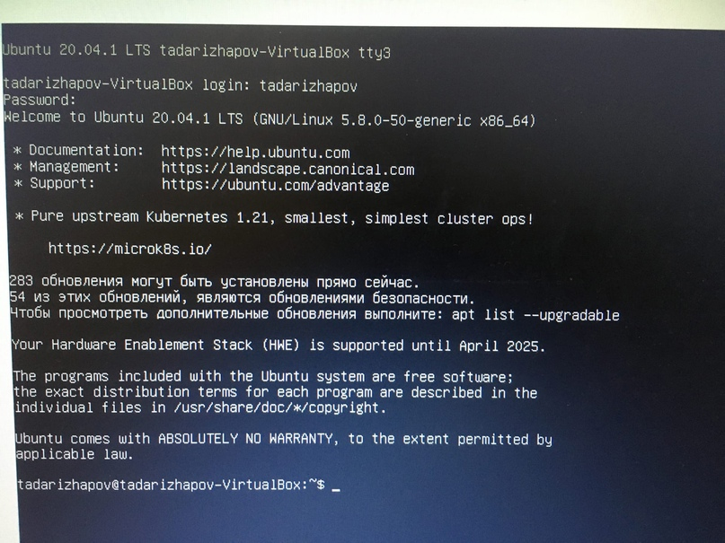
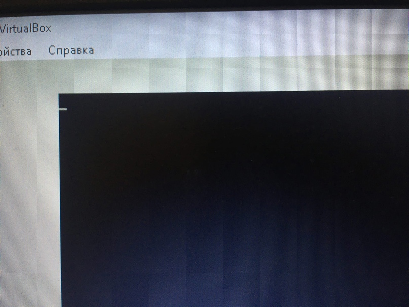
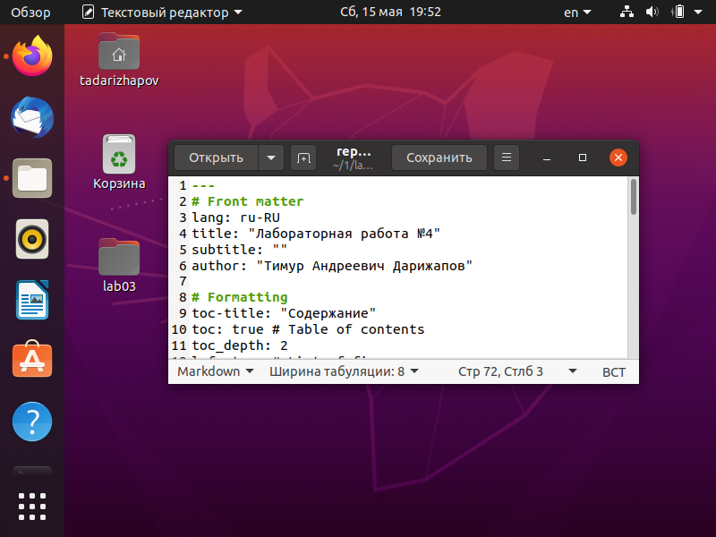
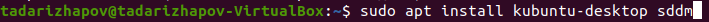
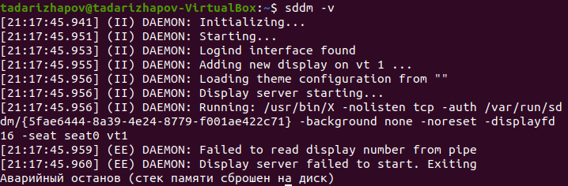

---
# Front matter
lang: ru-RU
title: "Лабораторная работа №4"
subtitle: ""
author: "Тимур Андреевич Дарижапов"

# Formatting
toc-title: "Содержание"
toc: true # Table of contents
toc_depth: 2
lof: true # List of figures
lot: true # List of tables
fontsize: 12pt
linestretch: 1.5
papersize: a4paper
documentclass: scrreprt
polyglossia-lang: russian
polyglossia-otherlangs: english
mainfont: PT Serif
romanfont: PT Serif
sansfont: PT Sans
monofont: PT Mono
mainfontoptions: Ligatures=TeX
romanfontoptions: Ligatures=TeX
sansfontoptions: Ligatures=TeX,Scale=MatchLowercase
monofontoptions: Scale=MatchLowercase
indent: true
pdf-engine: lualatex
header-includes:
  - \linepenalty=10 # the penalty added to the badness of each line within a paragraph (no associated penalty node) Increasing the value makes tex try to have fewer lines in the paragraph.
  - \interlinepenalty=0 # value of the penalty (node) added after each line of a paragraph.
  - \hyphenpenalty=50 # the penalty for line breaking at an automatically inserted hyphen
  - \exhyphenpenalty=50 # the penalty for line breaking at an explicit hyphen
  - \binoppenalty=700 # the penalty for breaking a line at a binary operator
  - \relpenalty=500 # the penalty for breaking a line at a relation
  - \clubpenalty=150 # extra penalty for breaking after first line of a paragraph
  - \widowpenalty=150 # extra penalty for breaking before last line of a paragraph
  - \displaywidowpenalty=50 # extra penalty for breaking before last line before a display math
  - \brokenpenalty=100 # extra penalty for page breaking after a hyphenated line
  - \predisplaypenalty=10000 # penalty for breaking before a display
  - \postdisplaypenalty=0 # penalty for breaking after a display
  - \floatingpenalty = 20000 # penalty for splitting an insertion (can only be split footnote in standard LaTeX)
  - \raggedbottom # or \flushbottom
  - \usepackage{float} # keep figures where there are in the text
  - \floatplacement{figure}{H} # keep figures where there are in the text
---

# Цель работы

Познакомиться с операционной системой Linux, получить практические навыки работы с консолью и некоторыми графическими менеджерами рабочих столов операционной системы.

# Выполнение лабораторной работы

1.Я ознакомился с теоретическим материалом.

2.Я загрузил компьютер.

3.Перешёл на текстовую консоль. На моём компьютере доступно 6 текстовых консолей(Рисунок 1). 

{ width=100% }

4.Перемещался между текстовыми консолями. Использовал комбинации кла-виши Alt с одной из функциональных клавиш (F1 – F6)(Рисунок 2).

{ width=100% }

5.Зарегестрировался в текстовой консоли операционной системы. Использовал логин tadarizhapov. При вводе пароля никакие символы не отображаются(Рисунок 3).

{ width=100% }

6.Завершил консольный сеанс. Использовал сочетание клавиш Ctrl + D(Рисунок 4). 

{ width=100% }

7.Переключился на графический интерфейс. Использовал комбинацию Ctrl + Alt + F7(Рисунок 5). 

{ width=100% }

К сожалению, я не понял, как открыть менеджер рабочих столов(Рисунок 6, 7). 

{ width=100% }

{ width=100% }

# Выводы

Я познакомился с операционной системой Linux, получил практические навыки работы с консолью.

# Ответы на контрольные вопросы

1.Что такое компьютерный терминал? Есть ли, по вашему мнению, у него преимущества перед графическим интерфейсом? Компьютерный терминал — устройство ввода–вывода, основные функции которого заключаются в вводе и отображении данных. По моему мнению, компьютерный терминал помогает быстрее получить необходимые данные и провести необходимый процесс, однако он совершенно не подходит для первоначального интеллектуального обучения, поскольку не понятен визуально. Хорошая система – это система, в которой может быстро разобраться даже ребёнок.

2.Что такое входное имя пользователя? Входное имя пользователя (Login) —название учётной записи пользователя.

3.В каком файле хранятся пароли пользователей? В каком виде они хранятся?Из соображений безопасности все пароли были перенесены в специальный файл /etc/shadow, недоступный для чтения обычным пользователям.Поэтому в файле /etc/passwd поле password имеет значение x.

4.Где хранятся настройки пользовательских программ? Для каждого пользо-вателя организуется домашний каталог, где хранятся его данные и настройки рабочей среды. В домашнем каталоге пользователя хранятся данные(файлы) пользователя, настройки рабочего стола и других приложений. Содержимое домашнего каталога обычно недоступно другим пользователямс обычными правами и не влияет на работу и настройки рабочей средыдругих пользователей

5.Какое входное имя у администратора ОС Unix? Учётная запись пользова
теля с UID=0 называется root и присутствует в любой системе типа Linux.Пользователь root имеет права администратора и может выполнять любые действия в системе.

6.Имеет ли администратор доступ к настройкам пользователей? Полномочия пользователей с административными правами обычно не ограничены.Поэтому администратор имеет доступ к настройкам пользователей.

7.Каковы основные характеристики многопользовательской модели разгра-ничения доступа? Linux — многопользовательская операционная система,т.е. несколько пользователей могут работать с ней одновременно с помощью терминалов. Процедура регистрации в системе обязательна для Linux.Каждый пользователь операционный системы имеет определенные ограничения на возможные с его стороны действия: чтение, изменение, запускфайлов, а также на ресурсы: пространство на файловой системе, процессор-ное время для выполнение текущих задач (процессов). При этом действия одного пользователя не влияют на работу другого. Такая модель разграничения доступа к ресурсам операционной системы получила названиемногопользовательской. В многопользовательской модели пользователи делятся на пользователей с обычными правами и администраторов. Пользователь с обычными правами может производить действия с элементами операционной системы только в рамках выделенного ему пространства и ресурсов, не влияя на жизнеспособность самой операционной системы и работу других пользователей. Полномочия же пользователей с административными правами обычно не ограничены. Для каждого пользователя организуется домашний каталог, где хранятся его данные и настройки рабочей среды. Доступ других пользователей с обычными правами к этому каталогу ограничивается.

8.Какую информацию кроме пароля и логина содержит учётная запись поль-зователя? Учётная запись пользователя содержит: – входное имя пользо-вателя (Login Name); – пароль (Password); – внутренний идентификатор
пользователя (User ID); – идентификатор группы (Group ID); – анкетные данные пользователя (General Information); –домашний каталог (Home Dir);– указатель на программную оболочку (Shell).

9.Что такое UID и GID? Расшифруйте эти аббревиатуры. Входному имени пользователя ставится в соответствие внутренний идентификатор пользо-вателя в системе (User ID, UID) — положительное целое число в диапазоне от 0 до 65535, по которому в системе однозначно отслеживаются действия пользователя. Пользователю может быть назначена определенная группа для доступа к некоторым ресурсам, разграничения прав доступа к различным файлам и директориям. Каждая группа пользователей в операционной системе имеет свой идентификатор — Group ID (GID).

10.Что такое GECOS? Анкетные данные пользователя (General Information или GECOS) являются необязательным параметром учётной записи и могут содержать реальное имя пользователя (фамилию, имя), адрес, телефон.

11.Что такое домашний каталог? Какие файлы хранятся в нем? Домашний каталог — это личный каталог пользователя в операционной системе, где находятся его данные, настройки и т.д. Для каждого пользователя органи-зуется домашний каталог, где хранятся его данные и настройки рабочей среды.

12.Как называется ваш домашний каталог? /home/tadarizhapov.

13.Имеет ли администратор возможность изменить содержимое домашнего каталога пользователя? Полномочия пользователей с административными правами обычно не ограничены. Пользователь root имеет права админи-стратора и может выполнять любые действия в системе. Администратор имеет возможность изменить содержимое домашнего каталога пользователя.

14.Что хранится в файле /etc/passwd? Учётные записи пользователей хранятсяв файле /etc/passwd.

15.Как, просмотрев содержимое файла /etc/passwd, узнать, какие пользователи
не смогут войти в систему? Символ * в поле password некоторой учётной записи в файле /etc/passwd означает, что пользователь не сможет войти в систему.

16.Что такое виртуальные консоли? Как вы думаете, что означает слово «вир-туальный» в данном контексте? Виртуальные консоли — реализация концепции многотерминальной работы в рамках одного устройства. По моему мнению, виртуальный в данном контексте означает – дополнительный,условный, многогранный.

17.Зачем нужна программа getty? getty (сокращение от get teletype) — программа для UNIX-подобных операционных систем, управляющая доступом к физическим и виртуальным терминалам (tty). Программа выполняет запрос имени пользователя и запускает программу ‘login’ для авторизации пользователя.

18.Что такое сеанс работы? Весь процесс взаимодействия пользователя с си-стемой с момента регистрации до выхода называется сеансом работы.

19.Что такое тулкит? Toolkit (Tk, «набор инструментов», «инструментарий»)—кроссплатформенная библиотека базовых элементов графического интерфейса, распространяемая с открытыми исходными текстами.

20.Какие основные тулкиты существуют в системе Unix? Используются следующие основные тулкиты: – GTK+ (сокращение от GIMP Toolkit) —кроссплатформенная библиотека элементов интерфейса; – Qt — кросс-платформенный инструментарий разработки программного обеспечения на языке программирования C++. GTK+ состоит из двух компонентов: – GTK — содержит набор элементов пользовательского интерфейса (таких, каккнопка, список, поле для ввода текста и т. п.) для различных задач; – GDK — отвечает за вывод информации на экран, может использовать для этого X Window System, Linux Framebuffer, WinAPI. На основе GTK+ построены рабочие окружения GNOME, LXDE и Xfce. Естественно, эти тулкиты могут использоваться и за пределами «родных» десктопных окружений. Qt используется в среде KDE (Kool Desktop Environment).
