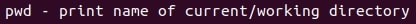

---
# Front matter
lang: ru-RU
title: "Лабораторная работа №5"
subtitle: ""
author: "Тимур Андреевич Дарижапов"

# Formatting
toc-title: "Содержание"
toc: true # Table of contents
toc_depth: 2
lof: true # List of figures
lot: true # List of tables
fontsize: 12pt
linestretch: 1.5
papersize: a4paper
documentclass: scrreprt
polyglossia-lang: russian
polyglossia-otherlangs: english
mainfont: PT Serif
romanfont: PT Serif
sansfont: PT Sans
monofont: PT Mono
mainfontoptions: Ligatures=TeX
romanfontoptions: Ligatures=TeX
sansfontoptions: Ligatures=TeX,Scale=MatchLowercase
monofontoptions: Scale=MatchLowercase
indent: true
pdf-engine: lualatex
header-includes:
  - \linepenalty=10 # the penalty added to the badness of each line within a paragraph (no associated penalty node) Increasing the value makes tex try to have fewer lines in the paragraph.
  - \interlinepenalty=0 # value of the penalty (node) added after each line of a paragraph.
  - \hyphenpenalty=50 # the penalty for line breaking at an automatically inserted hyphen
  - \exhyphenpenalty=50 # the penalty for line breaking at an explicit hyphen
  - \binoppenalty=700 # the penalty for breaking a line at a binary operator
  - \relpenalty=500 # the penalty for breaking a line at a relation
  - \clubpenalty=150 # extra penalty for breaking after first line of a paragraph
  - \widowpenalty=150 # extra penalty for breaking before last line of a paragraph
  - \displaywidowpenalty=50 # extra penalty for breaking before last line before a display math
  - \brokenpenalty=100 # extra penalty for page breaking after a hyphenated line
  - \predisplaypenalty=10000 # penalty for breaking before a display
  - \postdisplaypenalty=0 # penalty for breaking after a display
  - \floatingpenalty = 20000 # penalty for splitting an insertion (can only be split footnote in standard LaTeX)
  - \raggedbottom # or \flushbottom
  - \usepackage{float} # keep figures where there are in the text
  - \floatplacement{figure}{H} # keep figures where there are in the text
---

# Цель работы

 Приобретение практических навыков взаимодействия пользователя с системой посредством командной строки.

# Задание

 Изучить команды cd, ls, man, pwd, mkdir, rm, history и их опции.

# Выполнение лабораторной работы
1.С помощью команды pwd узнаём полное имя домашнего каталога(Рисунок 1).
{ width=70% }

2.
2.1.С помощью команды cd переходим в каталог /tmp(Рисунок 2).
{ width=70% }

2.2.С помощью команды ls выводим содержимое каталога /tmp(Рисунок 3).
{ width=70% }
Команда ls с функцией -a покажет нам скрытые каталоги(Рисунок 4).
{ width=70% }
Команда ls с функцией -F покажет нам типы файлов(Рисунок 5).
{ width=70% }
Команда ls с функцией -l покажет подробное описание файлов(Рисунок 6).
{ width=70% }

2.3.Переходим в каталог /var/spool и находим там подкаталог с именем cron(Рисунок 7).
{ width=70% }

2.4.С помощью ls -l в домашнем каталоге смотрим, кто является владельцем файлов.Написано - tadarizhapov(Рисунок 8).
{ width=70% }

3.
3.1.В домашнем каталоге создаём каталог newdir с помощью команды mkdir(Рисунок 9).
{ width=70% }

3.2.В newdir создаём подкаталог morefun(Рисунок 10).
{ width=70% }

3.3.Одной командой создаём 3 новых каталога в домашней папке(Рисунок 11).
{ width=70% }
Одной командой rmdir удаляем пустые каталоги(Рисунок 12).
{ width=70% }

3.4.С помощью команды rm и опции -R удаляем ранее созданный каталог newdir из домашней папки(Рисунок 13).
{ width=70% }

3.5.И удаляем каталог morefun из домашнего каталога(Рисунок 14).
{ width=70% }

4.С помощью команды man ls узнаём, какую опцию нужно вводить для просмотра содержимого каталога и подкаталогов(Рисунок 15,16).
{ width=70% }
{ width=70% }

5.С помощью man ls находим опцию для сортировки по времени и для развёрнутого описания файлов. Эта команда ls -t -l(Рисунок 17,18).
{ width=70% }
{ width=70% }

6.С помощью man смотрим описание команд cd, pwd, mkdir, rm, rmdir(Рисунок 19,20,21,22,23).
{ width=70% }
{ width=70% }
{ width=70% }
{ width=70% }
{ width=70% }

7.С помощью команды history смотрим историю выполненных команд, сделаем модификацию и выполним несколько команд(Рисунок 24,25,26).
{ width=70% }
{ width=70% }
{ width=70% }

# Выводы

 Я приобрёл практические навыки взаимодействия пользователя с системой с помощью командной строки(терминала).
