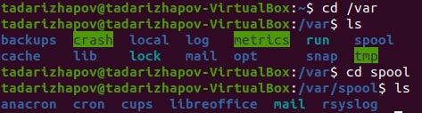
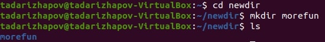
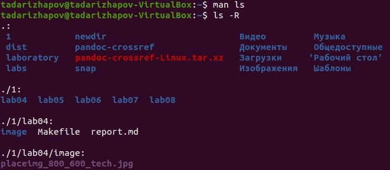
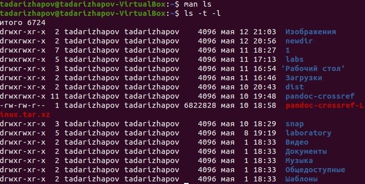
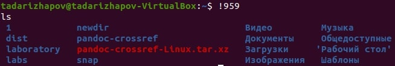

---
## Front matter
lang: ru-RU
title: Лабораторная работа №5
author: Тимур Андреевич Дарижапов
institute: |
	\inst{1}Российский университет дружбы народов, Москва
	
date: 2021 Москва

## Formatting
toc: false
slide_level: 2
theme: metropolis
header-includes: 
 - \metroset{progressbar=frametitle,sectionpage=progressbar,numbering=fraction}
 - '\makeatletter'
 - '\beamer@ignorenonframefalse'
 - '\makeatother'
aspectratio: 43
section-titles: true
---

# Выполнение лабораторной работы
## 
Цель работы: Приобретение практических навыков взаимодействия пользователя с системой посредством командной строки

Ход работы: 1.С помощью команды pwd узнаём полное имя домашнего каталога(Рисунок 1).

{ width=100% }

##
2.
2.1.С помощью команды cd переходим в каталог /tmp(Рисунок 2).
{ width=100% }
2.2.С помощью команды ls выводим содержимое каталога /tmp(Рисунок 3).
{ width=100% }

##
Команда ls с функцией -a покажет нам скрытые каталоги(Рисунок 4).
{ width=100% }

##
Команда ls с функцией -F покажет нам типы файлов(Рисунок 5).
{ width=100% }

##
Команда ls с функцией -l покажет подробное описание файлов(Рисунок 6).
{ width=100% }

## 
2.3.Переходим в каталог /var/spool и находим там подкаталог с именем cron(Рисунок 7).
{ width=100% }
2.4.С помощью ls -l в домашнем каталоге смотрим, кто является владельцем файлов.Написано - tadarizhapov(Рисунок 8).
{ width=70% }

##
3.
3.1.В домашнем каталоге создаём каталог newdir с помощью команды mkdir(Рисунок 9).
{ width=100% }
3.2.В newdir создаём подкаталог morefun(Рисунок 10).
{ width=100% }

##
3.3.Одной командой создаём 3 новых каталога в домашней папке(Рисунок 11).
{ width=100% }
Одной командой rmdir удаляем пустые каталоги(Рисунок 12).
{ width=100% }

##
3.5.И удаляем каталог morefun из домашнего каталога(Рисунок 14).
{ width=100% }
4.С помощью команды man ls узнаём, какую опцию нужно вводить для просмотра содержимого каталога и подкаталогов(Рисунок 15,16).
{ width=100% }
{ width=100% }

##
5.С помощью man ls находим опцию для сортировки по времени и для развёрнутого описания файлов. Эта команда ls -t -l(Рисунок 17,18).
{ width=100% }
{ width=100% }

##
6.С помощью man смотрим описание команд cd, pwd, mkdir, rm, rmdir(Рисунок 19,20,21,22,23).
{ width=70% }
{ width=70% }

##
7.С помощью команды history смотрим историю выполненных команд, сделаем модификацию и выполним несколько команд(Рисунок 24,25,26).
{ width=70% }
{ width=70% }
{ width=70% }

Вывод: Я приобрёл практические навыки взаимодействия пользователя с системой с помощью командной строки(терминала).

