---
# Front matter
lang: ru-RU
title: "Лабораторная работа №6"
subtitle: ""
author: "Дарижапов Тимур Андреевич"

# Formatting
toc-title: "Содержание"
toc: true # Table of contents
toc_depth: 2
lof: true # List of figures
lot: true # List of tables
fontsize: 12pt
linestretch: 1.5
papersize: a4paper
documentclass: scrreprt
polyglossia-lang: russian
polyglossia-otherlangs: english
mainfont: PT Serif
romanfont: PT Serif
sansfont: PT Sans
monofont: PT Mono
mainfontoptions: Ligatures=TeX
romanfontoptions: Ligatures=TeX
sansfontoptions: Ligatures=TeX,Scale=MatchLowercase
monofontoptions: Scale=MatchLowercase
indent: true
pdf-engine: lualatex
header-includes:
  - \linepenalty=10 # the penalty added to the badness of each line within a paragraph (no associated penalty node) Increasing the value makes tex try to have fewer lines in the paragraph.
  - \interlinepenalty=0 # value of the penalty (node) added after each line of a paragraph.
  - \hyphenpenalty=50 # the penalty for line breaking at an automatically inserted hyphen
  - \exhyphenpenalty=50 # the penalty for line breaking at an explicit hyphen
  - \binoppenalty=700 # the penalty for breaking a line at a binary operator
  - \relpenalty=500 # the penalty for breaking a line at a relation
  - \clubpenalty=150 # extra penalty for breaking after first line of a paragraph
  - \widowpenalty=150 # extra penalty for breaking before last line of a paragraph
  - \displaywidowpenalty=50 # extra penalty for breaking before last line before a display math
  - \brokenpenalty=100 # extra penalty for page breaking after a hyphenated line
  - \predisplaypenalty=10000 # penalty for breaking before a display
  - \postdisplaypenalty=0 # penalty for breaking after a display
  - \floatingpenalty = 20000 # penalty for splitting an insertion (can only be split footnote in standard LaTeX)
  - \raggedbottom # or \flushbottom
  - \usepackage{float} # keep figures where there are in the text
  - \floatplacement{figure}{H} # keep figures where there are in the text
---

# Цель работы

 Ознакомление с файловой системой Linux, её структурой, именами и содержа-нием каталогов. Приобретение практических навыков по применению команд для работы с файлами и каталогами, по управлению процессами (и работами), по проверке использования диска и обслуживанию файловой системы.

# Задание

Изучить команды touch, cat, less, head, tail, cp, mv в командной строке и их опции. Изучить права доступа и анализ файловой системы.

# Выполнение лабораторной работы
1.Для создания текстового файла используем команду touch(Рисунок 1).

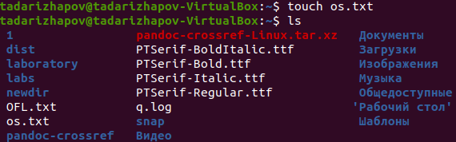{ width=100% }

Для просмотра небольших файлов используем команду cat(Рисунок 2).

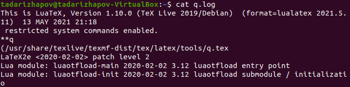{ width=100% }

Для просмотра больших файлов используем команду less. Она позволяет смотреть файл постранично(Рисунок 3, 4).

{ width=100% }

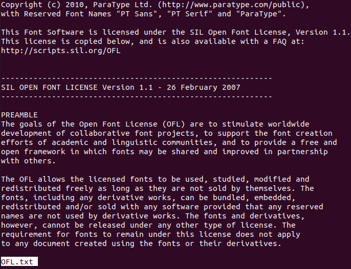{ width=100% }

Для просмотра начала файла используем команду head. По умолчанию она выведет первые 10 строк файла. Сколько первых строк нам нужно, мы указываем в опциях(Рисунок 5).

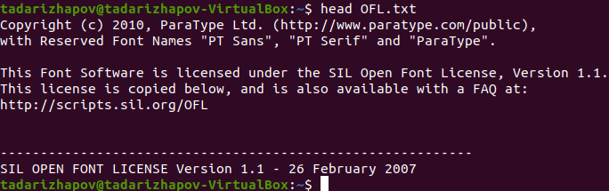{ width=100% }

Для просмотра конца файла используем команду tail. По умолчанию она выведет последние 10 строк файла. Сколько последних строк нам нужно, мы указываем в опциях(Рисунок 6).

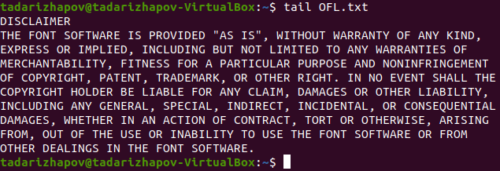{ width=100% }

2.

2.1. Копируем файл io.h из /usr/include/sys/ в домашнюю папку. Переименовываем io.h в equipment(Рисунок 7).

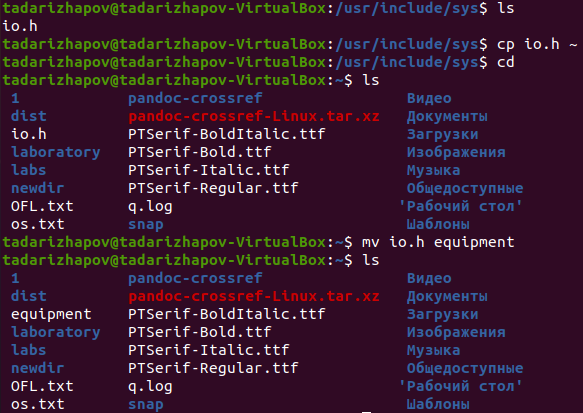{ width=100% }

2.2.В домашнем каталоге создаём директорию ski.plases(Рисунок 8).

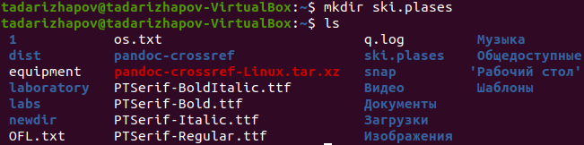{ width=100% }

2.3.Перемещаем equipment в ski.plases c помощью mv.

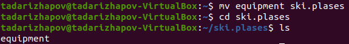{ width=100% }

2.4.Переименовываем файл equipment в equiplist из домашней папки(Рисунок 10).

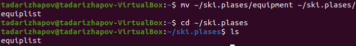{ width=100% }

2.5.Создаём в домашнем каталоге файл abc1 и копируем его в каталог~/ski.plases, называем его equiplist2(Рисунок 11).

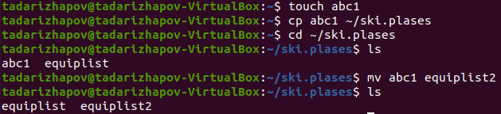{ width=100% }

2.6.Создаём каталог equipment в каталоге ~/ski.plases(Рисунок 12).

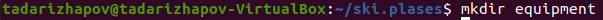{ width=100% }

2.7.Перемещаем файлы ~/ski.plases/equiplist и equiplist2 в каталог ~/ski.plases/equipment(Рисунок 13).

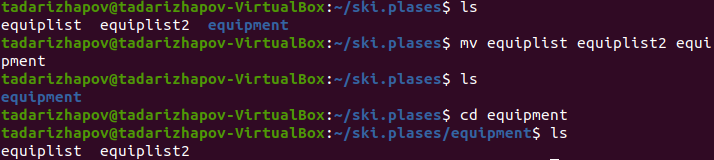{ width=100% }

2.8.Создаём и перемещаем каталог ~/newdir в каталог ~/ski.plases и называем его plans(Рисунок 14).

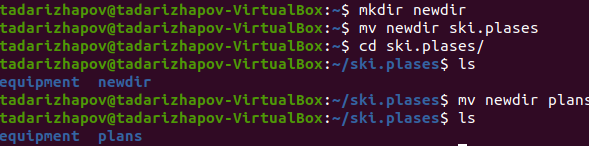{ width=100% }

3.Создаём 2 каталога и 2 файла. С помощью команды chmod присваиваем права доступа(Рисунок 15, 16).

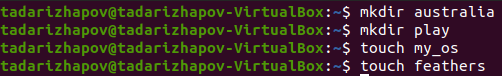{ width=100% }

3.1. 3.2. 3.3. 3.4.

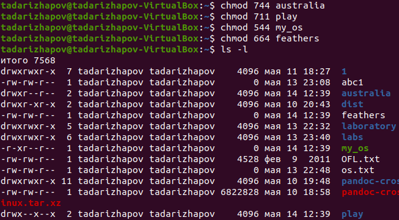{ width=100% }

4.Здесь на одном скриншоте будет несколько заданий.
4.1.Смотрим содержимое /etc/password.

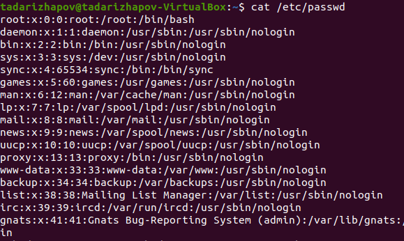{ width=100% }

4.2. - 4.7. (Рисунок 18).

4.2.Копируем файл ~/feathers в файл ~/file.old.

4.3.Перемещаем файл ~/file.old в каталог ~/play.

4.4.Копируем каталог ~/play в каталог ~/fun.

4.5.Перемещаем каталог ~/fun в каталог ~/play и называем его games.

4.6.Лишаем владельца файла ~/feathers права на чтение.

4.7.Если открыть feathers командой cat, то консоль выведет : Отказано в доступе.

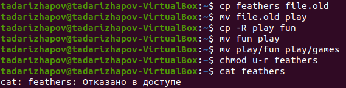{ width=100% }

4.8. - 4.12.

4.8.Если попытаться скопировать feathers, то консоль выведет : Отказано в доступе.

4.9.Даём владельцу файла ~/feathers право на чтение.

4.10.Лишаем владельца каталога ~/play права на выполнение.

4.11.В каталог play невозможно перейти. Пишет : Отказано в доступе.

4.12.Даём владельцу каталога ~/play право на выполнение.

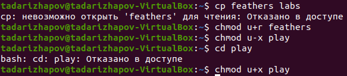{ width=100% }

5.С помощью команды man узнаём для чего нужны команды mount, fsck,mkfs и kill.

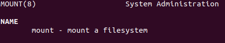{ width=100% }

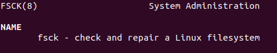{ width=100% }

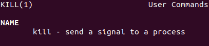{ width=100% }

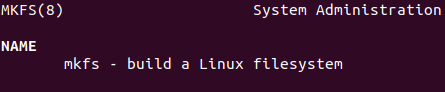{ width=100% }

Команда mount нужна для монтирования файловой системы. Команда mount служит для подключения файловых систем разных устройств к большому дереву.
Пример: mount -t vfstype device dir.
Такая команда помогает ядру смонтировать файловую систему типа vfstype, расположенную на устройстве device, к каталогу dir(Рисунок 20).

Команда fsck - это утилита командной строки, которая позволяет выполнять проверки согласованности и интерактивное исправление в одной или нескольких файловых системах Linux.Если нужно восстановить файловую систему на устройстве /dev/sdb2, следует воспользоваться командой : sudo fsck -y /dev/sdb2(Рисунок 21).

Команда kill посылает сигнал процессу или выводит список допустимых сигналов. Например, команда kill -KILL 3121 посылает сигнал KILL процессу 3121, чтобы принудительно завершить процесс(Рисунок 22).

Команда mkfs создаёт новыю файловую систему Linux. Например, команда mkfs -t ext2 /dev/hdb1 создаёт файловую систему типа ext2 в разделе /dev/hdb1(Рисунок 23).

# Выводы

 Я ознакомился с файловой системой Linux, её структурой, именами и содержа-нием каталогов, а также приобрёл практические навыки по применению команд для работы с файлами и каталогами, по управлению процессами (и работами), по проверке использования диска и обслуживанию файловой системы.
