---
# Front matter
lang: ru-RU
title: "Лабораторная работа №7"
subtitle: ""
author: "Тимур Андреевич Дарижапов"

# Formatting
toc-title: "Содержание"
toc: true # Table of contents
toc_depth: 2
lof: true # List of figures
lot: true # List of tables
fontsize: 12pt
linestretch: 1.5
papersize: a4paper
documentclass: scrreprt
polyglossia-lang: russian
polyglossia-otherlangs: english
mainfont: PT Serif
romanfont: PT Serif
sansfont: PT Sans
monofont: PT Mono
mainfontoptions: Ligatures=TeX
romanfontoptions: Ligatures=TeX
sansfontoptions: Ligatures=TeX,Scale=MatchLowercase
monofontoptions: Scale=MatchLowercase
indent: true
pdf-engine: lualatex
header-includes:
  - \linepenalty=10 # the penalty added to the badness of each line within a paragraph (no associated penalty node) Increasing the value makes tex try to have fewer lines in the paragraph.
  - \interlinepenalty=0 # value of the penalty (node) added after each line of a paragraph.
  - \hyphenpenalty=50 # the penalty for line breaking at an automatically inserted hyphen
  - \exhyphenpenalty=50 # the penalty for line breaking at an explicit hyphen
  - \binoppenalty=700 # the penalty for breaking a line at a binary operator
  - \relpenalty=500 # the penalty for breaking a line at a relation
  - \clubpenalty=150 # extra penalty for breaking after first line of a paragraph
  - \widowpenalty=150 # extra penalty for breaking before last line of a paragraph
  - \displaywidowpenalty=50 # extra penalty for breaking before last line before a display math
  - \brokenpenalty=100 # extra penalty for page breaking after a hyphenated line
  - \predisplaypenalty=10000 # penalty for breaking before a display
  - \postdisplaypenalty=0 # penalty for breaking after a display
  - \floatingpenalty = 20000 # penalty for splitting an insertion (can only be split footnote in standard LaTeX)
  - \raggedbottom # or \flushbottom
  - \usepackage{float} # keep figures where there are in the text
  - \floatplacement{figure}{H} # keep figures where there are in the text
---

# Цель работы

 Ознакомление с инструментами поиска файлов и фильтрации текстовых данных. Приобретение практических навыков: по управлению процессами (и заданиями), по проверке использования диска и обслуживанию файловых систем.

# Выполнение лабораторной работы

1.Осуществляю вход в систему, используя своё имя пользователя - tadarizhapov.

2.Записываем в файл file.txt названия файлов, содержащихся в каталоге /etc. Дописываем в этот же файл названия файлов, содержащихся в моём домашнем каталоге. Используем команды ls -a /etc > file.txt , ls -a ~ >> file.txt. С помощью команды cat просматриваем содержимое file.txt(Рисунок 1,2).

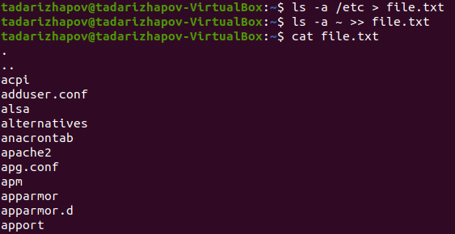{ width=100% }

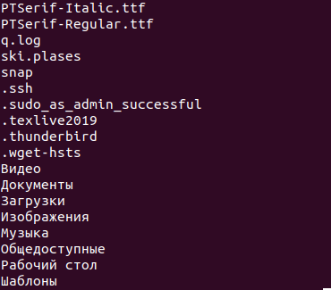{ width=100% }

3.Выводим имена всех файлов из file.txt, имеющих расширение .conf, после чего запишем их в новый текстовой файл conf.txt. Команда grep -e '\.conf$' file.txt > conf.txt.Команда cat conf.txt выводит содержимое conf.txt(Рисунок 3).

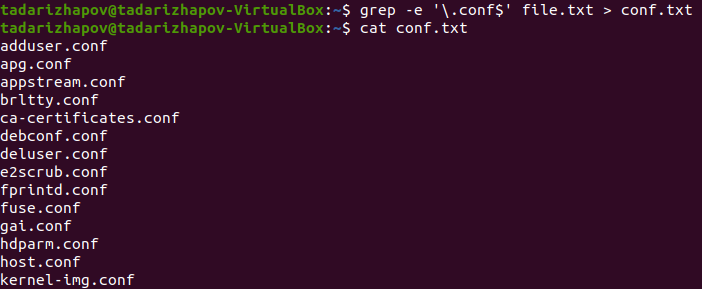{ width=100% }

4.Определим, какие файлы в нашем домашнем каталоге имеют имена, начинав-шиеся с символа c. Это можно сделать тремя разными способами: find ~ -maxdepth 1 -name "c*" -print, ls ~/c*, ls -a ~ | grep c*(Рисунок 4).

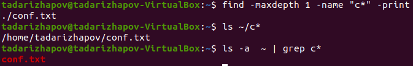{ width=100% }

5.Выведем на экран(постранично) имена файлов из каталога /etc, начинающи-еся с символа h(Рисунок 5).

{ width=100% }

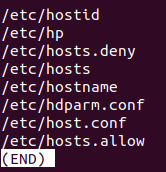{ width=100% }

6.Запустим в фоновом режиме процесс, который будет записывать в файл ~/logfile файлы, имена которых начинаются с log.Команда find / -name "log*" > logfile &(Рисунок 7).Выведем содержимое logfile командой cat logfile.

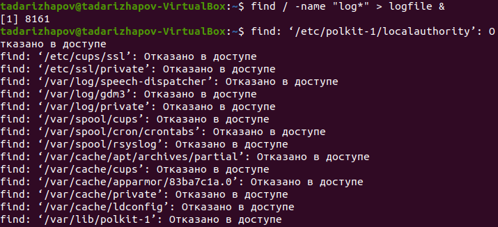{ width=100% }

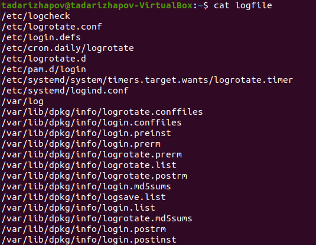{ width=100% }

7.Удалим файл ~/logfile(Рисунок 9).

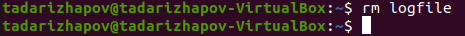{ width=100% }

8.Запускаем редактор gedit в фоновом режиме командой gedit &(Рисунок 10).

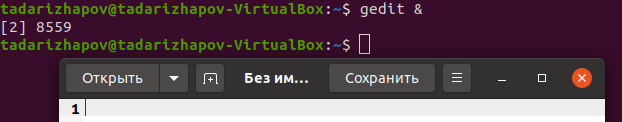{ width=100% }

9.Для определения идентификатора процесса gedit, используем команду ps | grep -i "gedit".Наш процесс имеет PID 8559.Идентификатор можно узнать с помощью команд: pgrep gedit и pidof gedit(Рисунок 11).

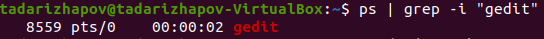{ width=100% }

10.С помощью man узнаём информацию о команде kill.Использую её для завершения процесса(Рисунок 12, 13).

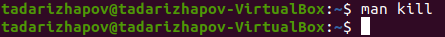{ width=100% }

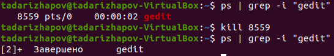{ width=100% }

11.Выполним команды df и du, предварительно прочитав информацию о них с помощью man.

df - утилита, показывающая список всех файловых систем по именам устройств, сообщает их размер, занятое и свободное пространство и точки монтирования.

du - утилита, предназначенная для вывода информации об объёме дискового пространства, занятого файлами и директориями.

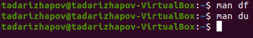{ width=100% }

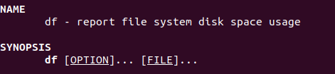{ width=100% }

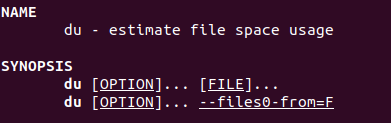{ width=100% }

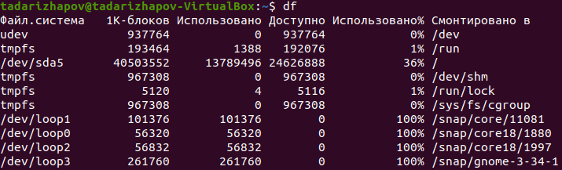{ width=100% }

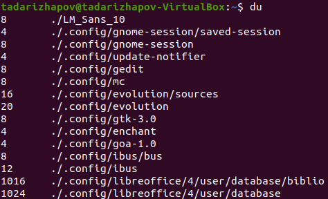{ width=100% }

12.Выведем имена всех директорий,имеющихся в нашем домашнем каталоге с помощью find ~ -type d, предварительно написав man find.

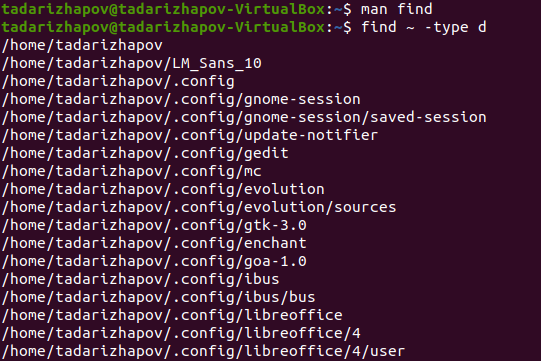{ width=100% }

# Выводы

Я ознакомился с инструментами поиска файлов и фильтрации текстовых данных и приобрёл практические навыки по управлению процессами (и заданиями), по проверке использования диска и обслуживанию файловых систем.
