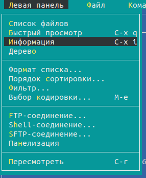
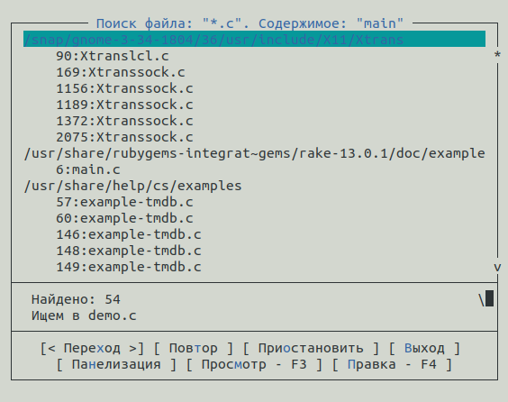
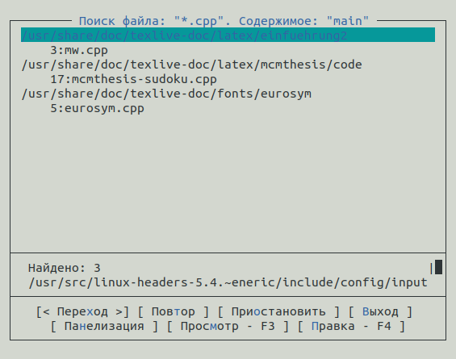

---
# Front matter
lang: ru-RU
title: "Лабораторная работа №8"
subtitle: ""
author: "Тимур Андреевич Дарижапов"

# Formatting
toc-title: "Содержание"
toc: true # Table of contents
toc_depth: 2
lof: true # List of figures
lot: true # List of tables
fontsize: 12pt
linestretch: 1.5
papersize: a4paper
documentclass: scrreprt
polyglossia-lang: russian
polyglossia-otherlangs: english
mainfont: PT Serif
romanfont: PT Serif
sansfont: PT Sans
monofont: PT Mono
mainfontoptions: Ligatures=TeX
romanfontoptions: Ligatures=TeX
sansfontoptions: Ligatures=TeX,Scale=MatchLowercase
monofontoptions: Scale=MatchLowercase
indent: true
pdf-engine: lualatex
header-includes:
  - \linepenalty=10 # the penalty added to the badness of each line within a paragraph (no associated penalty node) Increasing the value makes tex try to have fewer lines in the paragraph.
  - \interlinepenalty=0 # value of the penalty (node) added after each line of a paragraph.
  - \hyphenpenalty=50 # the penalty for line breaking at an automatically inserted hyphen
  - \exhyphenpenalty=50 # the penalty for line breaking at an explicit hyphen
  - \binoppenalty=700 # the penalty for breaking a line at a binary operator
  - \relpenalty=500 # the penalty for breaking a line at a relation
  - \clubpenalty=150 # extra penalty for breaking after first line of a paragraph
  - \widowpenalty=150 # extra penalty for breaking before last line of a paragraph
  - \displaywidowpenalty=50 # extra penalty for breaking before last line before a display math
  - \brokenpenalty=100 # extra penalty for page breaking after a hyphenated line
  - \predisplaypenalty=10000 # penalty for breaking before a display
  - \postdisplaypenalty=0 # penalty for breaking after a display
  - \floatingpenalty = 20000 # penalty for splitting an insertion (can only be split footnote in standard LaTeX)
  - \raggedbottom # or \flushbottom
  - \usepackage{float} # keep figures where there are in the text
  - \floatplacement{figure}{H} # keep figures where there are in the text
---

# Цель работы

Освоение основных возможностей командной оболочки Midnight Commander.Приобретение навыков практической работы по просмотру каталогов и файлов; манипуляций с ними.

# Выполнение лабораторной работы

Задания по mc.

1.Изучаем информацию о mc, вызвав в командной строке man mc.

{ width=100% }

{ width=100% }

2.Запускаем из командной строки mc, изучаем его структуру и меню.

{ width=100% }

{ width=100% }

Левая панель

{ width=100% }

fn + F2 откроет Меню пользователя.

{ width=100% }

fn + F1 откроет Помощь.

{ width=100% }

3.Выполняем несколько операций в mc, используя управляющие клавиши(операции с панелями; выделение/отмена выделения файлов, копирование/перемещение файлов, получение информации о размере и правах доступа на файлы и/или каталоги и т.п.)

Выделение/отмена выделения файлов.Используем клавишу insert и выделяем необходимые файлы(Рисунок 8).Для выделения файлов или отмены можно использовать пункты Отметить группу, Снять отметку и Обратить выделение в меню Файл(Рисунок 9).

{ width=100% }

{ width=100% }

Копирование/перемещение файлов.Для копирования используем fn + F5.

{ width=100% }

Для перемещения используем fn + F6.

{ width=100% }

Получение информации о размере и правах доступа на файлы и/или каталоги.Для получения данной информации можно перейти : Левая панель -> Информация. 

{ width=100% }

Левая панель -> Формат списка -> Расширенный.

{ width=100% }

{ width=100% }

Файл -> Права доступа.

{ width=100% }

Файл -> Права(расширенные).

{ width=100% }

4.Выполним основные команды меню правой панели

{ width=100% }

Список файлов отображает размер файла и время его правки.

{ width=100% }

Быстрый просмотр необходим для предпросмотра содержания файла.

{ width=100% }

{ width=100% }

Информация отображает подробные данные о файле.

{ width=100% }

Дерево необходим для просмотра дерева каталога(отображает минимум информации).

{ width=100% }

Формат списка -> Укороченный отображает только имя файла или каталога

{ width=100% }

Формат списка -> Расширенный отображает подробную информацию о файлах, но менее подробную, чем Информация.

{ width=100% }

Формат списка -> Определённый пользователем предоставляет пользователю возможность самому изменять степень подробности информации о файле.

Формат списка −> Стандартный ставится по умолчанию.

Порядок сортировки необходим для сортировки файлов или каталогов по конкретному критерию.

{ width=100% }

Фильтр необходим, чтобы просматривать название файлов или каталогов, которые подходят под указанную маску.

{ width=100% }

5.Используя возможности подменю Файл, выполним:

Просмотр файла 

{ width=100% }

{ width=100% }

Правка файла

{ width=100% }

{ width=100% }

Создание каталога

{ width=100% }

Копирование файлов.С помощью insert выделим файлы my_os, feathers и abc1, скопируем их.

{ width=100% }

{ width=100% }

6.С помощью подменю Команда выполним: 

Поиск файла.Найдём файлы с расширением .c и .cpp, содержащего строку main.

{ width=100% }

{ width=100% }

{ width=100% }

{ width=100% }

Выбор и повторение команд. Команда -> История.

{ width=100% }

Переход в домашний каталог.Для перехода в домашний каталог перейдем в Дерево каталогов, выберем необходимый каталог и нажмем Еnter, в результате чего, в левой панели перейдем в домашний каталог.

{ width=100% }

Анализ файла меню и файла расширений.Перейдем в Редактировать файл расширений. Редактировать файл расширений позволяет задать с помощью определённого синтаксиса действия при запуске файлов с определённым расширением.

Редактировать файл меню позволяет отредактировать контекстное меню пользователя.

{ width=100% }

{ width=100% }

{ width=100% }

7.С помощью подменю Найстройки освоим операции, определяющие структуру экрана mc.

Конфигурация позволяет скорректировать настройки работы с панелями.

{ width=100% } 

Внешний вид и Найстройки панелей определяют элементы, отображаемые при вызове mc, а также геометрию расположения панелей и цветовыделение.

{ width=100% } 

{ width=100% } 

Подтверждение позволяет установить или убрать вывод окна с запросом подтверждения действий при операциях удаления и перезаписи файлов, а также при выходе из программы.

{ width=100% } 

Оформление позволяет поменять цветовую гамму визуальной оболочки для комфортной работы.

{ width=100% } 

Биты символов задаёт формат обработки информации локальным терминалом.

{ width=100% } 

Распознование клавиш используется для тестирования функциональных клавиш, клавишу правления курсором и прочее.

{ width=100% } 

Виртуальные ФС - это настройки виртуальной файловой системы: тайм-аут, пароль и прочее.

{ width=100% } 

Сохранить настройки - данный пункт сохранит все изменения.

{ width=100% } 

Задания по редактору mc.

1.Создаём text.txt с помощью touch.

{ width=100% } 

2.Откроем этот файл с помощью mc.Нужно ввести mcedit.

{ width=100% } 

3.Вставим в открытый файл небольшой фрагмент текста, скопированный из Интернета.

{ width=100% } 

4.Сейчас будем использовать горячие клавиши рекоктора mc.

4.1.Удалим 4-ю строку текста с помощью клавиш fn + F8.

{ width=100% } 

4.2.Выделим фрагмент текста, нажав fn + F3 для начала выделения текста и для его окончания, и скопируем его на новую строку, используя клавиши fn + F5.

{ width=100% } 

4.3.Выделим фрагмент текста и перенесем его на новую строку с помощью клавиш fn + F6.

{ width=100% }

4.4.Сохраним файл, нажав fn + F2.

{ width=100% }

4.5.Отменим последнее действие с помощью клавиш Сtrl + u.

{ width=100% }

4.6.Перейдём в конец файла (нажав комбинацию клавиш Ctrl + End и Ctrl + x) и напишем некоторый текст.

{ width=100% }

4.7.Перейдём в начало файла (нажав комбинацию клавиш Ctrl + Home и Ctrl + z) и напишем некоторый текст.

{ width=100% }

4.8.Сохраним и закроем файл.

{ width=100% }

5.Откроем файл с исходным текстом на  языке программирования Java.

{ width=100% }

{ width=100% }

{ width=100% }

6.Используя меню редактора, включим подсветку синтаксиса.

{ width=100% }

# Выводы

Я освоил основные возможности командной оболочки Midnight Commander, а также приобрёл навыки практической работы по просмотру каталогов и файлов; манипуляций с ними.
