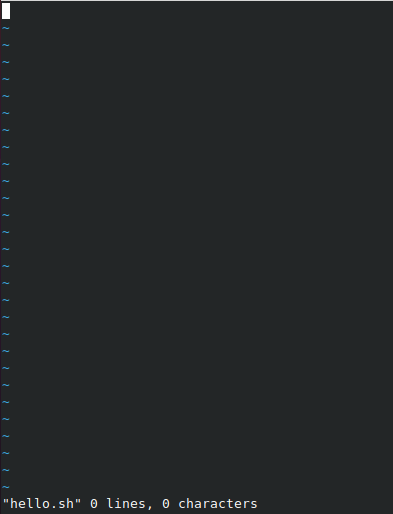
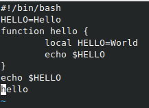
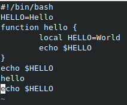

---
## Front matter
lang: ru-RU
title: Лабораторная работа №9
author: Тимур Андреевич Дарижапов
institute: |
	\inst{1}Российский университет дружбы народов, Москва
	
date: 2021 Москва

## Formatting
toc: false
slide_level: 2
theme: metropolis
header-includes: 
 - \metroset{progressbar=frametitle,sectionpage=progressbar,numbering=fraction}
 - '\makeatletter'
 - '\beamer@ignorenonframefalse'
 - '\makeatother'
aspectratio: 43
section-titles: true
---

## Цель работы и задание

Цель: Познакомиться с операционной системой Linux. Получить практические навыки работы с редактором vi, установленным по умолчанию практически во всех дистрибутивах. 

Задание:

1.Ознакомиться с теоретическим материалом.

2.Ознакомиться с редактором vi.

3.Выполнить упражнения, используя команды vi.

##

{ width=100% }

##

Клавиша Esc - переход в командный режим, клавиша i - переход в режим вставки, клавиша :(двоеточие) - переход в режим последней строки

В редакторе vi существует множество команд: команды управления курсором, команды редактирования, команды редактирования в режиме командной строки, опции.

## Пример работы команд

{ width=80% }

## Пример работы команд

{ width=80% }

## Выводы

Вывод: Я познакомился с операционной системой Linux. Я получил практические навыки работы с редактором vi, установленным по умолчанию практически во всех дистрибутивах.

