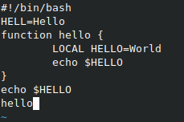

---
# Front matter
lang: ru-RU
title: "Лабораторная работа №9"
subtitle: "Российский университет дружбы народов"
author: "Тимур Андреевич Дарижапов"

# Formatting
toc-title: "Содержание"
toc: true # Table of contents
toc_depth: 2
lof: true # List of figures
lot: true # List of tables
fontsize: 12pt
linestretch: 1.5
papersize: a4paper
documentclass: scrreprt
polyglossia-lang: russian
polyglossia-otherlangs: english
mainfont: PT Serif
romanfont: PT Serif
sansfont: PT Sans
monofont: PT Mono
mainfontoptions: Ligatures=TeX
romanfontoptions: Ligatures=TeX
sansfontoptions: Ligatures=TeX,Scale=MatchLowercase
monofontoptions: Scale=MatchLowercase
indent: true
pdf-engine: lualatex
header-includes:
  - \linepenalty=10 # the penalty added to the badness of each line within a paragraph (no associated penalty node) Increasing the value makes tex try to have fewer lines in the paragraph.
  - \interlinepenalty=0 # value of the penalty (node) added after each line of a paragraph.
  - \hyphenpenalty=50 # the penalty for line breaking at an automatically inserted hyphen
  - \exhyphenpenalty=50 # the penalty for line breaking at an explicit hyphen
  - \binoppenalty=700 # the penalty for breaking a line at a binary operator
  - \relpenalty=500 # the penalty for breaking a line at a relation
  - \clubpenalty=150 # extra penalty for breaking after first line of a paragraph
  - \widowpenalty=150 # extra penalty for breaking before last line of a paragraph
  - \displaywidowpenalty=50 # extra penalty for breaking before last line before a display math
  - \brokenpenalty=100 # extra penalty for page breaking after a hyphenated line
  - \predisplaypenalty=10000 # penalty for breaking before a display
  - \postdisplaypenalty=0 # penalty for breaking after a display
  - \floatingpenalty = 20000 # penalty for splitting an insertion (can only be split footnote in standard LaTeX)
  - \raggedbottom # or \flushbottom
  - \usepackage{float} # keep figures where there are in the text
  - \floatplacement{figure}{H} # keep figures where there are in the text
---

# Цель работы

Познакомиться с операционной системой Linux. Получить практические навыки работы с редактором vi, установленным по умолчанию практически во всех дистрибутивах.

# Задание

1.Ознакомиться с теоретическим материалом.
2.Ознакомиться с редактором vi.
3.Выполнить упражнения, используя команды vi.

# Выполнение лабораторной работы

Задание 1. Создание нового файла с использованием vi.

1.Создаём каталог с именем ~/work/os/lab06(Рисунок 3.1).

2.Переходим в этот каталог(Рисунок 3.1).

{ width=100% }

3.Вызываем vi и создаём файл hello.sh(Рисунок 3.2, 3.3).

{ width=100% }

{ width=100% }

4.Нажимаем клавишу i и вводим текст(Рисунок 3.4).

{ width=100% }

5.Нажимаем клавишу Esc для перехода в командный режим после завершения ввода текста(Рисунок 3.5).

{ width=100% }

6.Нажимаем :(двоеточие) для перехода в режим последней строки и внизу нашего экрана появляется приглашение в виде двоеточия(Рисунок 3.6).

{ width=100% }

7.Нажимаем w(записать) и q(выйти), а затем нажимаем клавишу Enter для сохранения нашего текста и завершения работы(Рисунок 3.7).

{ width=100% }

8.Делаем файл исполняемым(Рисунок 3.8).

{ width=100% }

Задание 2. Редактирование существующего файла.

1.Вызывем vi на редактирование файла(Рисунок 3.9).

{ width=100% }

2.Установим курсор в конец слова HELL второй строки(Рисунок 3.10).

{ width=100% }

3.Переходим в режим вставки и заменяем на HELL на HELLO. Нажимаем Esc для возврата в командный режим(Рисунок 3.11).

{ width=100% }

4.Устанавливаем курсор на четвертую строку и стираем слово LOCAL. Комбинация клавиш d - delete и w - word(Рисунок 3.12).

{ width=100% }

5.Переходим в режим вставки(клавиша i) и набираем local, нажимаем Esc для возврата в командный режим(Рисунок 3.13).

{ width=100% }

6.Устанавливаем курсор на последней строке файла. Вставляем после неё строку, содержащую следующий текст: echo $HELLO(Рисунок 3.14).

{ width=100% }

7.Нажимаем Esc для перехода в командный режим.

8.Удаляем последнюю строку(Рисунок 3.15).

{ width=100% }

9.Вводим команду отмены изменений u для отмены последней команды(Рисунок 3.16).

{ width=100% }

10.Вводим символ :(двоеточие) для перехода в режим последней строки. Записываем произведённые изменения и выходим из vi(Рисунок 3.17).

{ width=100% }

# Выводы

Я познакомился с операционной системой Linux. Я получил практические навыки работы с редактором vi, установленным по умолчанию практически во всех дистрибутивах.
