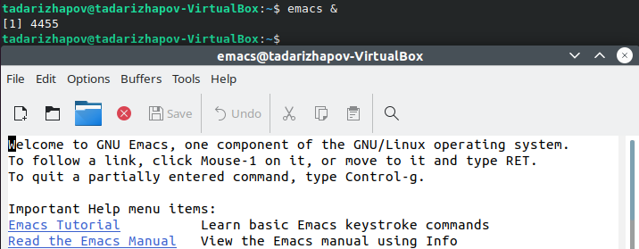

---
## Front matter
lang: ru-RU
title: Лабораторная работа №10
author: Тимур Андреевич Дарижапов
institute: |
	\inst{1}Российский университет дружбы народов, Москва
	
date: 2021 Москва

## Formatting
toc: false
slide_level: 2
theme: metropolis
header-includes: 
 - \metroset{progressbar=frametitle,sectionpage=progressbar,numbering=fraction}
 - '\makeatletter'
 - '\beamer@ignorenonframefalse'
 - '\makeatother'
aspectratio: 43
section-titles: true
---

## Цель работы и задание

Цель: Познакомиться с операционной системой Linux. Получить практические навыки работы с редактором Emacs.

Задание: 1.Ознакомиться с теоретическим материалом.

2.Ознакомиться с редактором emacs.

3.Выполнить упражнения.

4.Ответить на контрольные вопросы.

##

{ width=100% }

##

Проделываем с текстом стандартные процедуры редактирования: вырезание, вставка, копирование и т.д. 

Учимся использовать команды по перемещению курсора.

Учимся управлять буферами. Буфер — объект, представляющий какой-либо текст. Буфер может содержать что угодно, например, результаты компиляции программы или встроенные подсказки. Практически всё взаимодействие с пользователем, в том числе интерактивное, происходит посредством буферов.

##

Учимся управлять окнами: делить на 2,3,4 части и открывать в каждом окне файл.

Учимся режиму поиска.

Редактор emacs мне понравился больше, чем редактор vi.

## Выводы

Вывод: Я познакомился с операционной системой Linux. Я получил практические навыки работы с редактором Emacs.
