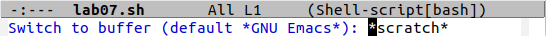

---
# Front matter
lang: ru-RU
title: "Лабораторная работа №10"
subtitle: "Российский университет дружбы народов"
author: "Тимур Андреевич Дарижапов"

# Formatting
toc-title: "Содержание"
toc: true # Table of contents
toc_depth: 2
lof: true # List of figures
lot: true # List of tables
fontsize: 12pt
linestretch: 1.5
papersize: a4paper
documentclass: scrreprt
polyglossia-lang: russian
polyglossia-otherlangs: english
mainfont: PT Serif
romanfont: PT Serif
sansfont: PT Sans
monofont: PT Mono
mainfontoptions: Ligatures=TeX
romanfontoptions: Ligatures=TeX
sansfontoptions: Ligatures=TeX,Scale=MatchLowercase
monofontoptions: Scale=MatchLowercase
indent: true
pdf-engine: lualatex
header-includes:
  - \linepenalty=10 # the penalty added to the badness of each line within a paragraph (no associated penalty node) Increasing the value makes tex try to have fewer lines in the paragraph.
  - \interlinepenalty=0 # value of the penalty (node) added after each line of a paragraph.
  - \hyphenpenalty=50 # the penalty for line breaking at an automatically inserted hyphen
  - \exhyphenpenalty=50 # the penalty for line breaking at an explicit hyphen
  - \binoppenalty=700 # the penalty for breaking a line at a binary operator
  - \relpenalty=500 # the penalty for breaking a line at a relation
  - \clubpenalty=150 # extra penalty for breaking after first line of a paragraph
  - \widowpenalty=150 # extra penalty for breaking before last line of a paragraph
  - \displaywidowpenalty=50 # extra penalty for breaking before last line before a display math
  - \brokenpenalty=100 # extra penalty for page breaking after a hyphenated line
  - \predisplaypenalty=10000 # penalty for breaking before a display
  - \postdisplaypenalty=0 # penalty for breaking after a display
  - \floatingpenalty = 20000 # penalty for splitting an insertion (can only be split footnote in standard LaTeX)
  - \raggedbottom # or \flushbottom
  - \usepackage{float} # keep figures where there are in the text
  - \floatplacement{figure}{H} # keep figures where there are in the text
---

# Цель работы

Познакомиться с операционной системой Linux. Получить практические навыки работы с редактором Emacs.

# Задание

1.Ознакомиться с теоретическим материалом.

2.Ознакомиться с редактором emacs.

3.Выполнить упражнения.

4.Ответить на контрольные вопросы.

# Выполнение лабораторной работы

1.Открываем emacs(Рисунок 3.1).

{ width=100% }

2.Создаём файл lab07.sh с помощью комбинации Ctrl-x и Ctrl-f(Рисунок 3.2).

{ width=100% }

3.Набираем текст(Рисунок 3.3).

{ width=100% }

4.Сохраняем файл с помощью комбинации Ctrl-x Ctrl-s.

5.Проделываем с текстом стандартные процедуры редактирования.(Примечание: клашиша Ctrl обозначена как С, а клавиша Alt обозначена как А).

5.1.Вырезаем одной командой целую строку (С-k)(Рисунок 3.4).

{ width=100% }

5.2.Вставляем эту строку в конец файла (C-y)(Рисунок 3.5).

{ width=100% }

5.3.Выделяем область текста (C-space)(Рисунок 3.6).

{ width=100% }

5.4.Копируем область в буфер обмена (А-w).

5.5.Вставляем область в конец файла(Рисунок 3.7).

{ width=100% }

5.6.Выделяем эту область второй раз и на этот раз вырезаем её (C-w)(Рисунок 3.8).

{ width=100% }

5.7.Отменяем последнее действие (C-/)(Рисунок 3.9).

{ width=100% }

6.Учимся использовать команды по перемещению курсора.

6.1.Перемещаем курсор в начало строки (C-a)(Рисунок 3.10).

{ width=100% }

6.2.Перемещаем курсор в конец строки (C-e)(Рисунок 3.11).

{ width=100% }

6.3.Перемещаем курсор в начало буфера (А-<)(Рисунок 3.12).

{ width=100% }

6.4.Перемещаем курсор в конец буфера (А->)(Рисунок 3.13).

{ width=100% }

7.Учимся управлять буферами.

7.1.Выводим список активных буферов на экран (C-x C-b)(Рисунок 3.14).

{ width=100% }

7.2.Перемещаемся во вновь открытое окно (C-x o) со списком открытых буфе-ров и переключаемся на другой буфер(Рисунок 3.15, 3.16).

{ width=100% }

{ width=100% }

7.3.Закрываем это окно (C-x 0).

7.4.Теперь вновь переключаемся между буферами, но уже без вывода их списка на экран (C-x b)(Рисунок 3.17, 3.18).

{ width=100% }

{ width=100% }

8.Учимся управлять окнами.

8.1.Поделим фрейм на 4 части: разделим фрейм на два окна по вертикали(C-x 3), а затем каждое из этих окон на две части по горизонтали (C-x 2)(Рисунок 3.19).

{ width=100% }

8.2.В каждом из четырёх созданных окон откроем новый буфер (файл) и введём несколько строк текста(Рисунок 3.20).

{ width=100% }

9.Учимся режиму поиска.

9.1.Переключаемся в режим поиска (C-s) и находим несколько слов, присутствующих в тексте(Рисунок 3.21).

{ width=100% }

9.2.Переключаемся между результатами поиска, нажимая C-s(Рисунок 3.22).

{ width=100% }

9.3.Выходим из режима поиска, нажав C-g(Рисунок 3.23).

{ width=100% }

9.4.Переходим в режим поиска и замены (А-%), вводим текст, который следует найти и заменить, нажимаем Enter, затем вводим текст для замены. После того как будут подсвечены результаты поиска, нажимаем ! для подтверждения замены(Рисунок 3.24).

{ width=100% }

9.5.Испробуем другой режим поиска, нажав А-s o. Данный вид поиска отличается от обычного тем, что тут считывается строка поиска,  которая трактуется как  регулярное  выражение, и не осуществляется поиск точного совпадения в тексте буфера. Регулярное выражение − это образец, который обозначает набор строк, возможно, и неограниченный набор(Рисунок 3.25).

{ width=100% }

# Выводы

Я познакомился с операционной системой Linux. Я получил практические навыки работы с редактором Emacs.

# Ответы на контрольные вопросы

1.Emacs − один  из  наиболее  мощных  и  широко  распространённых редакторов,  используемых  в  мире Unix.  По  популярности  он соперничает с редактором vi и его клонами. В зависимости от ситуации, Emacs может быть:текстовым редактором; программой для чтения почты и новостей Usenet; интегрированной средой разработки (IDE); операционной системой и т.д. Всё  это  разнообразие  достигается  благодаря  архитектуре Emacs, которая  позволяет  расширять  возможности  редактора  при  помощи языка Emacs  Lisp. На языке C написаны  лишь  самые базовые и низкоуровневые части Emacs, включая полнофункциональный интерпретатор языка Lisp. Таким образом, Emacs имеет встроенный язык программирования, который может использоваться для настройки, расширения  и  изменения  поведения  редактора.  В действительности, большая часть того редактора, с которым пользователи Emacs работают в наши дни, написана на языке Lisp.

2.Основную трудность для новичков при освоении данного редактора могут составлять  большое  количество  команд,  комбинаций  клавиш, которые не получится все запомнить с первого раза и поэтому придется часто обращаться к справочным материалам.

3.Буфер – это  объект,  представляющий собой текст. Если  имеется несколько буферов, то редактировать можно только один. Обычно буфер считывает данные из файла или записывает в файл данные из буфера. Окно –это область экрана, отображающая буфер. При запуске редактора отображается одно окно, но при обращении к некоторым функциям могут открыться дополнительные окна. Окна Emacs и окна графической среды XWindow – разные вещи. Одно окно XWindow может быть разбито  на  несколько  окон  в  смысле Emacs,  в  каждом  из  которых отображается отдельный буфер.

4.Да, можно.

5.При запуске Emacs по умолчанию создаются следующие буферы: «scratch»(буфер для несохраненного текста); «Messages»(журнал ошибок, включающий также информацию, которая появляется в области EchoArea); «GNUEmacs»(справочный буфер о редакторе).

6.C-c | сначала, удерживая «ctrl», нажимаю «c», после – отпускаю обе клавишии нажимаю «|». C-c C- | сначала, удерживая «ctrl»,нажимаю «с», после – отпускаю обе клавиши и, удерживая «ctrl», нажимаю «|».

7.Чтобы  поделить  окно  на  две  части  необходимо  воспользоваться комбинацией «Ctrl-x 3»(по вертикали) или «Ctrl-x 2» (по горизонтали).

8.Настройки Emacs хранятся в файле .emacs.

9.По  умолчанию  клавиша «←»(стрелочка) удаляет  символ перед  курсором, но в редакторе  её  можно  переназначить.  Для  этого  необхдимо изменить конфигурацию файла .emacs.

10.Более удобным я считаю редактор emacs, нежели vi, потому что в нем проще открывать другие файлы, можно использовать сразу несколько окон, нет «Командного режима», «Режима ввода», «Режима командной строки», которые  являются  немного  непривычными  и  в  какой-то  степени неудобными. 
