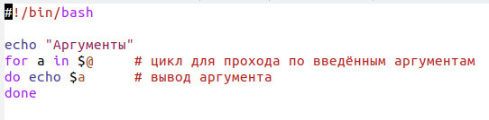
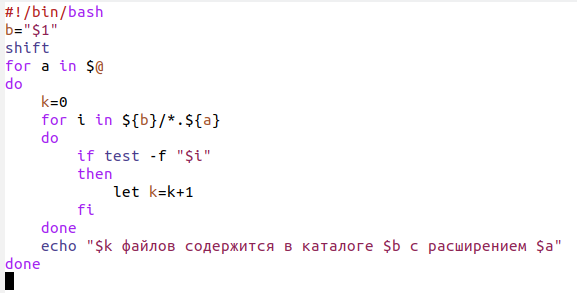
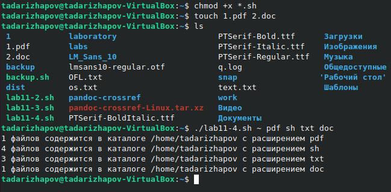

---
## Front matter
lang: ru-RU
title: Лабораторная работа №11
author: Тимур Андреевич Дарижапов
institute: |
	\inst{1}Российский университет дружбы народов, Москва
	
date: 2021 Москва

## Formatting
toc: false
slide_level: 2
theme: metropolis
header-includes: 
 - \metroset{progressbar=frametitle,sectionpage=progressbar,numbering=fraction}
 - '\makeatletter'
 - '\beamer@ignorenonframefalse'
 - '\makeatother'
aspectratio: 43
section-titles: true
---

## Цель работы

Цель: Изучить основы программирования в оболочке ОС UNIX/Linux. Научиться писать небольшие командные файлы, ответить на контрольные вопросы.

##
Пример командного файла, который обрабатывает любое произвольное число аргументов командной строки, в том числе превышающее десять. Например, скрипт может последовательно распечатывать значения всех переданных аргументов.

{ width=100% }

##

Пример командного файла, который получает в качестве аргумента командной строки формат файла(.txt,.doc,.jpg,.pdf и т.д.) и вычисляет количество таких файлов в указанной директории. Путь к директории также передаётся в виде аргумента командной строки.

{ width=100% }

##

Пример выполнения: 

{ width=100% }

##

Для написания командных файлов мы пользовались текстовым редактором emacs. Он очень удобен для написания.

## Выводы

Вывод: Я изучил основы программирования в оболочке ОС UNIX/Linux. Я научился писать небольшие командные файлы и ответил на контрольные вопросы.
