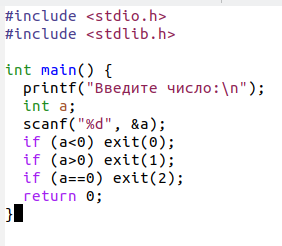
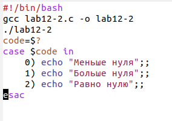
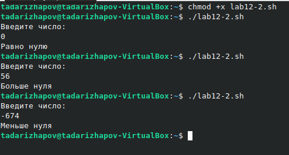

---
## Front matter
lang: ru-RU
title: Лабораторная работа №12
author: Тимур Андреевич Дарижапов
institute: |
	\inst{1}Российский университет дружбы народов, Москва
	
date: 2021 Москва

## Formatting
toc: false
slide_level: 2
theme: metropolis
header-includes: 
 - \metroset{progressbar=frametitle,sectionpage=progressbar,numbering=fraction}
 - '\makeatletter'
 - '\beamer@ignorenonframefalse'
 - '\makeatother'
aspectratio: 43
section-titles: true
---

## Цель работы

Цель: Изучить основы программирования в оболочке ОС UNIX. Научится писать более сложные командные файлы с использованием логических управляющих конструкций и циклов и ответить на контрольные вопросы.

##

Пример командного файла на языке С, который печатает, какое число введено с клавиатуры.

{ width=100% }

##

{ width=100% }

##

Выполнение: 

{ width=100% }

## Выводы

Я изучил основы программирования в оболочке ОС UNIX. Я научился писать более сложные командные файлы с использованием логических управляющих конструкций и циклов и ответил на контрольные вопросы.
