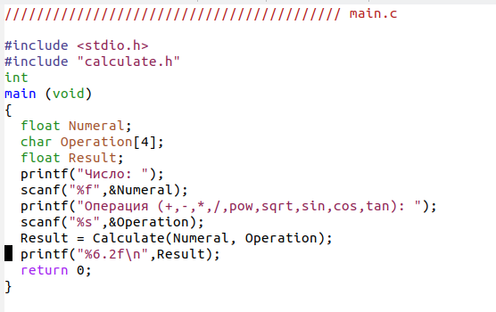
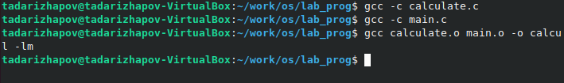
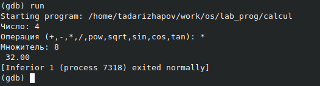

---
## Front matter
lang: ru-RU
title: Лабораторная работа №14
author: Тимур Андреевич Дарижапов
institute: |
	\inst{1}Российский университет дружбы народов, Москва
	
date: 2021 Москва

## Formatting
toc: false
slide_level: 2
theme: metropolis
header-includes: 
 - \metroset{progressbar=frametitle,sectionpage=progressbar,numbering=fraction}
 - '\makeatletter'
 - '\beamer@ignorenonframefalse'
 - '\makeatother'
aspectratio: 43
section-titles: true
---

## Цель работы

Цель: Приобрести простейшие навыки разработки, анализа, тестирования и отладки приложений в ОС типа UNIX/Linux на примере создания на языке программирова-ния С калькулятора с простейшими функциями.

##

Создаём калькулятор с помощью трёх командных файлов.

Пример командного файла main.c.

{ width=100% }

##

Компиляция.

{ width=100% }

##

Для запуска программы внутри отладчика вводим команду run

{ width=100% }

## Выводы

Вывод: Я приобрёл простейшие навыки разработки, анализа, тестирования и отладки приложений в ОС типа UNIX/Linux на примере создания на языке программирования С калькулятора с простейшими функциями.
