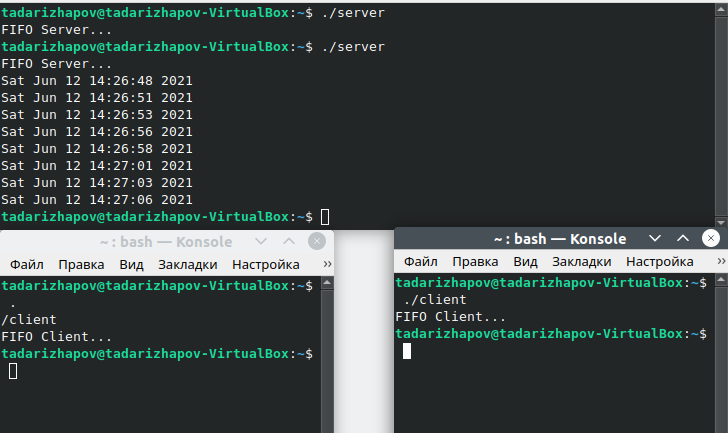

---
## Front matter
lang: ru-RU
title: Лабораторная работа №15
author: Тимур Андреевич Дарижапов
institute: |
	\inst{1}Российский университет дружбы народов, Москва
	
date: 2021 Москва

## Formatting
toc: false
slide_level: 2
theme: metropolis
header-includes: 
 - \metroset{progressbar=frametitle,sectionpage=progressbar,numbering=fraction}
 - '\makeatletter'
 - '\beamer@ignorenonframefalse'
 - '\makeatother'
aspectratio: 43
section-titles: true
---

## Цель работы

Цель: Приобретение практических навыков работы с именованными каналами.

##

В программировании именованный канал или именованный конвейер (англ. named pipe) — один из методов межпроцессного взаимодействия, расширение понятия конвейера в Unix и подобных ОС.

 Именованный канал позволяет различным процессам обмениваться данными, даже если программы, выполняющиеся в этих процессах, изначально не были написаны для взаимодействия с другими программами.
 
##

Как это должно работать.

{ width=100% }

## Выводы

Я приобрёл практические навыки работы с именованными каналами и ответил на контрольные вопросы.
