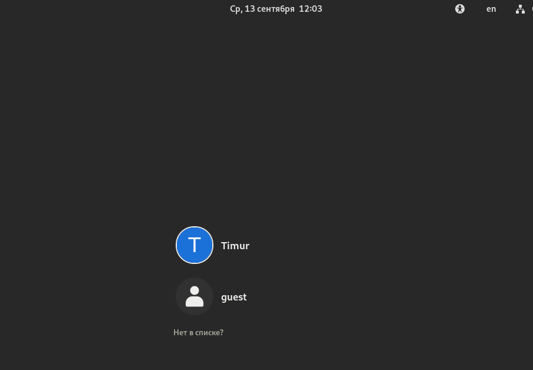
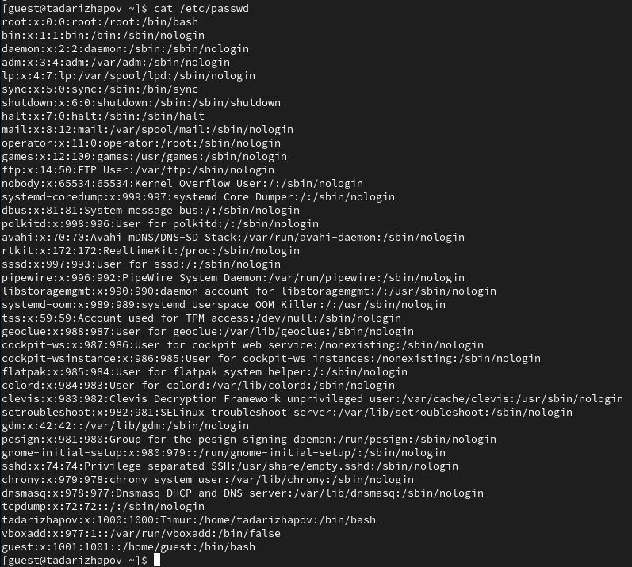
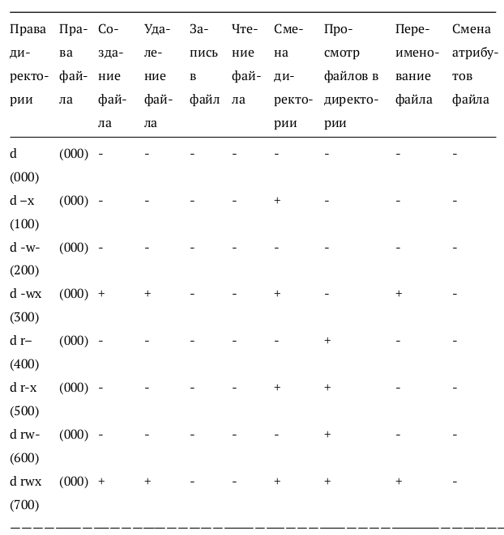

---
## Front matter
lang: ru-RU
title: Отчёт по лабораторной работе №1
author: Дарижапов Тимур Андреевич
institute: РУДН, Москва, Россия

date: 8 Сентября 2023

## Formatting
toc: false
slide_level: 2
theme: metropolis
header-includes: 
 - \metroset{progressbar=frametitle,sectionpage=progressbar,numbering=fraction}
 - '\makeatletter'
 - '\beamer@ignorenonframefalse'
 - '\makeatother'
aspectratio: 43
section-titles: true
---

# Отчет по лабораторной работы №1

## Установка виртуальной машины

- Установка виртуальной машины в VirtualBox, система Rocky Linux

{ width=70% }

## Основные настройки

- Настройка языка

{ width=70% }

## Запуск виртуальной машины

{ width=70% }

## Работа с виртуальной машиной (Домашняя работа №1)

- На данном слайде представлено одно из заданий Домашней работы к лабораторной работе №1

{ width=70% }

## Работа с GitHub

{ width=70% }

## Основные команды git

- На следующем скриншоте представлены команды git, которые позволяют отправить созданные файлы в репозиторий на GitHub

{ width=70% }

## Скачивание pandoc

{ width=70% }

## Файл Markdown 

{ width=70% }

## Выводы

- Установил VirtualBox, изучил её работу. 
- Изучил идеологию и научился пременять средства контроля версий. 
- Научился работать с Markdown-файлами.
- Научился создавать pdf и docx файлы из файла Markdown (с помощью команды make)
