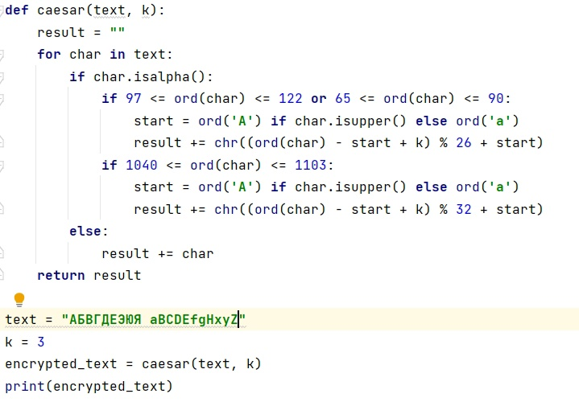
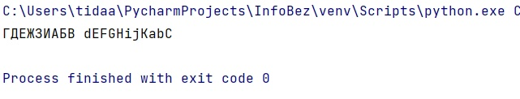
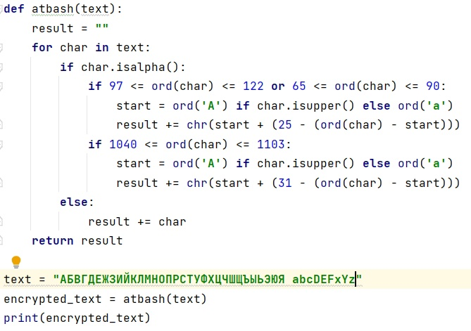
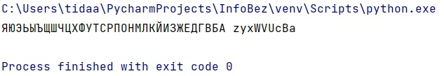

---
# Front matter
lang: ru-RU
title: "Лабораторная работа №1"
subtitle: "Дисциплина: Математические основы защиты информации и информационной безопасности"
author: "Дарижапов Тимур Андреевич"

# Formatting
toc-title: "Содержание"
toc: true # Table of contents
toc_depth: 2
lof: true # Список рисунков
lot: true # Список таблиц
fontsize: 12pt
linestretch: 1.5
papersize: a4paper
documentclass: scrreprt
polyglossia-lang: russian
polyglossia-otherlangs: english
mainfont: PT Serif
romanfont: PT Serif
sansfont: PT Sans
monofont: PT Mono
mainfontoptions: Ligatures=TeX
romanfontoptions: Ligatures=TeX
sansfontoptions: Ligatures=TeX,Scale=MatchLowercase
monofontoptions: Scale=MatchLowercase
indent: true
pdf-engine: lualatex
header-includes:
  - \linepenalty=10 # the penalty added to the badness of each line within a paragraph (no associated penalty node) Increasing the value makes tex try to have fewer lines in the paragraph.
  - \interlinepenalty=0 # value of the penalty (node) added after each line of a paragraph.
  - \hyphenpenalty=50 # the penalty for line breaking at an automatically inserted hyphen
  - \exhyphenpenalty=50 # the penalty for line breaking at an explicit hyphen
  - \binoppenalty=700 # the penalty for breaking a line at a binary operator
  - \relpenalty=500 # the penalty for breaking a line at a relation
  - \clubpenalty=150 # extra penalty for breaking after first line of a paragraph
  - \widowpenalty=150 # extra penalty for breaking before last line of a paragraph
  - \displaywidowpenalty=50 # extra penalty for breaking before last line before a display math
  - \brokenpenalty=100 # extra penalty for page breaking after a hyphenated line
  - \predisplaypenalty=10000 # penalty for breaking before a display
  - \postdisplaypenalty=0 # penalty for breaking after a display
  - \floatingpenalty = 20000 # penalty for splitting an insertion (can only be split footnote in standard LaTeX)
  - \raggedbottom # or \flushbottom
  - \usepackage{float} # keep figures where there are in the text
  - \floatplacement{figure}{H} # keep figures where there are in the text
---

# Цель работы

Изучить шифр Цезаря и шифр Атбаш, научиться реализации данных шифров программным путём.

# Задание

1. Реализовать шифр Цезаря с произвольным ключом k
2. Реализовать шифр Атбаш

# Выполнение лабораторной работы

1)Перед тем как выполнять лабораторную работу, нужно понять, каким образом её мы будем выполнять. 
В силу незнания языка Julia, первую лабораторную работу я буду выполнять с помощью языка программирования Python.

Нам нужно реализовать два шифра. Начнём с первого(Рисунок 3.1).

{ width=70% }

В шифре Цезаря на вход мы получаем текст и число смещения. Делаем цикл, который поменяет каждую букву нашего предложения на соответствующую букву шифроалфавита. Стоит отметить, что используем мы кодировку ASCII, поэтому нам нужно отличать латиницу и кириллицу. Для этого мы вводим дополнительные условия. Также стоит учесть тот факт, что буква 'ё' из кириллицы выходит за границы кодировки простых букв. Поэтому в наших текстах эта буква не будет использоваться.
Вывод программы представлен на рисунке 3.2.

{ width=70% }

2)Похожим образом реализуется шифр Атбаш, который зеркалит алфавит. В этом шифроалфавите мы не будем использовать пробел из-за таких же проблем, как и с буквой 'ё'. Код представлен на рисунке 3.3.

{ width=70% }

Вывод программы представлен на рисунке 3.4.

{ width=70% }

# Выводы

- Я изучил шифр Цезаря и шифр Атбаш, научился реализации данных шифров программным путём.

# Список литературы

-  Шифры простой замены 
[Электронный ресурс]. URL: https://esystem.rudn.ru/pluginfile.php/2368411/mod_folder/content/0/lab01.pdf?forcedownload=1

