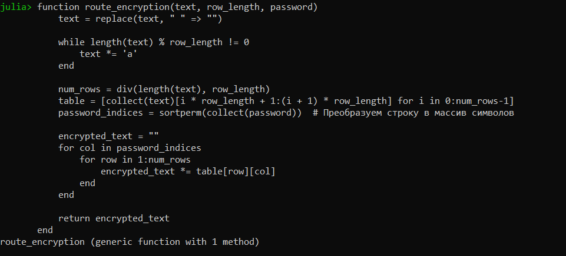
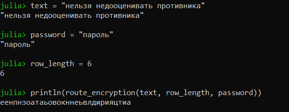
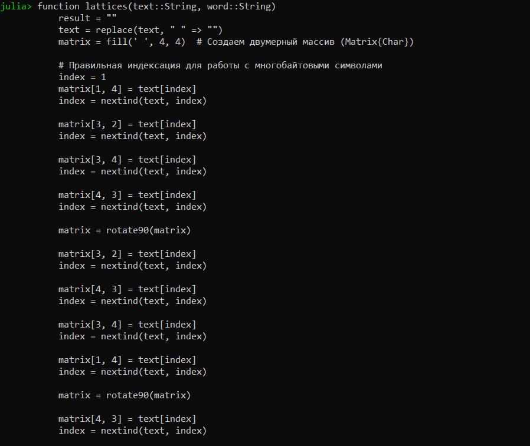
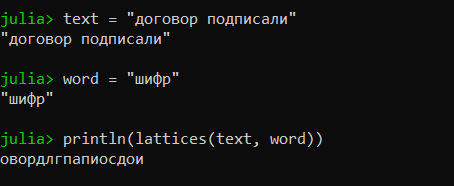
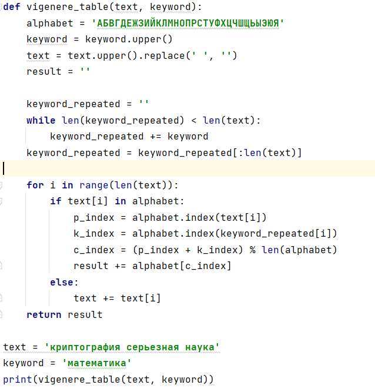
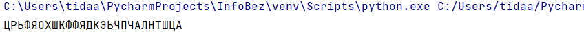

---
## Front matter
lang: ru-RU
title: Отчёт по лабораторной работе №2
author: Дарижапов Тимур Андреевич
institute: РУДН, Москва, Россия

date: 28 Сентября 2024

## Formatting
toc: false
slide_level: 2
theme: metropolis
header-includes: 
 - \metroset{progressbar=frametitle,sectionpage=progressbar,numbering=fraction}
 - '\makeatletter'
 - '\beamer@ignorenonframefalse'
 - '\makeatother'
aspectratio: 43
section-titles: true
---

# Отчет по лабораторной работе №2

##

Цель работы: Изучить маршрутное шифрование, шифрование с помощью решёток и таблицу Виженера, научиться реализации данных шифров программным путём.

## Маршрутное шифрование

{ width=70% }

## Маршрутное шифрование 2

{ width=70% }

## Шифрование с помощью решёток

{ width=70% }

## Шифрование с помощью решёток 2

{ width=70% }

## Таблица Виженера

{ width=60% }

## Таблица Виженера 2

{ width=70% }

## Выводы

- Я изучил маршрутное шифрование, шифрование с помощью решёток и таблицу Виженера, научился реализации данных шифров программным путём.
