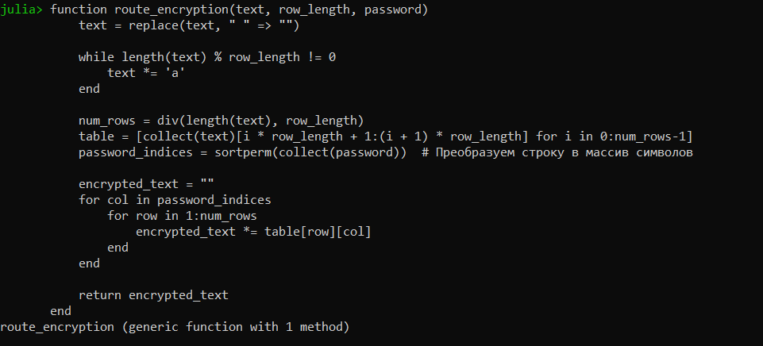
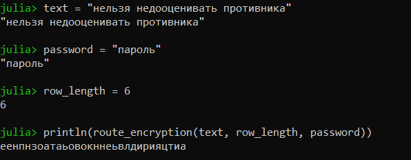
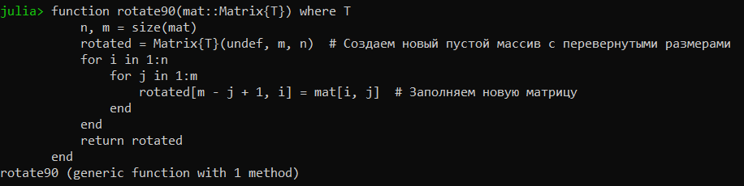
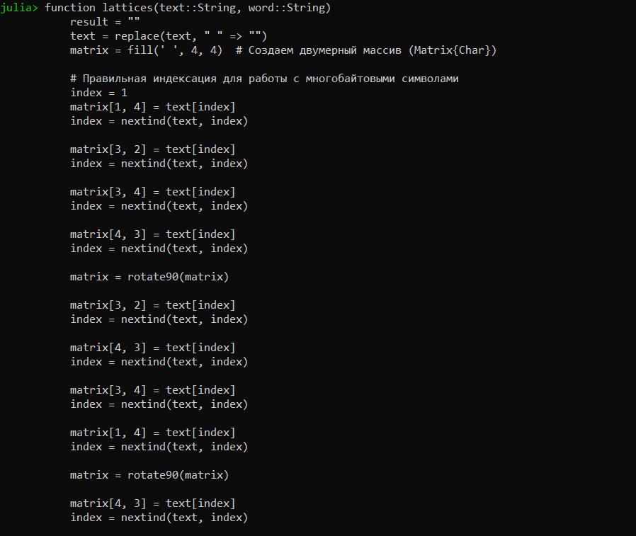
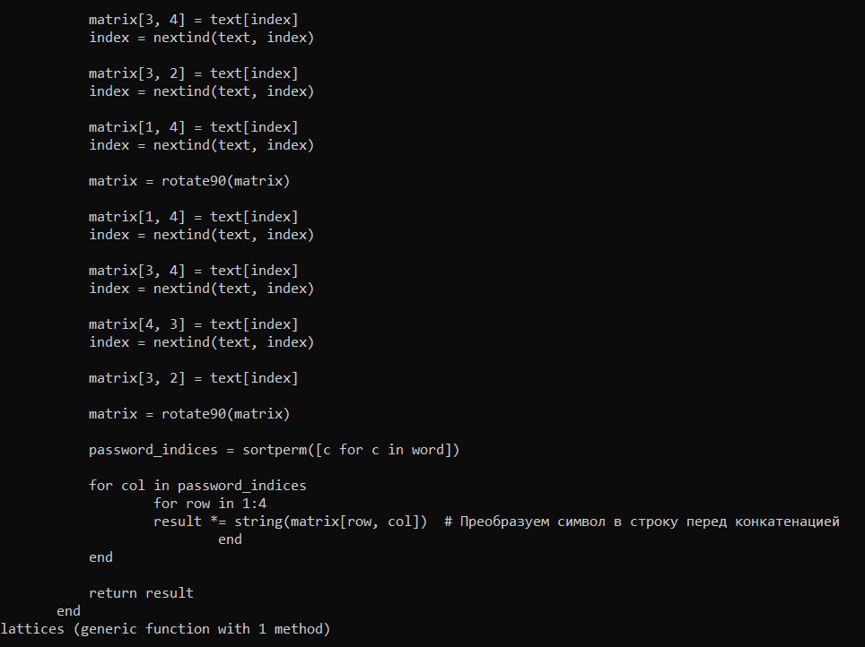
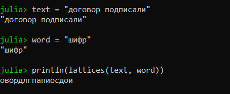
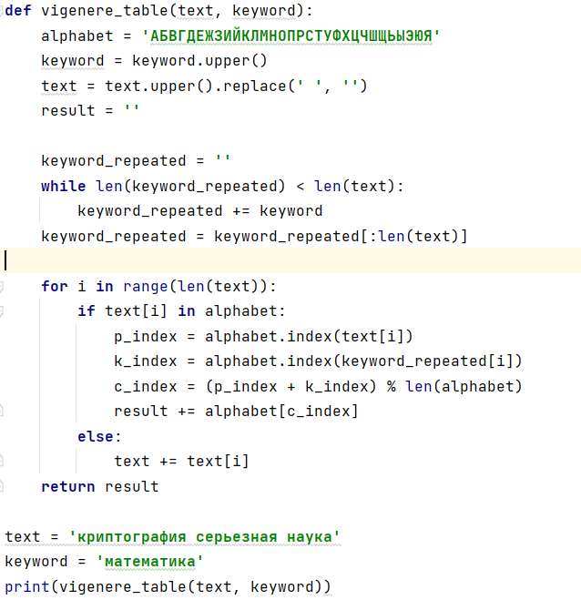
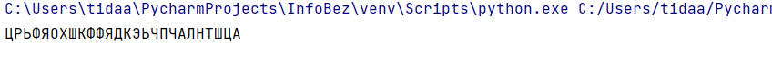

---
# Front matter
lang: ru-RU
title: "Лабораторная работа №2"
subtitle: "Дисциплина: Математические основы защиты информации и информационной безопасности"
author: "Дарижапов Тимур Андреевич"

# Formatting
toc-title: "Содержание"
toc: true # Table of contents
toc_depth: 2
lof: true # Список рисунков
lot: true # Список таблиц
fontsize: 12pt
linestretch: 1.5
papersize: a4paper
documentclass: scrreprt
polyglossia-lang: russian
polyglossia-otherlangs: english
mainfont: PT Serif
romanfont: PT Serif
sansfont: PT Sans
monofont: PT Mono
mainfontoptions: Ligatures=TeX
romanfontoptions: Ligatures=TeX
sansfontoptions: Ligatures=TeX,Scale=MatchLowercase
monofontoptions: Scale=MatchLowercase
indent: true
pdf-engine: lualatex
header-includes:
  - \linepenalty=10 # the penalty added to the badness of each line within a paragraph (no associated penalty node) Increasing the value makes tex try to have fewer lines in the paragraph.
  - \interlinepenalty=0 # value of the penalty (node) added after each line of a paragraph.
  - \hyphenpenalty=50 # the penalty for line breaking at an automatically inserted hyphen
  - \exhyphenpenalty=50 # the penalty for line breaking at an explicit hyphen
  - \binoppenalty=700 # the penalty for breaking a line at a binary operator
  - \relpenalty=500 # the penalty for breaking a line at a relation
  - \clubpenalty=150 # extra penalty for breaking after first line of a paragraph
  - \widowpenalty=150 # extra penalty for breaking before last line of a paragraph
  - \displaywidowpenalty=50 # extra penalty for breaking before last line before a display math
  - \brokenpenalty=100 # extra penalty for page breaking after a hyphenated line
  - \predisplaypenalty=10000 # penalty for breaking before a display
  - \postdisplaypenalty=0 # penalty for breaking after a display
  - \floatingpenalty = 20000 # penalty for splitting an insertion (can only be split footnote in standard LaTeX)
  - \raggedbottom # or \flushbottom
  - \usepackage{float} # keep figures where there are in the text
  - \floatplacement{figure}{H} # keep figures where there are in the text
---

# Цель работы

Изучить маршрутное шифрование, шифрование с помощью решёток и таблицу Виженера, научиться реализации данных шифров программным путём.

# Задание

- Реализовать маршрутное шифрование
- Реализовать шифрование с помощью решёток
- Реализовать таблицу Виженера

# Выполнение лабораторной работы

1)Напишем код для маршрутного шифрования с помощью языка Julia. На вход функции идёт текст, слово-шифр и длина стороны прямоугольника.

{ width=70% }

Далее мы вводим начальные данные. В нашем случае текст - нельзя недооценивать противника. Слово-шифр - пароль. Длина стороны - 5. Получаем вывод.

{ width=70% }

2)Для шифрования с помощью решёток нам понадобятся 2 функции. Первая функция будет разворачивать матрицу на 90 градусов по часовой стрелке.

{ width=70% }

Вторая функция будет заполнять нашу большую матрицу символами из текста.

{ width=70% }

{ width=70% }

Вводим начальные данные. Текст - договор подписали. Слово-шифр - шифр. Получаем результат.

{ width=70% }

3)Таблицу Виженера на языке Julia сделать не получилось. Представляю код на языке Python. 

{ width=70% }

Вводим начальные данные. Текст - криптография серьезная наука. Слово-шифр - математика. Получает результат.

{ width=70% }

# Выводы

- Я изучил маршрутное шифрование, шифрование с помощью решёток и таблицу Виженера, научился реализации данных шифров программным путём.

