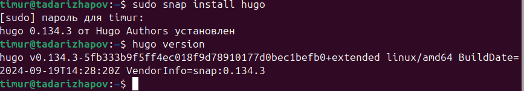
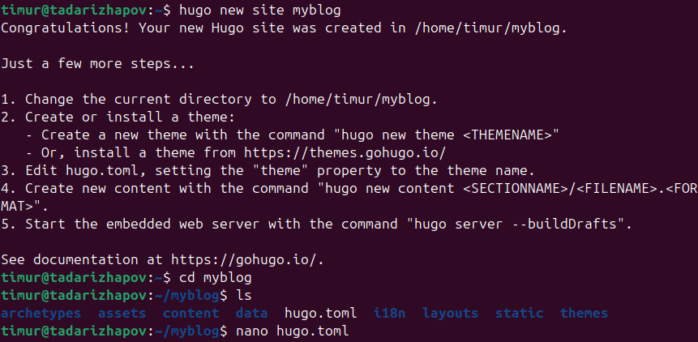
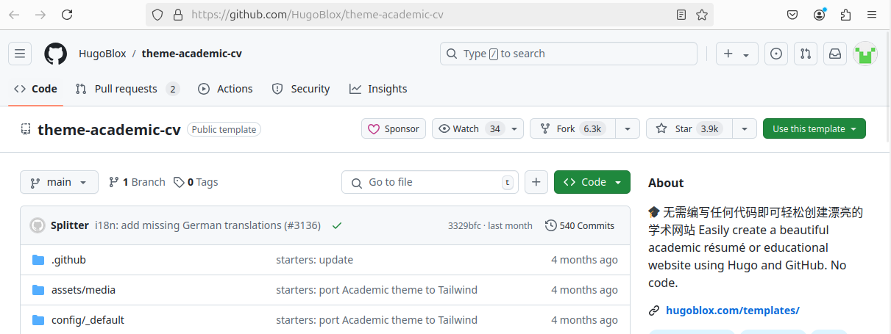
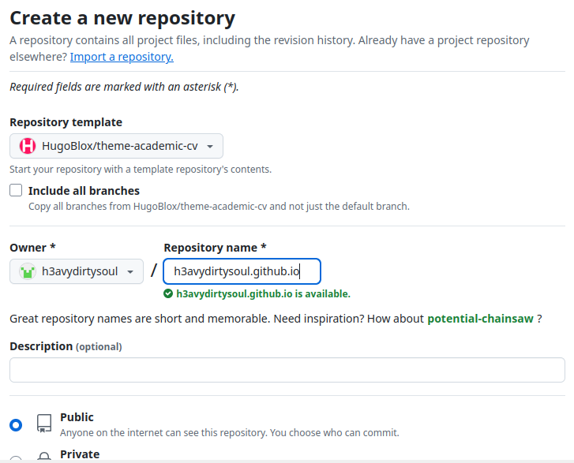
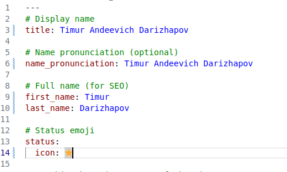
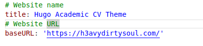

---
## Front matter
lang: ru-RU
title: Научное программирование
author: Дарижапов Тимур Андреевич
institute: РУДН, Москва, Россия

date: 20 Сентября 2024

## Formatting
toc: false
slide_level: 2
theme: metropolis
header-includes: 
 - \metroset{progressbar=frametitle,sectionpage=progressbar,numbering=fraction}
 - '\makeatletter'
 - '\beamer@ignorenonframefalse'
 - '\makeatother'
aspectratio: 43
section-titles: true
---

# Индивидуальный проект: 1 часть

## Программное обеспечение

{ width=70% }

## Создание репозитория сайта

{ width=70% }

## Github темы сайта

{ width=70% }

## Создание репозитория

{ width=70% }

## Изменение имени пользователя

{ width=70% }

## Изменение URLs

{ width=70% }

## Выводы

Я разместил на Github pages заготовку для персонального сайта.

## {.standout}

Спасибо за внимание!
