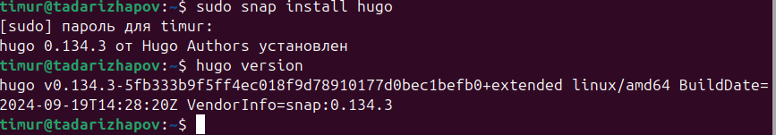
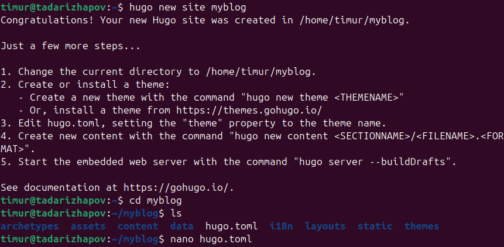
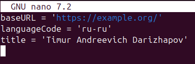
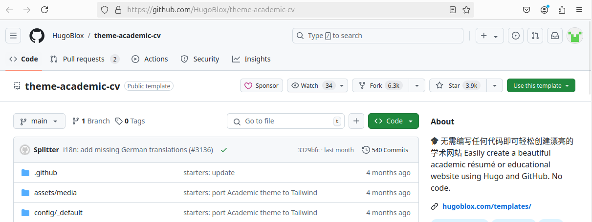
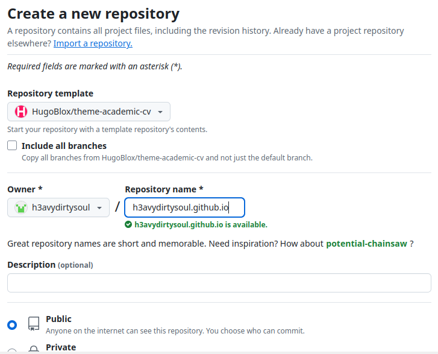
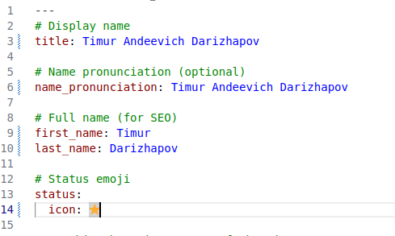
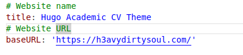

---
# Front matter
lang: ru-RU
title: "Индивидуальный проект: 1 часть"
subtitle: "Научное программирование"
author: "Дарижапов Тимур Андреевич"

# Formatting
toc-title: "Содержание"
toc: true # Table of contents
toc_depth: 2
lof: true # List of figures
lot: true # List of tables
fontsize: 12pt
linestretch: 1.5
papersize: a4paper
documentclass: scrreprt
polyglossia-lang: russian
polyglossia-otherlangs: english
mainfont: PT Serif
romanfont: PT Serif
sansfont: PT Sans
monofont: PT Mono
mainfontoptions: Ligatures=TeX
romanfontoptions: Ligatures=TeX
sansfontoptions: Ligatures=TeX,Scale=MatchLowercase
monofontoptions: Scale=MatchLowercase
indent: true
pdf-engine: lualatex
header-includes:
  - \linepenalty=10 # the penalty added to the badness of each line within a paragraph (no associated penalty node) Increasing the value makes tex try to have fewer lines in the paragraph.
  - \interlinepenalty=0 # value of the penalty (node) added after each line of a paragraph.
  - \hyphenpenalty=50 # the penalty for line breaking at an automatically inserted hyphen
  - \exhyphenpenalty=50 # the penalty for line breaking at an explicit hyphen
  - \binoppenalty=700 # the penalty for breaking a line at a binary operator
  - \relpenalty=500 # the penalty for breaking a line at a relation
  - \clubpenalty=150 # extra penalty for breaking after first line of a paragraph
  - \widowpenalty=150 # extra penalty for breaking before last line of a paragraph
  - \displaywidowpenalty=50 # extra penalty for breaking before last line before a display math
  - \brokenpenalty=100 # extra penalty for page breaking after a hyphenated line
  - \predisplaypenalty=10000 # penalty for breaking before a display
  - \postdisplaypenalty=0 # penalty for breaking after a display
  - \floatingpenalty = 20000 # penalty for splitting an insertion (can only be split footnote in standard LaTeX)
  - \raggedbottom # or \flushbottom
  - \usepackage{float} # keep figures where there are in the text
  - \floatplacement{figure}{H} # keep figures where there are in the text
---

# Цель работы

Размещение на Github pages заготовки для персонального сайта.

# Задание

1. Установить необходимое программное обеспечение.
2. Скачать шаблон темы сайта.
3. Разместить его на хостинге git.
4. Установить параметр для URLs сайта.
5. Разместить заготовку сайта на Github pages.

# Выполнение проекта

1) Выполнение проекта подразумевает знакомство с генерацией статических сайтов Hugo.
В качестве шаблона индивидуального сайта используется шаблон Hugo Academic Theme.
    Демо-сайт: https://academic-demo.netlify.app/
    Репозиторий: https://github.com/wowchemy/starter-hugo-academic

Сначала установим в консоли Linux программное обеспечение Hugo и проверим его версию.

{ width=70% }

2) С помощью консоли можно создать версию сайта и прямо из репозитория им управлять. Тему можно скачать с официального сайта.

{ width=70% }

{ width=70% }

Нам в задании был дан репозиторий темы сайта, в описании которого написано, что нам нужно склонировать репозиторий под именем USERNAME.github.io. 

{ width=70% }

3)Таким образом, наш шаблон темы сайта расположен на нашем github.

{ width=70% }

4)Можем поменять URLs нашего сайта, а также можем для начала поменять имя пользователя.

{ width=70% }

{ width=70% }

5)В конце концов делаем commit и push. Начальные настройки сайта с темой размещены на github.

# Выводы

Я разместил на Github pages заготовку для персонального сайта.

