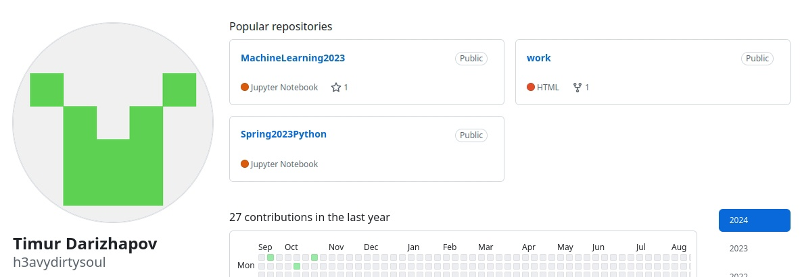
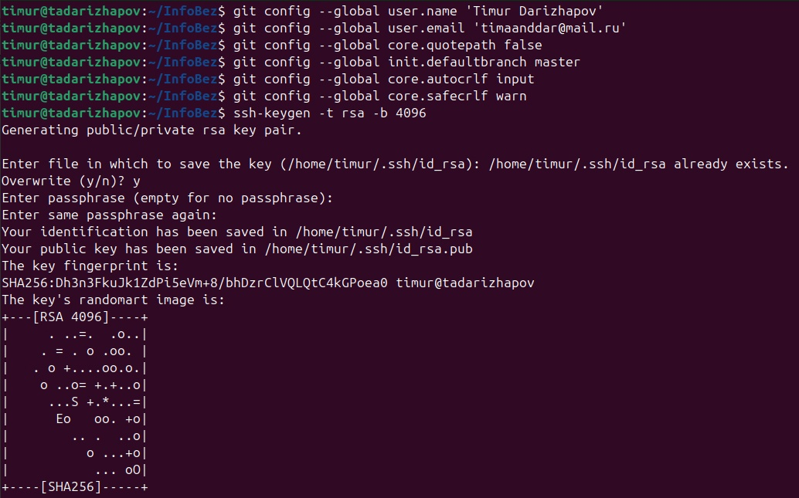
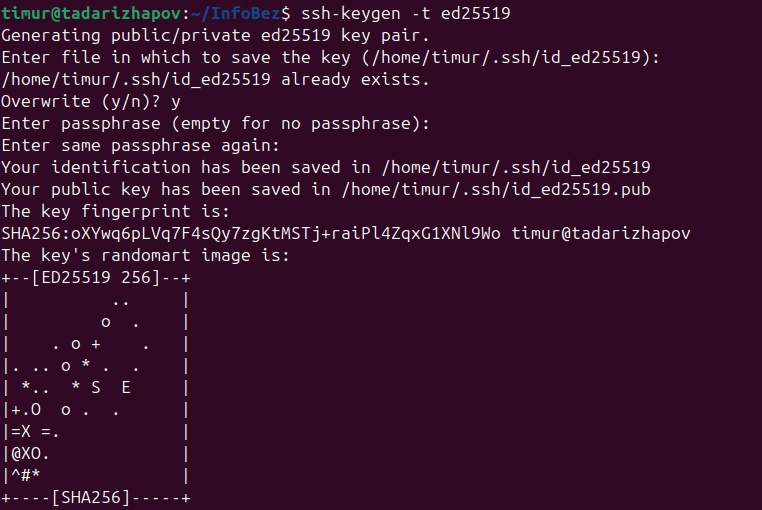
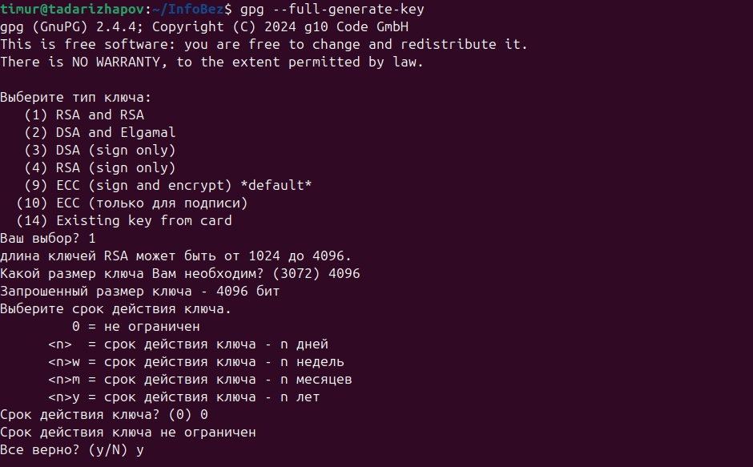
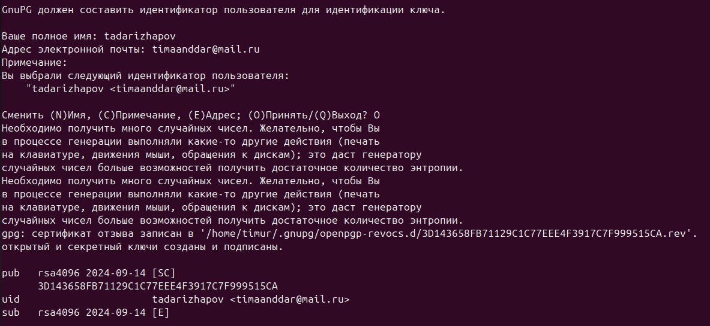
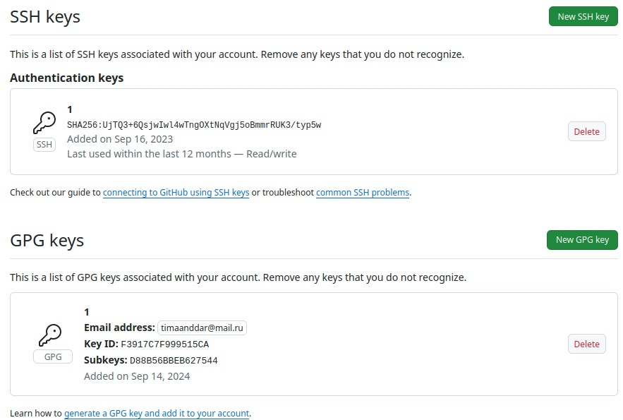
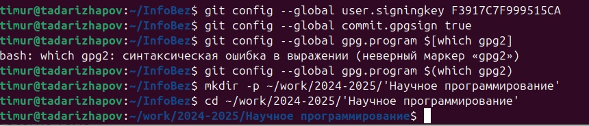
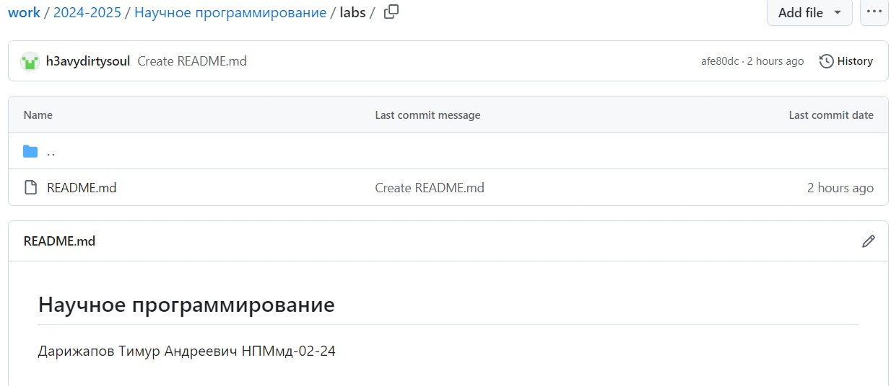

---
## Front matter
lang: ru-RU
title: Научное программирование
author: Дарижапов Тимур Андреевич
institute: РУДН, Москва, Россия

date: 19 Сентября 2024

## Formatting
toc: false
slide_level: 2
theme: metropolis
header-includes: 
 - \metroset{progressbar=frametitle,sectionpage=progressbar,numbering=fraction}
 - '\makeatletter'
 - '\beamer@ignorenonframefalse'
 - '\makeatother'
aspectratio: 43
section-titles: true
---

# Лабораторная работа 2

## Создание файлов из файла .md

Ниже на слайдах будет представлена презентация лабораторной работы №1.

## GitHub

{ #fig:001 width=70% }

## Начало работы

{ #fig:009 width=70% }

## Создание ssh-ключа

{ #fig:002 width=70% }

## Создание pgp-ключа

{ #fig:002 width=70% }

## Создание pgp-ключа

{ #fig:002 width=70% }

## Подключение pgp-ключа

{ #fig:002 width=70% }

## Последние настройки

{ #fig:002 width=70% }

## Создание репозитория

{ #fig:002 width=70% }

## Выводы

В ходе выполнения лабораторной работы я научился оформлять отчёты с помощью легковесного языка разметки Markdown.

## {.standout}

Спасибо за внимание!
