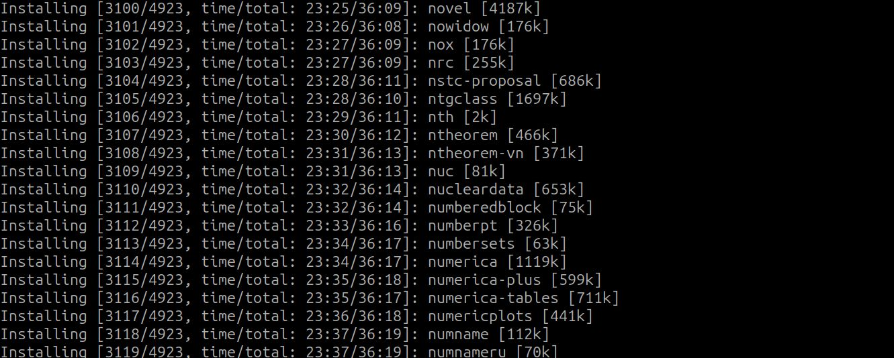

---
## Front matter
lang: ru-RU
title: Отчёт по лабораторной работе №1
author: Дарижапов Тимур Андреевич
institute: РУДН, Москва, Россия

date: 27 Сентября 2025

## Formatting
toc: false
slide_level: 2
theme: metropolis
header-includes: 
 - \metroset{progressbar=frametitle,sectionpage=progressbar,numbering=fraction}
 - '\makeatletter'
 - '\beamer@ignorenonframefalse'
 - '\makeatother'
aspectratio: 43
section-titles: true
---

# Отчет по лабораторной работе №1

##

Цель работы: Установить TeXlive.

##

Установка из дистрибутивов происходит с помощью команды: sudo apt install texlive-full. Установка долгая, но я заранее всё установил.

{ width=70% }

##

Также установку можно сделать вручную.

{ width=70% }

Распаковка архива.

{ width=70% }

##

Сама установка тоже занимает много времени, поэтому я прикладываю часть этой установки.

{ width=70% }

## Выводы

- Я установил TeXlive на дистрибутив DragonOS (Ubuntu).
