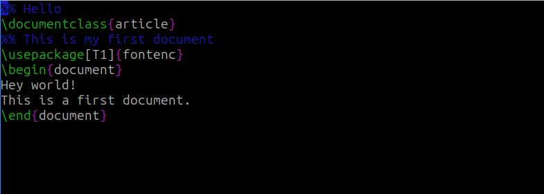
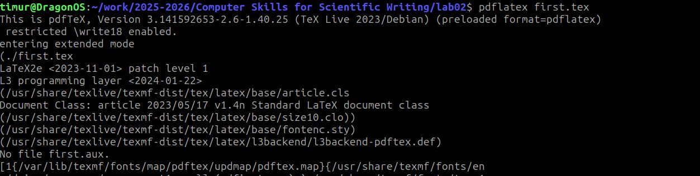
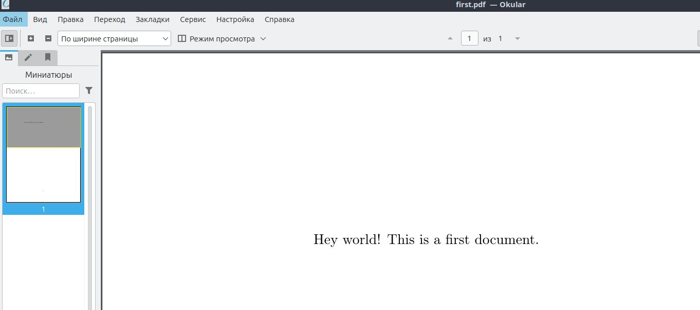

---
## Front matter
lang: ru-RU
title: Отчёт по лабораторной работе №2
author: Дарижапов Тимур Андреевич
institute: РУДН, Москва, Россия

date: 27 Сентября 2025

## Formatting
toc: false
slide_level: 2
theme: metropolis
header-includes: 
 - \metroset{progressbar=frametitle,sectionpage=progressbar,numbering=fraction}
 - '\makeatletter'
 - '\beamer@ignorenonframefalse'
 - '\makeatother'
aspectratio: 43
section-titles: true
---

# Отчет по лабораторной работе №2

##

Цель работы: Использовать TeXlive. Сделать первый файл в формате .pdf из файла .tex.

##

Создадим наш первый файл в формате .tex.

{ width=70% }

{ width=70% }

##

Сделаем файл .pdf из файла .tex.

{ width=70% }

Сделанный файл.

{ width=70% }

## Выводы

- Я использовал TeXlive. Сделал свой первый .pdf файл.
