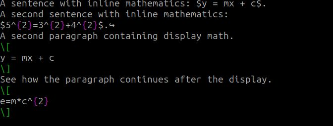
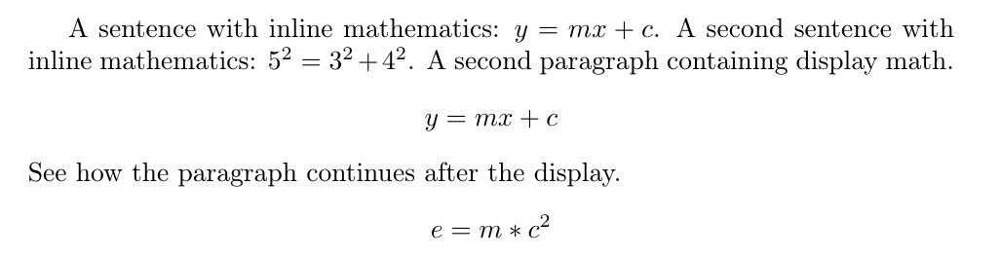
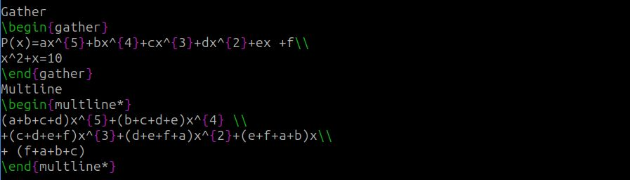
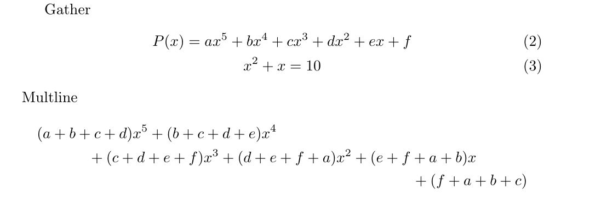
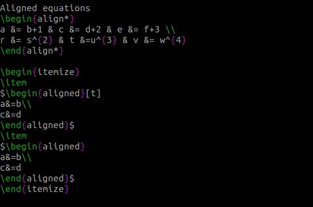
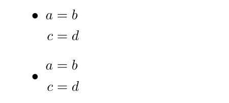
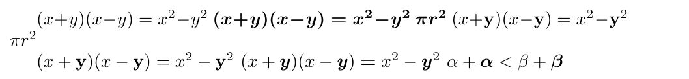
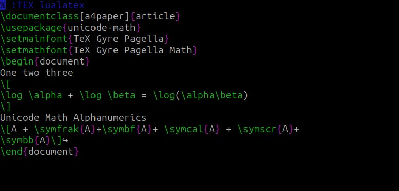
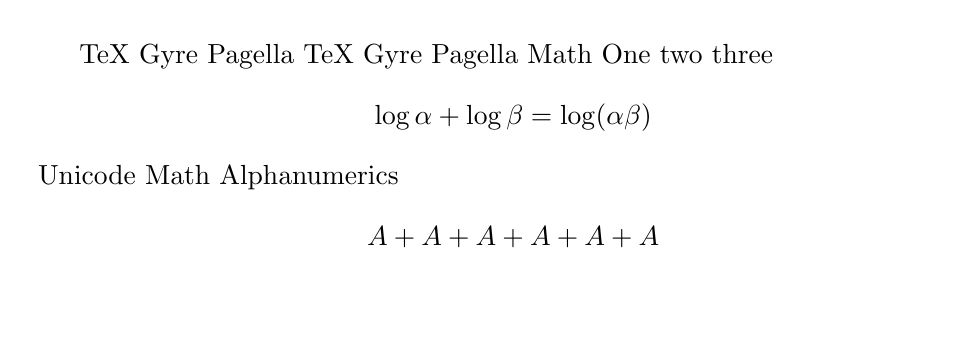

---
## Front matter
lang: ru-RU
title: Отчёт по лабораторной работе №3
author: Дарижапов Тимур Андреевич
institute: РУДН, Москва, Россия

date: 11 Октября 2025

## Formatting
toc: false
slide_level: 2
theme: metropolis
header-includes: 
 - \metroset{progressbar=frametitle,sectionpage=progressbar,numbering=fraction}
 - '\makeatletter'
 - '\beamer@ignorenonframefalse'
 - '\makeatother'
aspectratio: 43
section-titles: true
---

# Отчет по лабораторной работе №3

##

Цель работы: Изучить особенности математического набора в системе LaTeX , научиться использовать математический режим (math mode), работать с пакетами amsmath, amssymb, bm и mathtools, а также освоить применение различных шрифтов и греческих символов при оформлении научных и технических текстов. 

## Математический режим (Math Mode)

**Код:**

## Отображаемая математика (Display Mathematics)

**Код:**

{ width=70% }

{ width=70% }

## Пакет amsmath

**Код:**

## Матрицы AMS (AMS Matrices)

**Код:**

{ width=50% }

{ width=50% }

## Шрифты в математическом режиме (Fonts in Math Mode)

**Код:**

## Дополнительные выравнивания amsmath (Further amsmath Alignments)

**Код:**

## Столбцы в математических выравниваниях (Columns in Math Alignments)

**Код:**

{ width=40% }

{ width=50% }

{ width=50% }

## Жирный математический шрифт (Bold Math)

**Код:**

## Пакет mathtools

**Код:**

## Unicode Math

**Код:**

{ width=70% }

## Вывод

Были изучены основные принципы математического набора в LaTeX, включая использование различных пакетов, режимов, шрифтов и символов, а также применение Unicode-математики. Полученные знания могут применяться при подготовке научных публикаций, отчётов и учебных материалов, требующих точного и аккуратного математического оформления.

