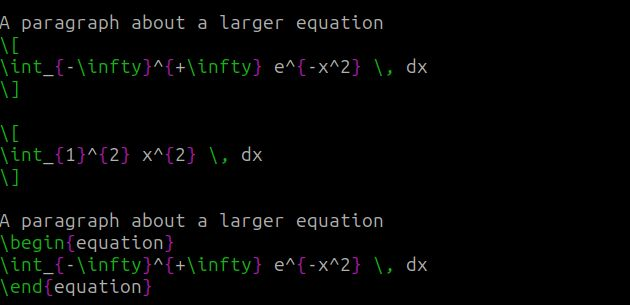
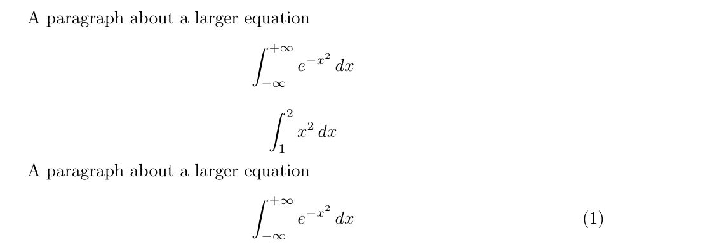
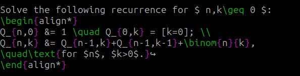
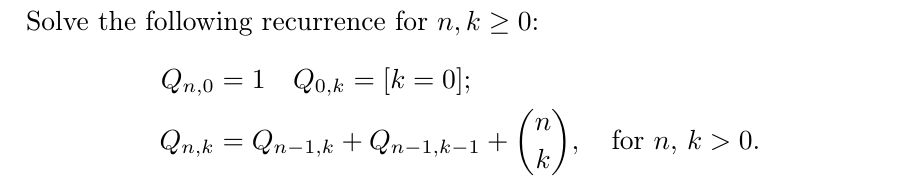
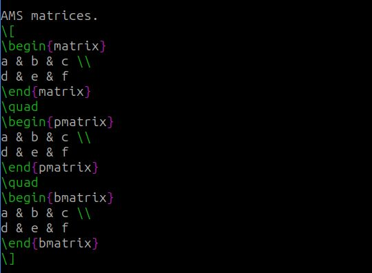
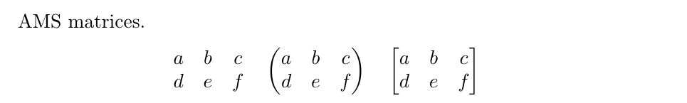
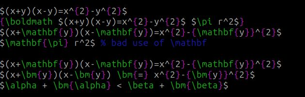
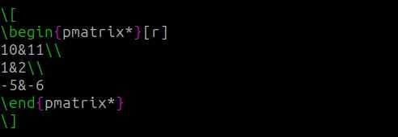

---
# Front matter
lang: ru-RU
title: "Лабораторная работа №3"
subtitle: "Дисциплина: Computer Skills for Scientific Writing"
author: "Дарижапов Тимур Андреевич"

# Formatting
toc-title: "Содержание"
toc: true # Table of contents
toc_depth: 2
lof: true # Список рисунков
lot: true # Список таблиц
fontsize: 12pt
linestretch: 1.5
papersize: a4paper
documentclass: scrreprt
polyglossia-lang: russian
polyglossia-otherlangs: english
mainfont: PT Serif
romanfont: PT Serif
sansfont: PT Sans
monofont: PT Mono
mainfontoptions: Ligatures=TeX
romanfontoptions: Ligatures=TeX
sansfontoptions: Ligatures=TeX,Scale=MatchLowercase
monofontoptions: Scale=MatchLowercase
indent: true
pdf-engine: lualatex
header-includes:
  - \linepenalty=10 # the penalty added to the badness of each line within a paragraph (no associated penalty node) Increasing the value makes tex try to have fewer lines in the paragraph.
  - \interlinepenalty=0 # value of the penalty (node) added after each line of a paragraph.
  - \hyphenpenalty=50 # the penalty for line breaking at an automatically inserted hyphen
  - \exhyphenpenalty=50 # the penalty for line breaking at an explicit hyphen
  - \binoppenalty=700 # the penalty for breaking a line at a binary operator
  - \relpenalty=500 # the penalty for breaking a line at a relation
  - \clubpenalty=150 # extra penalty for breaking after first line of a paragraph
  - \widowpenalty=150 # extra penalty for breaking before last line of a paragraph
  - \displaywidowpenalty=50 # extra penalty for breaking before last line before a display math
  - \brokenpenalty=100 # extra penalty for page breaking after a hyphenated line
  - \predisplaypenalty=10000 # penalty for breaking before a display
  - \postdisplaypenalty=0 # penalty for breaking after a display
  - \floatingpenalty = 20000 # penalty for splitting an insertion (can only be split footnote in standard LaTeX)
  - \raggedbottom # or \flushbottom
  - \usepackage{float} # keep figures where there are in the text
  - \floatplacement{figure}{H} # keep figures where there are in the text
---

# Цель работы

Изучить особенности математического набора в системе **LaTeX** , научиться использовать **математический режим (math mode)**, работать с пакетами **amsmath**, **amssymb**, **bm** и **mathtools**, а также освоить применение различных шрифтов и греческих символов при оформлении научных и технических текстов.

# Выполнение лабораторной работы

**Математический режим (Math Mode)**

**Код:**


**Пояснение:**
В данном разделе показано использование **математического режима**:

* **Встроенный (inline)** режим — используется для коротких формул в тексте и обозначается `$...$` или `\(...\)`.
  Пример: $y = mx + c$, $5^{2}=3^{2}+4^{2}$.
* **Выведенный (display)** режим — обозначается `\[...\]` и размещает формулу по центру на отдельной строке:
  $$
  y = mx + c
  $$
* Используются **верхние индексы** (`^`) и **нижние индексы** (`_`), а также стандартные функции, например `\sin`.
* Добавлен пример с греческой буквой `\theta`.

**Назначение:**
Показать различие между встроенным и отдельным математическим режимом и их влияние на форматирование текста.

---

#### **Отображаемая математика (Display Mathematics)**

**Код:**





**Пояснение:**
Демонстрируется использование **интегралов** и **нумерованных уравнений**:

* Символ интеграла `\int` имеет пределы интегрирования, задаваемые через `_` и `^`.
* Команда `\diff` определена как:

  ```latex
  \newcommand{\diff}{\mathop{}\!d}
  ```

  и используется для корректного отображения дифференциала ( d ).
* Окружение `equation` автоматически добавляет **нумерацию** формулы.

**Назначение:**
Изучить синтаксис длинных уравнений и способы добавления нумерации и интервалов в математическом режиме.

---

#### **Пакет amsmath**

**Код:**





**Пояснение:**
Пакет **amsmath** предоставляет расширенные возможности для работы с формулами:

* Окружение `align*` выравнивает уравнения по символу `&`.
* Команда `\quad` добавляет горизонтальный пробел.
* `\text{}` вставляет обычный текст внутрь формулы.
* `\binom{n}{k}` создаёт **биномиальные коэффициенты**.

**Назначение:**
Показать применение выравнивания формул и оформление нескольких строк уравнений.

---

#### **Матрицы AMS (AMS Matrices)**

**Код:**





**Пояснение:**
Здесь показано создание различных видов **матриц**:

* `matrix` — без скобок,
* `pmatrix` — в круглых скобках,
* `bmatrix` — в квадратных скобках.

**Назначение:**
Научиться оформлять матрицы с различными типами ограничивающих скобок.

---

#### **Шрифты в математическом режиме (Fonts in Math Mode)**

**Код:**


**Пояснение:**
Продемонстрированы различные команды изменения шрифта:

| Команда     | Назначение                      |
| ----------- | ------------------------------- |
| `\mathrm{}` | Прямое начертание               |
| `\mathit{}` | Курсив                          |
| `\mathbf{}` | Жирный шрифт                    |
| `\mathsf{}` | Без засечек                     |
| `\mathtt{}` | Моноширинный                    |
| `\mathbb{}` | Двойной штрих (blackboard bold) |

Команда `\text{}` позволяет вставлять обычный текст в математическом режиме с правильными интервалами.

**Назначение:**
Понять назначение и визуальные различия математических шрифтов.

---

#### **Дополнительные выравнивания amsmath (Further amsmath Alignments)**

**Код:**


**Пояснение:**

* `gather` — выравнивает несколько строк по центру.
* `multline` — используется для длинных формул, переносимых на несколько строк.
  Первая строка выравнивается влево, последняя — вправо.

**Назначение:**
Научиться красиво оформлять многострочные и громоздкие уравнения.

---

#### **Столбцы в математических выравниваниях (Columns in Math Alignments)**

**Код:**


**Пояснение:**

* `align*` создаёт таблицу уравнений, выравнивая их по знакам равенства.
* `aligned` используется внутри других формул для небольших систем уравнений.
* `[t]` задаёт выравнивание по верхней строке блока.

**Назначение:**
Освоить создание многоколонных структур уравнений и вложенных блоков.

---

#### **Жирный математический шрифт (Bold Math)**

**Код:**




**Пояснение:**

* `\boldmath` делает всю формулу жирной.
* `\mathbf{}` делает жирными только латинские буквы.
* `\bm{}` (из пакета **bm**) позволяет выделять жирным любые символы, включая греческие.

**Назначение:**
Продемонстрировать способы выделения важных элементов в формулах.

---

#### **Пакет mathtools**

**Код:**




**Пояснение:**
Пакет **mathtools** расширяет возможности **amsmath**.
Окружение `pmatrix*` с параметром `[r]` выравнивает элементы по правому краю.

**Назначение:**
Позволяет более точно управлять форматированием матриц и формул.

---

#### **Unicode Math**

**Код:**


**Пояснение:**
В этом разделе продемонстрировано использование **пакета `unicode-math`** с движком **LuaLaTeX** для работы с **OpenType-шрифтами**:

* Подключается пакет `unicode-math`, который позволяет использовать современные математические шрифты.
* Команды `\setmainfont` и `\setmathfont` задают основной и математический шрифты документа.
* Используются греческие буквы (`\alpha`, `\beta`) и различные математические начертания:
  `\symfrak{A}` (готический), `\symbf{A}` (жирный), `\symcal{A}` (каллиграфический), `\symscr{A}` (рукописный), `\symbb{A}` (двойной штрих).

**Назначение:**
Познакомиться с современным способом отображения математических шрифтов в LaTeX и возможностями использования Unicode-символов.

---

# Выводы

- Были изучены основные принципы математического набора в LaTeX, включая использование различных пакетов, режимов, шрифтов и символов, а также применение Unicode-математики. Полученные знания могут применяться при подготовке научных публикаций, отчётов и учебных материалов, требующих точного и аккуратного математического оформления.


