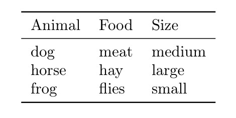
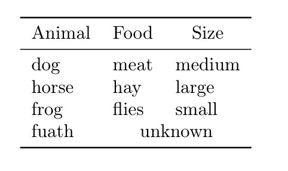
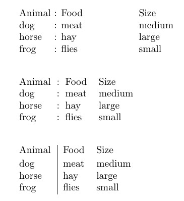
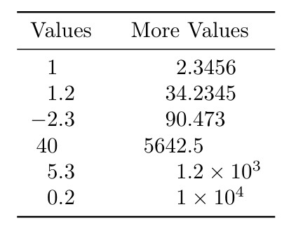
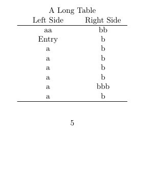
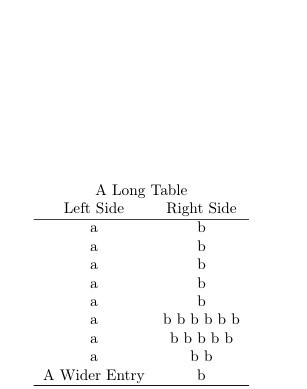
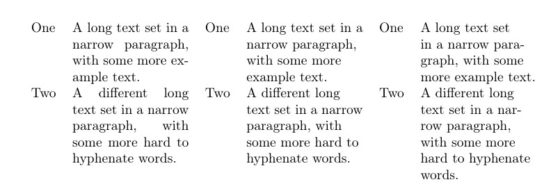
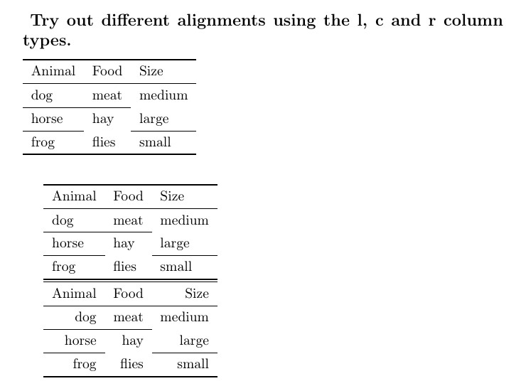
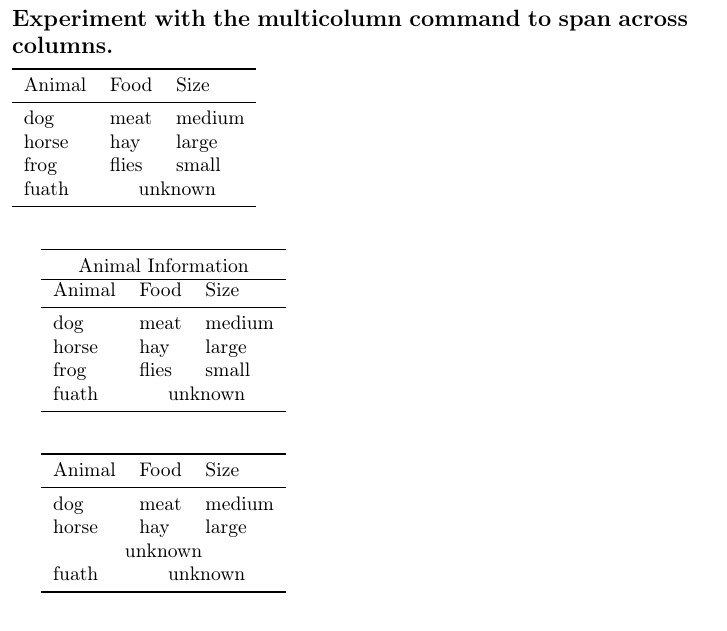

---
## Front matter
lang: ru-RU
title: Отчёт по лабораторной работе №5
author: Дарижапов Тимур Андреевич
institute: 
    - РУДН, Москва, Россия

date: \today

## Formatting
## i18n babel
babel-lang: russian
babel-otherlangs: english

## Formatting pdf
toc: false
toc-title: Содержание
slide_level: 2
aspectratio: 169
section-titles: true
theme: metropolis
header-includes:
 - \metroset{progressbar=frametitle,sectionpage=progressbar,numbering=fraction}

##{:class="img-responsive"}
##{:height="50%" width="50%"}
##{:height="700px" width="400px"}
##{height=25}{width=150}
---

# **Презентация по лабораторной работе №5**

## **Тема:**

**Таблицы в LaTeX: профессиональное оформление, выравнивание и расширенные приёмы**

## **Цель работы**

Изучить создание и оформление таблиц в LaTeX. Освоить пакеты `array`, `booktabs`, `tabularx`, `longtable`, `threeparttable`, `siunitx` и приёмы, позволяющие делать таблицы профессионального уровня.

## **Задачи**

1. Освоить базовый синтаксис окружения `tabular`.
2. Проработать типы выравнивания колонок: `l`, `c`, `r`, `p{}`.
3. Оформлять таблицы с помощью `booktabs` и частичных правил `\cmidrule`.
4. Уметь объединять ячейки через `\multicolumn`.
5. Применять числовое выравнивание с `siunitx` (`S`-колонки).
6. Управлять шириной и переносом: `tabular*`, `tabularx`.
7. Создавать многостраничные таблицы (`longtable`).
8. Добавлять сноски в таблицах (`threeparttable`).

## **Создание простой таблицы**

* Базовое окружение `tabular`, выравнивание `l l l`.

```latex
\begin{tabular}{lll}
Animal & Food & Size \\
dog & meat & medium \\
horse & hay & large \\
frog & flies & small \\
\end{tabular}
```

## Скриншот

{height=150}

## **Колонка фиксированной ширины (`p{}`)**

* Перенос длинных описаний внутри ячейки.

```latex
\begin{tabular}{cp{9cm}}
Animal & Description \\
dog & The dog is a member of the genus Canis, ...
\\
cat & The cat is a domestic species of small carnivorous mammal, ...
\end{tabular}
```

## Скриншот


## **Оформление `booktabs`**

* Типографские линии: `\toprule`, `\midrule`, `\bottomrule`.

```latex
\begin{tabular}{lll}
\toprule
Animal & Food & Size \\
\midrule
dog & meat & medium \\
horse & hay & large \\
frog & flies & small \\
\bottomrule
\end{tabular}
```

## Скриншот

{height=150}

## **Частичные линии — `\cmidrule`**

* Группировка и акцентирование колонок.

```latex
\begin{tabular}{lll}
\toprule
Animal & Food & Size \\
\midrule
dog & meat & medium \\
\cmidrule{1-2}
horse & hay & large \\
\cmidrule(r){1-1}\cmidrule(rl){2-2}\cmidrule(l){3-3}
frog & flies & small \\
\bottomrule
\end{tabular}
```

## Скриншот

{height=150}

## **Интервал между строками — `\addlinespace`**

* Повышение читаемости.

```latex
\begin{tabular}{cp{9cm}}
\toprule
Animal & Description \\
\midrule
dog & The dog is a member of the genus Canis, ... \\
\addlinespace
cat & The cat is a domestic species of small carnivorous mammal, ... \\
\bottomrule
\end{tabular}
```

## Скриншот


## **Объединение ячеек — `\multicolumn`**

* Центрирование заголовков, объединение «Food+Size».

```latex
\begin{tabular}{lll}
\toprule
\multicolumn{1}{c}{Animal} & \multicolumn{1}{c}{Food} & \multicolumn{1}{c}{Size} \\
\midrule
dog   & meat  & medium \\
horse & hay   & large \\
frog  & flies & small \\
fuath & \multicolumn{2}{c}{unknown} \\
\bottomrule
\end{tabular}
```

## Скриншот

{height=150}

## **Группировка строк**

* Визуальное объединение сущностей по категориям.

```latex
\begin{tabular}{lll}
\toprule
Group & Animal & Size \\
\midrule
herbivore & horse & large \\
          & deer  & medium \\
          & rabbit& small  \\
\addlinespace
carnivore & dog   & medium \\
          & cat   & small  \\
          & lion  & large  \\
\addlinespace
omnivore  & crow  & small  \\
          & bear  & large  \\
          & pig   & medium \\
\bottomrule
\end{tabular}
```

## Скриншот


## **Декораторы колонок: `>{}` и `<{}`**

* Автоформат для всей колонки (курсив + двоеточие).

```latex
\begin{tabular}{>{\itshape}l<{:} *{2}{l}}
\toprule
Animal & Food & Size \\
\midrule
dog & meat & medium \\
horse & hay & large \\
frog & flies & small \\
\bottomrule
\end{tabular}
```

## Скриншот

{height=150}

## **Отступы и границы**

* Межколоночные вставки `@{...}` и внутренние разделители.

```latex
\begin{tabular}{l@{ : }l@{\hspace{2cm}}l}
Animal & Food & Size \\
dog & meat & medium \\
horse & hay & large \\
frog & flies & small \\
\end{tabular}
```

```latex
\begin{tabular}{l!{:}ll}
Animal & Food & Size \\
dog & meat & medium \\
horse & hay & large \\
frog & flies & small \\
\end{tabular}
```

```latex
\begin{tabular}{l|ll}
Animal & Food & Size \\[2pt]
dog & meat & medium \\
horse & hay & large \\
frog & flies & small \\
\end{tabular}
```

## Скриншот



## **Толщина правил**

* Точный контроль визуального веса линий.

```latex
\begin{tabular}{@{} lll@{}} \toprule[2pt]
Animal & Food & Size \\ \midrule[1pt]
dog & meat & medium \\
\cmidrule[0.5pt](r{1pt}l{1cm}){1-2}
horse & hay & large \\
frog & flies & small \\ \bottomrule[2pt]
\end{tabular}
```

## Скриншот

{height=150}

## **Числовое выравнивание — `siunitx`**

* Выравнивание по десятичной точке (`S`-колонки).

```latex
\begin{tabular}{SS}
\toprule
{Values} & {More Values} \\
\midrule
1    & 2.3456 \\
1.2  & 34.2345 \\
-2.3 & 90.473 \\
40   & 5642.5 \\
5.3  & 1.2e3 \\
0.2  & 1e4 \\
\bottomrule
\end{tabular}
```

## Скриншот

{height=200}

## **Ширина и автоподбор**

* `tabular*` (растяжение по ширине), `tabularx` (автоширина колонки `X`).

```latex
\begin{center}
\begin{tabular*}{.5\textwidth}{@{\extracolsep{\fill}}cc@{}}
\hline
A & B\\
C & D\\
\hline
\end{tabular*}
\end{center}
```

```latex
\begin{center}
\begin{tabularx}{.5\textwidth}{lX}
\hline
A & B B B B B B B B B B B B B B B B B B B B B B B B\\
C & D D D D D D D\\
\hline
\end{tabularx}
\end{center}
```

## Скриншот


## **Многостраничные таблицы — `longtable`**

* Автоматический перенос с сохранением заголовка.

```latex
\begin{longtable}{cc}
\multicolumn{2}{c}{A Long Table}\\
Left Side & Right Side\\
\hline
\endhead
\hline
\endfoot
aa & bb\\
Entry & b\\
% ... длинный список ...
A Wider Entry & b\\
\end{longtable}
```

## Скриншот

{height=200}
{height=200}

## **Сноски в таблицах — `threeparttable`**

* Комментирование значений в подпояснениях.

```latex
\begin{table}
\begin{threeparttable}
\caption{An Example}
\begin{tabular}{ll}
An entry & 42\tnote{1}\\
Another entry & 24\tnote{2}\\
\end{tabular}
\begin{tablenotes}
\item [1] the first note.
\item [2] the second note.
\end{tablenotes}
\end{threeparttable}
\end{table}
```

## Скриншот

{height=150}

## **Типографика в узких колонках**

* Сравнение `p{}`, `\raggedright`, `\RaggedRight`.

```latex
\begin{table}
\begin{tabular}[t]{lp{3cm}}
One & A long text set in a narrow paragraph...\\
Two & A different long text set in a narrow paragraph...\\
\end{tabular}% 
\begin{tabular}[t]{l>{\raggedright\arraybackslash}p{3cm}}
One & A long text set in a narrow paragraph...\\
Two & A different long text set in a narrow paragraph...\\
\end{tabular}% 
\begin{tabular}[t]{l>{\RaggedRight}p{3cm}}
One & A long text set in a narrow paragraph...\\
Two & A different long text set in a narrow paragraph...\\
\end{tabular}
\end{table}
```

## Скриншот



## **Вертикальные «мини-таблицы» в ячейках**

* Совмещение подписи и значения.

```latex
\begin{tabular}{lcc}
\toprule
Test & \begin{tabular}{@{}c@{}}A\\a\end{tabular} & \begin{tabular}{@{}c@{}}B\\b\end{tabular} \\
\midrule
Content & is & here \\
Content & is & here \\
Content & is & here \\
\bottomrule
\end{tabular}
```

## Скриншот

{height=150}

## **Межстрочный интервал в таблице**

* Контроль читабельности.

```latex
\setlength\extrarowheight{2pt}
\begin{tabular}{cc}
\hline
Square & $x^2$\\
\hline
Cube & $x^3$\\
\hline
\end{tabular}
```

## Скриншот

{height=150}

## **Упражнения (5.14) — 1/5**

**1. Создание простой таблицы**
(базовый синтаксис `tabular`, разделение `&`, конец строки `\\`)

```latex
\begin{tabular}{lll}
Animal & Food & Size \\
dog & meat & medium \\
horse & hay & large \\
frog & flies & small \\
\end{tabular}
```

## Скриншот

{height=250}

## **Упражнения (5.14) — 2/5**

**2. Разные выравнивания (`l`, `c`, `r`)**
(сравнение трёх вариантов на одной таблице)

```latex
\begin{tabular}{lll} ... \end{tabular}
\begin{tabular}{lll} ... \end{tabular}
\begin{tabular}{rrr} ... \end{tabular}
```

## Скриншот

{height=290}

## **Упражнения (5.14) — 3/5**
(последняя ячейка остаётся пустой; ошибки нет)

```latex
\begin{tabular}{lll}
A & B & C \\
1 & 2 \\
\end{tabular}
```

## Скриншот

{height=150}

## **Упражнения (5.14) — 4/5**

**4. Избыток элементов в строке**
(предупреждение “Extra alignment tab has been changed to \verb|\cr|” — исправление: добавить колонку)

```latex
\begin{tabular}{llll}
A & B & C & D \\
1 & 2 & 3 & 4 \\
\end{tabular}
```

## Скриншот

{height=150}

## **Упражнения (5.14) — 5/5**

(заголовок на 3 колонки; объединение последних двух)

```latex
\begin{tabular}{lll}
\toprule
\multicolumn{3}{c}{Animal Information}\\
\midrule
dog & meat & medium \\
fuath & \multicolumn{2}{c}{unknown} \\
\bottomrule
\end{tabular}
```

## Скриншот



## **Результаты**

* Освоены: `tabular`, `p{}`, `booktabs`, `\cmidrule`, `\multicolumn`.
* Выполнено числовое выравнивание `siunitx` (`S`-колонки).
* Показан контроль ширины (`tabular*`, `tabularx`) и перенос (`longtable`).
* Продемонстрированы сноски в таблицах (`threeparttable`).
* Отработаны типичные ошибки выравнивания и их исправление.

## **Вывод**

В результате работы получены практические навыки профессионального оформления таблиц в LaTeX: аккуратные правила, корректное выравнивание текста и чисел, гибкое управление шириной и высотой строк, многостраничные таблицы и сноски. **Все задачи выполнены, цель достигнута.**

## **Список литературы**

1. Львовский С.М. *Набор и вёрстка в системе LaTeX*. Москва: МЦНМО, 2014. 400 с.

## {.standout}

Спасибо за внимание!
