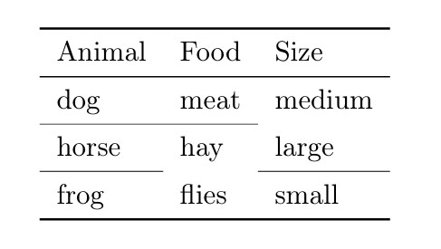
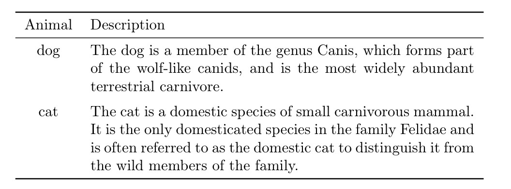
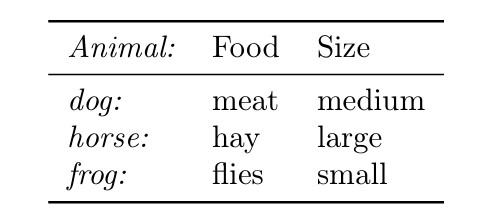
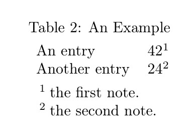

---
## Front matter
title: "Отчет по лабораторной работе №5"
subtitle: "Дисциплина: Computer Skills for Scientific Writing "
author: "Дарижапов Тимур Андреевич"

## Generic otions
lang: ru-RU
toc-title: "Содержание"

## Bibliography
bibliography: cite.bib
csl: pandoc/csl/gost-r-7-0-5-2008-numeric.csl
link-citations: true

## Pdf output format
toc: true # Table of contents
toc-depth: 2
lof: true # List of figures
lot: true # List of tables
fontsize: 12pt
linestretch: 1.5
papersize: a4
documentclass: scrreprt

## I18n babel
babel-lang: russian
babel-otherlangs: english
## Fonts
## Критически важные настройки для русского языка
mainfont: IBM Plex Serif
## I18n polyglossia
## Настройки для русского языка
polyglossia-lang:
  name: russian
  options:
    - spelling=modern
    - babelshorthands=true
polyglossia-otherlangs:
  name: english

romanfont: IBM Plex Serif
sansfont: IBM Plex Sans
monofont: IBM Plex Mono
mathfont: STIX Two Math
romanfontoptions: Ligatures=Common,Ligatures=TeX,Scale=0.94
sansfontoptions: Ligatures=Common,Ligatures=TeX,Scale=MatchLowercase,Scale=0.94
monofontoptions: Scale=MatchLowercase,Scale=0.94,FakeStretch=0.9
mathfontoptions:
## Pandoc-crossref LaTeX customization
figureTitle: "Рис."
tableTitle: "Таблица"
listingTitle: "Листинг"
# lofTitle: "Список иллюстраций"
# lotTitle: "Список таблиц"
# lolTitle: "Листинги"
## Misc options
indent: true
header-includes:
  - \usepackage{indentfirst}
  - \usepackage{float} # keep figures where there are in the text
  - \floatplacement{figure}{H} # keep figures where there are in the text
---

### **Лабораторная работа № 5. Таблицы в LaTeX**

### **Цель работы**

Изучить создание и оформление таблиц в системе LaTeX. Освоить пакеты `array`, `booktabs`, `tabularx`, `longtable`, `threeparttable`, `siunitx` и приёмы, позволяющие делать таблицы профессионального вида.

### **Задачи**

1. Научиться создавать таблицы в окружении `tabular`.
2. Изучить типы выравнивания колонок (`l`, `c`, `r`, `p{}`).
3. Освоить оформление таблиц с помощью `booktabs`.
4. Научиться объединять ячейки с `multicolumn`.
5. Освоить числовое выравнивание с `siunitx`.
6. Ознакомиться с таблицами переменной ширины (`tabularx`) и многостраничными (`longtable`).
7. Освоить добавление сносок в таблицах через `threeparttable`.
8. Выполнить упражнения 5.14 и проанализировать результат.

## **Ход работы**

### **1. Создание простой таблицы**

В начале создаётся минимальная таблица из трёх колонок. Каждая ячейка отделяется знаком \verb|&|, строка завершается \verb|\\|.

```latex
\begin{tabular}{lll}
Animal & Food & Size \\
dog & meat & medium \\
horse & hay & large \\
frog & flies & small \\
\end{tabular}
```


Были созданы три колонки и четыре строки. Таблица без границ, используется базовое окружение `tabular`.

### **2. Использование колонки фиксированной ширины**

Для длинных текстов применяется тип колонки `p{}` с указанием ширины, что позволяет переносить текст внутри ячейки.

```latex
 \begin{tabular}{cp{9cm}}
 Animal & Description \\
 dog  & The dog is a member of the genus Canis, which forms part of the
   wolf-like canids, and is the most widely abundant
 terrestrial carnivore. \\
 
 cat & The cat is a domestic species of small carnivorous mammal. It is
  the  only domesticated species in the family Felidae and is often referred
    to as the domestic cat to distinguish it from the wild members of the family. \\

 \end{tabular}
```


Во второй колонке задан параметр `p{9cm}`. Это позволяет ограничить ширину ячейки и автоматически переносить строки при необходимости.

### **3. Добавление линий и оформление таблиц**

Для профессионального оформления использован пакет `booktabs`. Он заменяет `hline` на аккуратные типографские линии.

```latex
\begin{tabular}{lll}
\toprule
Animal & Food & Size \\
\midrule
dog & meat & medium \\
horse & hay & large \\
frog & flies & small \\
\bottomrule
\end{tabular}
```


Линии `toprule`, `midrule`, `bottomrule` формируют верхнюю, среднюю и нижнюю границы таблицы. Таблица приобретает печатный вид.

### **4. Частичные линии textbackslash cmidrule**

Команда `cmidrule` даёт возможность проводить линии только под некоторыми колонками, что удобно при группировке данных.

```latex
\begin{tabular}{lll}
\toprule
Animal & Food & Size \\
\midrule
dog & meat & medium \\
\cmidrule{1-2}
horse & hay & large \\
\cmidrule(r){1-1}\cmidrule(rl){2-2}\cmidrule(l){3-3}
frog & flies & small \\
\bottomrule
\end{tabular}
```



Различные варианты `cmidrule` ограничивают длину линий и создают визуальные блоки в таблице.

### **5. Добавление интервала между строками**

Чтобы улучшить читаемость таблицы, используется `addlinespace`, добавляющая небольшой промежуток между строками.

```latex
\begin{tabular}{cp{9cm}}
\toprule
Animal & Description \\
\midrule
dog & The dog is a member of the genus Canis, which forms part of the wolf-like canids... \\
\addlinespace
cat & The cat is a domestic species of small carnivorous mammal... \\
\bottomrule
\end{tabular}
```



После строки с `dog` добавлен дополнительный вертикальный отступ, что делает таблицу более аккуратной.

### **6. Объединение ячеек textbackslash multicolumn**

Команда `multicolumn` используется для объединения нескольких колонок в одной ячейке — например, для заголовков.

```latex
\begin{tabular}{lll}
\toprule
\multicolumn{1}{c}{Animal} & \multicolumn{1}{c}{Food} & \multicolumn{1}{c}{Size} \\
\midrule
dog & meat & medium \\
horse & hay & large \\
frog & flies & small \\
fuath & \multicolumn{2}{c}{unknown} \\
\bottomrule
\end{tabular}
```


Три колонки в заголовке выравнены по центру, а в последней строке ячейки Food и Size объединены в одну.

### **7. Группировка данных в таблице**

```latex
\begin{tabular}{lll}
\toprule
Group & Animal & Size \\
\midrule
herbivore & horse & large \\
          & deer & medium \\
          & rabbit & small \\
\addlinespace
carnivore & dog & medium \\
          & cat & small \\
          & lion & large \\
\addlinespace
omnivore & crow & small \\
          & bear & large \\
          & pig & medium \\
\bottomrule
\end{tabular}
```


Первая колонка содержит названия групп (травоядные, плотоядные, всеядные). Пустые ячейки оставлены для визуального объединения строк внутри группы.

### **8. Использование декораторов в колонках**

С помощью `>{}` и `<{}` можно добавлять оформление к отдельным колонкам.

```latex
\begin{tabular}{>{\itshape}l<{:} *{2}{l}}
\toprule
Animal & Food & Size \\
\midrule
dog & meat & medium \\
horse & hay & large \\
frog & flies & small \\
\bottomrule
\end{tabular}
```



Названия животных показаны курсивом, а после них автоматически ставится двоеточие.

### **9. Межколоночные отступы и границы**

Варианты оформления с разными отступами и разделителями.

```latex
\begin{tabular}{l@{ : }l@{\hspace{2cm}}l}
Animal & Food & Size \\
dog & meat & medium \\
horse & hay & large \\
frog & flies & small \\
\end{tabular}

\begin{tabular}{l!{:}ll}
Animal & Food & Size \\
dog & meat & medium \\
horse & hay & large \\
frog & flies & small \\
\end{tabular}

\begin{tabular}{l|ll}
Animal & Food & Size \\[2pt]
dog & meat & medium \\
horse & hay & large \\
frog & flies & small \\
\end{tabular}
```


Различные варианты показывают, как можно управлять расстоянием между колонками и вставлять дополнительные разделители внутри таблицы.

### **10. Регулировка толщины линий**

```latex
\begin{tabular}{@{} lll@{}} \toprule[2pt]
Animal & Food & Size \\ \midrule[1pt]
dog & meat & medium \\
\cmidrule[0.5pt](r{1pt}l{1cm}){1-2}
horse & hay & large \\
frog & flies & small \\ \bottomrule[2pt]
\end{tabular}
```


Команды `toprule[2pt]`, `midrule[1pt]`, `cmidrule[0.5pt]` меняют толщину линий, что позволяет визуально разделять части таблицы.

### **11. Числовое выравнивание siunitx**

```latex
\begin{tabular}{SS}
\toprule
{Values} & {More Values} \\
\midrule
1    & 2.3456 \\
1.2  & 34.2345 \\
-2.3 & 90.473 \\
40   & 5642.5 \\
5.3  & 1.2e3 \\
0.2  & 1e4 \\
\bottomrule
\end{tabular}
```


Пакет `siunitx` автоматически выравнивает числа по десятичной точке, делая таблицу читабельной для сравнения значений.

### **12. Задание ширины таблицы и автоподбор**

```latex
\begin{center}
\begin{tabular*}{.5\textwidth}{@{\extracolsep{\fill}}cc@{}}
\hline
A & B\\
C & D\\
\hline
\end{tabular*}
\end{center}

\begin{center}
\begin{tabularx}{.5\textwidth}{lX}
\hline
A & B B B B B B B B B B B B B B B B B B B B B B B B\\
C & D D D D D D D\\
\hline
\end{tabularx}
\end{center}
```


`tabular*` растягивает таблицу на заданную долю ширины страницы, а `tabularx` автоматически подбирает ширину последней колонки для равномерного заполнения пространства.

### **13. Многостраничные таблицы**

```latex
 \begin{longtable}{cc}
 \multicolumn{2}{c}{A Long Table}\\
 Left Side & Right Side\\
 \hline
 \endhead
 \hline
 \endfoot
 aa & bb\\
 Entry & b\\
 a & b\\
 a & b\\
 a & b\\
 a & b\\
 a & bbb\\
 a & b\\
 a & b\\
 a & b\\
 a & b\\
 a & b\\
 a & b\\
 a & b b b b b b\\
 a & b b b b b\\
 a & b b\\
 A Wider Entry & b\\
 \end{longtable}
```


Окружение `longtable` позволяет таблице автоматически переноситься на новую страницу, сохраняя заголовки.

### **14. Таблицы со сносками threeparttable**

```latex
\begin{table}
\begin{threeparttable}
\caption{An Example}
\begin{tabular}{ll}
An entry & 42\tnote{1}\\
Another entry & 24\tnote{2}\\
\end{tabular}
\begin{tablenotes}
\item [1] the first note.
\item [2] the second note.
\end{tablenotes}
\end{threeparttable}
\end{table}
```



Пакет `threeparttable` добавляет сноски к таблицам в виде пронумерованных заметок под основным содержимым.

### **15. Типографика в узких колонках**

```latex
\begin{table}
\begin{tabular}[t]{lp{3cm}}
One & A long text set in a narrow paragraph...\\
Two & A different long text set in a narrow paragraph...\\
\end{tabular}%
\begin{tabular}[t]{l>{\raggedright\arraybackslash}p{3cm}}
One & A long text set in a narrow paragraph...\\
Two & A different long text set in a narrow paragraph...\\
\end{tabular}%
\begin{tabular}[t]{l>{\RaggedRight}p{3cm}}
One & A long text set in a narrow paragraph...\\
Two & A different long text set in a narrow paragraph...\\
\end{tabular}
\end{table}
```


Показано сравнение разных способов выравнивания текста в узких колонках (`left`, `raggedright`, `RaggedRight`).

---

### **16. Вертикальное выравнивание в ячейках**

```latex
\begin{tabular}{lcc}
\toprule
Test & \begin{tabular}{@{}c@{}}A\\a\end{tabular} & 
\begin{tabular}{@{}c@{}}B\\b\end{tabular} \\
\midrule
Content & is & here \\
Content & is & here \\
Content & is & here \\
\bottomrule
\end{tabular}
```


Комбинированные таблицы в ячейках (`@{}c@{}`) используются для вертикального совмещения текста и подписей.

### **17. Регулировка межстрочного интервала**

```latex
\setlength\extrarowheight{2pt}
\begin{tabular}{cc}
\hline
Square & $x^2$\\
\hline
Cube & $x^3$\\
\hline
\end{tabular}
```


Команда `setlength extrarowheight{2pt}` увеличивает высоту строк, что повышает читабельность таблицы.

## **Выполнение упражнений (раздел 5.14 Exercises)**

1. **Создание простой таблицы**

Для начала работы в LaTeX была создана самая простая таблица с тремя колонками: «Animal», «Food» и «Size».
Каждая ячейка таблицы отделяется символом `&`, а строки завершаются двойным обратным слэшем `\\`.
Это базовый синтаксис окружения `tabular`, который используется во всех примерах ниже.

```latex
 \begin{tabular}{lll}
 Animal & Food & Size \\
 dog & meat & medium \\
 horse & hay & large \\
 frog & flies & small \\
 \end{tabular}

 \begin{tabular}{lll}
 Animal & Food  \\
 dog & meat  \\
 horse & hay  \\
 frog & flies \\
 \end{tabular}

 \begin{tabular}{lll}
 Animal & Food & Size \\
 dog & meat & medium \\
 horse & hay & large \\
 \end{tabular}

```


В данном примере каждая строка таблицы содержит три элемента: название животного, его тип пищи и размер.
Параметр `{lll}` в объявлении окружения указывает, что все три колонки выравниваются по левому краю.
Такой формат подходит для простых таблиц, не требующих сложного оформления.
На выходе получается базовая структура, которая будет использоваться далее для демонстрации различных приёмов оформления таблиц в LaTeX.

2. **Проверка разных типов выравнивания.**  
   Для той же таблицы использовались разные типы колонок — `l`, `c`, `r`.  
   Это позволило сравнить, как изменяется расположение текста внутри ячеек:  
   слева (`l`), по центру (`c`) и справа (`r`).  

```latex
 \begin{tabular}{lll}
 \toprule
 Animal & Food & Size \\
 \midrule
 dog & meat & medium \\
 \cmidrule{1-2}
 horse & hay & large \\
 \cmidrule{1-1}
 \cmidrule{3-3}
 frog & flies & small \\
 \bottomrule
 \end{tabular}

 \begin{tabular}{lll}
 \toprule
 Animal & Food & Size \\
 \midrule
 dog & meat & medium \\
 \cmidrule{1-2}
 horse & hay & large \\
 \cmidrule{1-1}
 \cmidrule{3-3}
 frog & flies & small \\
 \bottomrule
 \end{tabular}

 \begin{tabular}{rrr}
 \toprule
 Animal & Food & Size \\
 \midrule
 dog & meat & medium \\
 \cmidrule{1-2}
 horse & hay & large \\
 \cmidrule{1-1}
 \cmidrule{3-3}
 frog & flies & small \\
 \bottomrule
 \end{tabular}
```


3. **Недостаток элементов в строке.**
   При создании строки с меньшим количеством элементов LaTeX оставляет последнюю ячейку пустой, не вызывая ошибок.

```latex
\begin{tabular}{lll}
A & B & C \\
1 & 2 \\
\end{tabular}

```


4. **Избыток элементов в строке.**
   При добавлении лишнего символа \verb|&| возникает предупреждение
   “Extra alignment tab has been changed to \verb|\cr|”.
   Для исправления нужно добавить дополнительную колонку.

```latex
\begin{tabular}{llll}
A & B & C & D \\
1 & 2 & 3 & 4 \\
\end{tabular}
```


5. **Применение команды `multicolumn`.**
   В упражнении проверено объединение ячеек с помощью `multicolumn`.
   Эта команда позволила сделать заголовок, охватывающий все три колонки,
   а также объединить ячейки в последней строке таблицы.

```latex
 \begin{tabular}{lll}
 \toprule
 Animal & Food & Size \\
 \midrule
 dog & meat & medium \\
 horse & hay & large \\
 frog & flies & small \\
 fuath & \multicolumn{2}{c}{unknown} \\
 \bottomrule
 \end{tabular}

 \begin{tabular}{lll}
 \toprule
 \multicolumn{3}{c}{Animal Information}\\
\hline
 Animal & Food & Size \\
 \midrule
 dog & meat & medium \\
 horse & hay & large \\
 frog & flies & small \\
 fuath & \multicolumn{2}{c}{unknown} \\
 \bottomrule
 \end{tabular}

 \begin{tabular}{lll}
 \toprule
 Animal & Food & Size \\
 \midrule
 dog & meat & medium \\
 horse & hay & large \\
\multicolumn{3}{c}{unknown} \\
 fuath & \multicolumn{2}{c}{unknown} \\
 \bottomrule
 \end{tabular}
```


Команда `multicolumn{3}{c}{...}` объединяет три колонки и выравнивает текст по центру,
а `multicolumn{2}{c}{unknown}` объединяет две последние колонки для общего значения.

## **Результаты**

* На практике изучены все основные приёмы построения таблиц в LaTeX.
* Проверено оформление таблиц с помощью пакета `booktabs`.
* Освоены команды `multicolumn` и `cmidrule`, а также создание таблиц с группами строк.
* Продемонстрировано использование `p{}` для ограничения ширины колонки и автоматических переносов строк.
* Освоены многостраничные таблицы (`longtable`) и таблицы с автоматической шириной (`tabularx`).
* Выполнены все упражнения раздела 5.14, показаны типичные ошибки при избыточных и недостаточных элементах строки.

### **Вывод**

В ходе лабораторной работы изучены основные возможности LaTeX для создания и форматирования таблиц.
Получены практические навыки использования пакетов `array`, `booktabs`, `tabularx`, `longtable`, `threeparttable` и `siunitx`.
Проведены эксперименты по объединению ячеек, выравниванию текста и чисел, настройке ширины и высоты строк.
Все задачи выполнены, цель работы достигнута.

### Список литературы {.unnumbered}

@book


