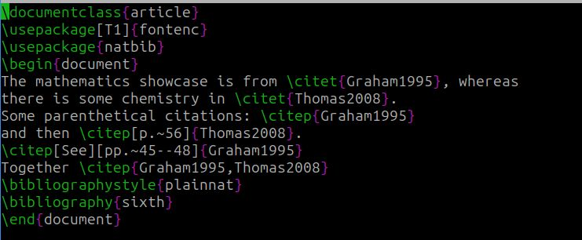
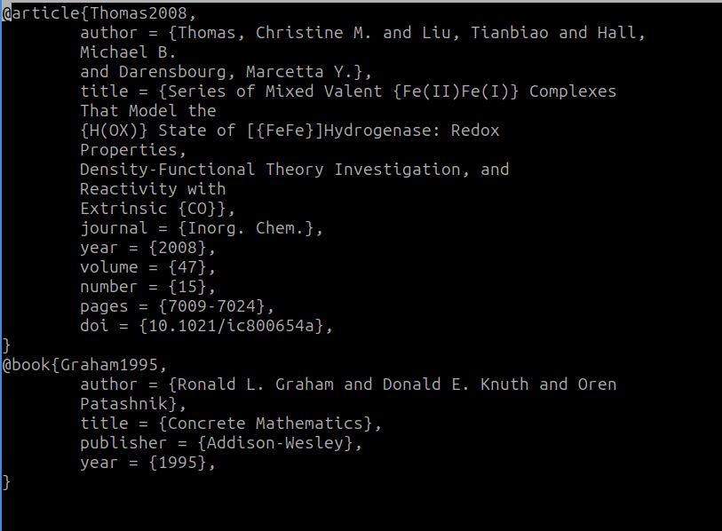
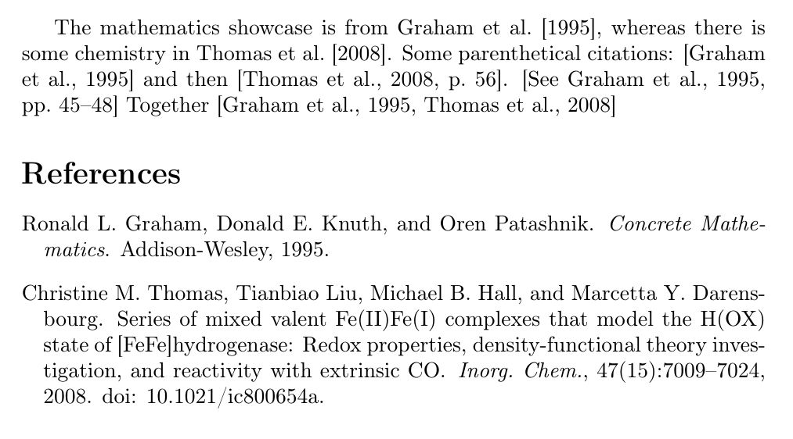

---
## Front matter
lang: ru-RU
title: Отчёт по лабораторной работе №6
author: Дарижапов Тимур Андреевич
institute: 
    - РУДН, Москва, Россия

date: \today

## Formatting
## i18n babel
babel-lang: russian
babel-otherlangs: english

## Formatting pdf
toc: false
toc-title: Содержание
slide_level: 2
aspectratio: 169
section-titles: true
theme: metropolis
header-includes:
 - \metroset{progressbar=frametitle,sectionpage=progressbar,numbering=fraction}

##{:class="img-responsive"}
##{:height="50%" width="50%"}
##{:height="700px" width="400px"}
##{height=25}{width=150}
---

# **Презентация по лабораторной работе №6**

## **Тема:**

**Библиография в LaTeX**

## **Цель работы**

Научиться работать с системой библиографических ссылок BibTeX и BibLaTeX и оформлять цитирования в соответствии с требованиями научных публикаций.


## **Создание файла .tex**



## **Создание файла .bib**



## **Компиляция**

Компиляция файла с библиографией происходит с помощью комбинации следующих команд:

```
pdflatex sixth.tex
bibtex sixth.aux
pdflatex sixth.tex
pdflatex sixth.tex
```
Я назвал файлы именем sixth.tex и sixth.bib. Команда bibtex sixth.aux ищет файл sixth.bib для оформления библиографии.

## **Итог выполнения**




## **Вывод**

Я научился работать с системой библиографических ссылок BibTeX и BibLaTeX и оформлять цитирования в соответствии с требованиями научных публикаций.


## {.standout}

Спасибо за внимание!
