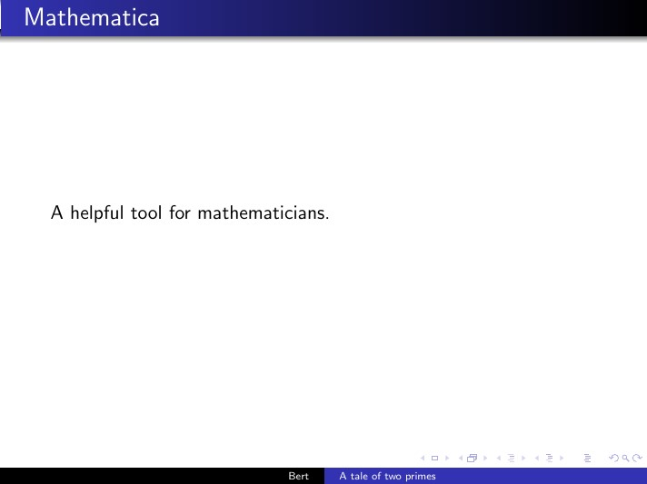
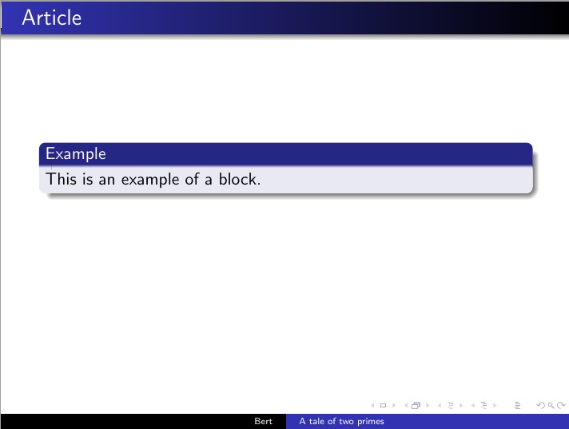
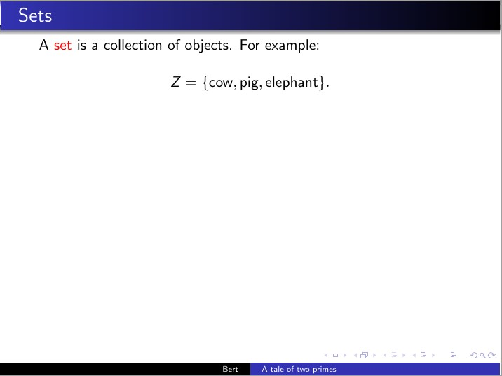
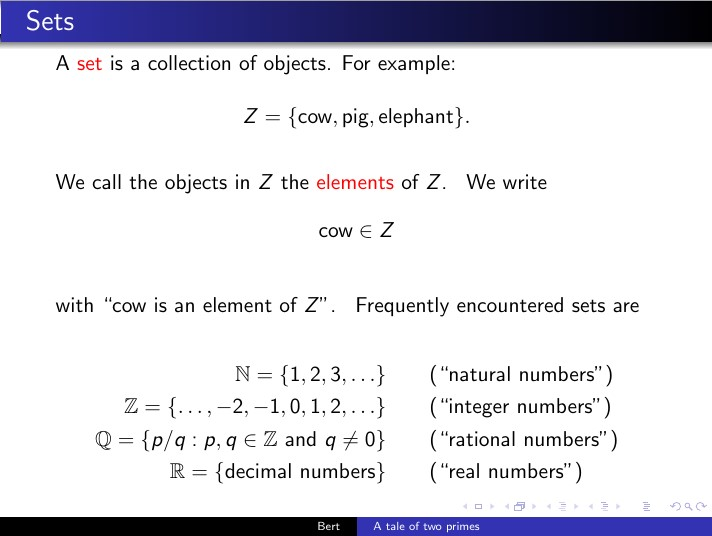
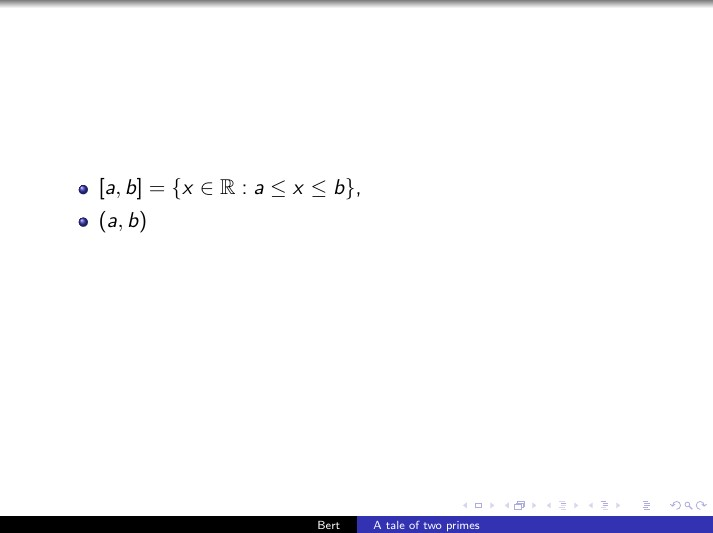
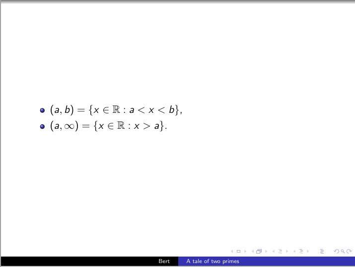
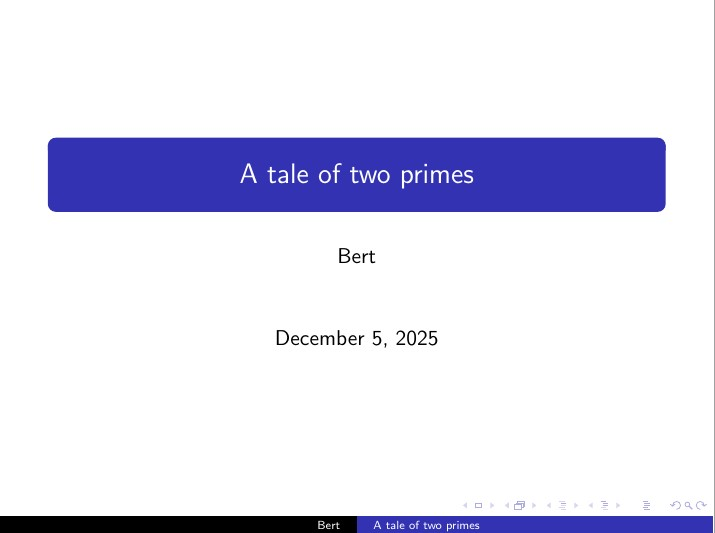
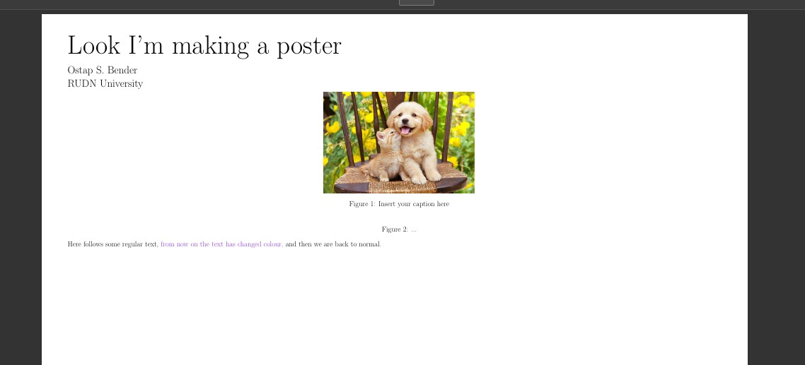

---
## Front matter
lang: ru-RU
title: Отчёт по лабораторной работе №7
author: Дарижапов Тимур Андреевич
institute: 
    - РУДН, Москва, Россия

date: \today

## Formatting
## i18n babel
babel-lang: russian
babel-otherlangs: english

## Formatting pdf
toc: false
toc-title: Содержание
slide_level: 2
aspectratio: 169
section-titles: true
theme: metropolis
header-includes:
 - \metroset{progressbar=frametitle,sectionpage=progressbar,numbering=fraction}

##{:class="img-responsive"}
##{:height="50%" width="50%"}
##{:height="700px" width="400px"}
##{height=25}{width=150}
---

# **Лабораторная работа №7**

## **Тема**

Презентации и постеры в LaTeX:  
`beamer`, `a0poster`, `beamerposter`, `tikzposter`.

## **Цель и задачи**

- Освоить создание презентаций в классе `beamer`.
- Изучить оверлеи: `\pause`, `\uncover<...->{...}`.
- Реализовать три типа постеров:
  - `a0poster`
  - `beamerposter`
  - `tikzposter`
- Связать примеры с пунктами главы 7 книги.

# **7.1 Презентация с Beamer**

## **7.1.1 Структура презентации — идея**

- Класс документа: `beamer`.
- Заголовок и автор:
  - `\title{...}`
  - `\author{...}`
- Каждый слайд — окружение `frame`.
- Первый слайд — титульный (`\titlepage`).
- Содержательные части — в `\begin{frame}{Заголовок} ...`.

## Ключевая конструкция

Ключевая конструкция:

```latex
\documentclass{beamer}
\usetheme{Warsaw}

\title{A tale of two primes}
\author{Bert}
...
\begin{frame}
  \titlepage
\end{frame}
```

## **7.1.1 Структура презентации — блоки**

Для структурирования информации используются блоки:

```latex
\begin{frame}{Article}
  \begin{block}{Example}
    This is an example of a block.
  \end{block}
  ...
\end{frame}
```

* `\begin{block}{Example} ... \end{block}`:

  * заголовок блока;
  * визуальное выделение важного фрагмента.

## **Скриншоты:**

{height=170}
{height=170}

## **7.1.2 Pauses — пошаговое появление**

Идея:

* `\pause` делит кадр на несколько фаз.
* Всё, что идёт **после** `\pause`, появляется **на следующем клике**.
* Подходит для поэтапного объяснения.

## Пример

Пример:

```latex
\begin{frame}{Article}
  \begin{block}{Example}
    This is an example of a block.
  \end{block}

  \pause  % после этого появится только со второго шага

  \begin{block}{Euclid's theorem}
    This is a theorem.
  \end{block}
\end{frame}
```

## **7.1.2 Pauses — визуальный эффект**

* Шаг 1:

  * виден только блок *Example*.
* Шаг 2:

  * дополнительно появляется блок *Euclid's theorem*.
* Таким образом можно управлять темпом объяснения.

## **Скриншоты:**

{height=170}
{height=170}

## **7.1.3 Uncover — общая идея**

Оверлей с явным номером шага:

```latex
\uncover<k->{ ... }
```

* контент внутри фигурных скобок:
  * **скрыт** на шагах < k;
  * **виден** на шагах (\ge k).
* можно применять к:
  * тексту;
  * формулам;
  * элементам списка.

Далее три примера:

1. слайд *Sets*;
2. формула в `align*`;
3. список интервалов.

## **7.1.3a Uncover в тексте и формулах (Sets)**

Основной приём: постепенно раскрывать определение множества и стандартные множества `(\mathbb{N},\mathbb{Z},\mathbb{Q},\mathbb{R})`.

Фрагмент кода:

```latex
A \alert{set} is a collection of objects.\uncover<2->{ For example:

\[
Z=\{\text{cow},\text{pig},\text{elephant}\}.
\]
}

\uncover<3->{We call the objects in \(Z\) the \alert{elements} of \(Z\).}
...
\uncover<7->{\mathbb{N}} \uncover<8->{= \{1,2,3,\ldots \}} ...
```

## **7.1.3a Uncover (Sets) — эффект**

* Шаги:

  1. Определение множества.
  2. Пример множества (Z).
  3. Определение элементов.
  4. Запись `\text{cow} \in Z`.
  5. Комментарий к записи.
  6. Заголовок: часто встречающиеся множества.
     7–18. Появление `\mathbb{N},\mathbb{Z},\mathbb{Q},\mathbb{R}` и их описаний.

## **Скриншоты:**

{height=170}
{height=170}

## **7.1.3b Uncover в `align*` — идея**

Задача: показать, как по шагам выводится правило производной произведения:

$$
f(x) = g(x)\cdot h(x),\quad g(x)=x^2,\quad h(x)=\sin(x).
$$

Ключевой фрагмент:

```latex
\begin{align*}
  f'(x)
    &\uncover<2->{= g'(x) \cdot h(x)}
     \uncover<3->{+ g(x) \cdot h'(x)} \\
    &\uncover<4->{= 2x \cdot \sin(x)}
     \uncover<5->{+ x^2 \cdot \cos(x).}
\end{align*}
```

## **7.1.3b Uncover в `align*` — эффект**

* Шаг 1: видно только $f'(x)$.
* Шаг 2: появляется $= g'(x)\cdot h(x)$.
* Шаг 3: добавляется $+ g(x)\cdot h'(x)$.
* Шаг 4–5: раскрываются конкретные выражения $2x\sin x$ и $x^2\cos x$.

## **Скриншот:**

{height=290}

## **7.1.3c Uncover в списке — идея**

Можно задавать диапазоны шагов для элементов списка:

* `\item<4-6>` — пункт виден **только** с 4-го по 6-й шаг;
* `\item<6->` — виден **с 6-го шага и далее**.

Комбинация с `\uncover` внутри:

```latex
\item<4-6> \([a,b]\uncover<5-6>{=\{x\in\mathbb{R}: a\le x\le b\}}\),
```

## **7.1.3c Uncover в списке — пример**

Полный фрагмент:

```latex
\begin{frame}
  \begin{itemize}
    \item<4-6> \([a,b]\uncover<5-6>{=\{x\in\mathbb{R}: a\le x\le b\}}\),
    \item<6->  \((a,b)\uncover<7->{=\{x\in\mathbb{R}: a< x< b\}}\),
    \item<8->  \((a,\infty)\uncover<9->{=\{x\in\mathbb{R}: x>a\}}\).
  \end{itemize}
\end{frame}
```

## **Скриншоты:**

{height=170}
{height=170}

## **7.1.4 Оформление (Layout)**

Смена темы оформления:

```latex
\documentclass{beamer}
\usetheme{Warsaw}
% при необходимости:
% \usecolortheme{beaver}
```

* Логика кода не меняется.
* Меняется цветовая схема, оформление заголовков, панель навигации.
* Соответствует разделу 7.1.4.

## **Скриншот:**

{height=290}


# **7.2 Постеры**

## **7.2.1 Три подхода — обзор**

* **`a0poster`**

  * Класс документа для формата $A0$.
  * Похож на `article`, много колонок через `multicols`.
* **`beamerposter`**

  * Пакет к `beamer`, один `frame` = весь постер.
  * Вёрстка через `columns`.
* **`tikzposter`**

  * Класс, основанный на TikZ-блоках.
  * Использует `\block` и `\note`.

Далее по одному простому примеру для каждого подхода.

## **7.2.2 `a0poster` — шапка и структура**

Ключевые элементы:

```latex
\documentclass[a0, portrait]{a0poster}
\begin{document}
\begin{minipage}{.7\textwidth}
  \VeryHuge Look I'm making a poster \\[0.75cm]
  \Large Ostap S. Bender \\
  \Large RUDN University
\end{minipage}
\begin{minipage}{.3\textwidth}
  % место под логотип
\end{minipage}
...
\end{document}
```

* Формат постера: A0, книжная ориентация.
* Заголовок и авторы — в левой `minipage`.
* Правая `minipage` — под логотип или контактную информацию.

## **7.2.2 `a0poster` — рисунки и колонки**

Рисунки и TikZ-графика:

```latex
\begin{center}
  \includegraphics{image.jpg}
  \captionof{figure}{Insert your caption here}
\end{center}

\begin{center}
  \begin{tikzimageture}
    ...
  \end{tikzimageture}
  \captionof{figure}{...}
\end{center}
```

## **Скриншот:**

{height=290}

## **7.2.3 `beamerposter` — общая идея**

* Вычисление макета постера средствами `beamer`.
* Постер — один `frame` на формате A0.
* Вёрстка через `\begin{columns}...\end{columns}`.

## Заголовок и базовая структура

Заголовок и базовая структура:

```latex
\documentclass[xcolor={svgnames}]{beamer}
\usetheme{default}
\usecolortheme{seahorse}
\usepackage[orientation=portrait,size=a0,scale=1.4]{beamerposter}

\title{Look I'm making a poster}
\author{Ostap S. Bender}
\institute{RUDN University}
...
\begin{document}
\begin{frame}
  ...
\end{frame}
\end{document}
```

## **7.2.3 `beamerposter` — колонки постера**

Две «строки» колонок:

```latex
\begin{columns}
  \begin{column}{.33\textwidth}
    Hello there lets output 123
  \end{column}
  \begin{column}{.33\textwidth}
    and now we output 456
  \end{column}
  \begin{column}{.33\textwidth}
    lets not forget about 789
  \end{column}
\end{columns}
```

## **7.2.3a `beamerposter` — колонки постера**

```latex
\begin{columns}
  \begin{column}{.7\textwidth}
    and in the end here goes 10
  \end{column}
  \begin{column}{.3\textwidth}
    finish
  \end{column}
\end{columns}
```

## **Скриншот:**

{height=290}

## **7.2.4 `tikzposter` — общая идея**

* Класс `tikzposter` использует готовые TikZ-темы.
* Макет состоит из колонок и блоков `\block`.
* Можно добавлять комментарии-заметки `\note`.

## Заголовок и первые колонки

Заголовок и первые колонки:

```latex
\documentclass[24pt,a0paper,portrait]{tikzposter}
\usetheme{Simple}
\title{Look I'm making a poster}
\author{Ostap S. Bender}
\institute{RUDN University}
\begin{document}
\maketitle
\begin{columns}
  \column{.33} Hello there lets output 123
  \column{.33} and now we output 456
  \column{.33} lets not forget about 789
\end{columns}
```

## **7.2.4 `tikzposter` — блок и заметка**

Блок с рисунком и заметкой:

```latex
\begin{columns}
  \column{.7}
    and in the end here goes 10
  \column{.3}
    finish
    \block{title}{content \vspace{2cm}
      \begin{center}
        \includegraphics{image.jpg}
        \captionof{figure}{Insert your caption here}
      \end{center}
      \begin{center}
        \begin{tikzimageture}
          ...
        \end{tikzimageture}
        \captionof{figure}{...}
      \end{center}
    }
    \note[targetoffsetx=2cm,targetoffsety=-1cm,width=5cm]{note content}
\end{columns}
```

## **Скриншот:**

{height=290}

# **Итоги**

## **Результаты**

* Реализованы примеры из раздела 7.1:

  * структура презентации `beamer`;
  * пошаговое появление с помощью `\pause` и `\uncover`.
* Реализованы три варианта постеров (7.2):

  * `a0poster` — классический постер;
  * `beamerposter` — постер в стиле презентации;
  * `tikzposter` — блочный постер с заметками.
* Показано, какие именно строчки кода отвечают за ключевые эффекты.

## **Вывод**

* Освоены базовые техники презентаций и постеров в LaTeX.
* Выделены важные элементы кода:

  * `\pause`, `\uncover<k->{...}`, `frame`, `columns`, `block`, `note`.
* Получены рабочие шаблоны, которые можно дальше развивать для курсовых, выступлений и научных конференций.

**Все задачи лабораторной работы №7 выполнены, цель достигнута.**

## **Список литературы**

1. Львовский С.М. *Набор и вёрстка в системе LaTeX*. Москва: МЦНМО, 2014. 400 с.

## {.standout}

Спасибо за внимание!

