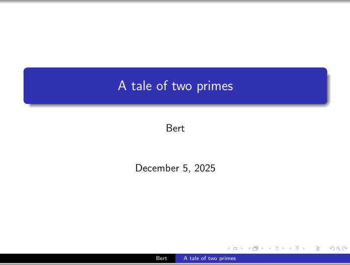
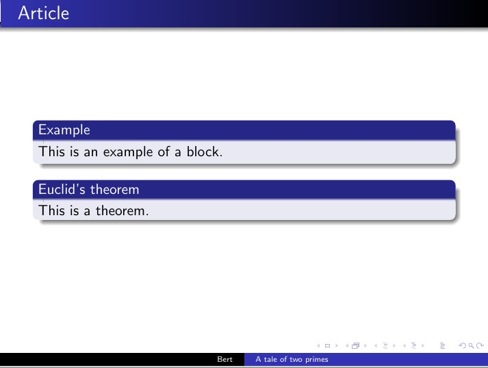
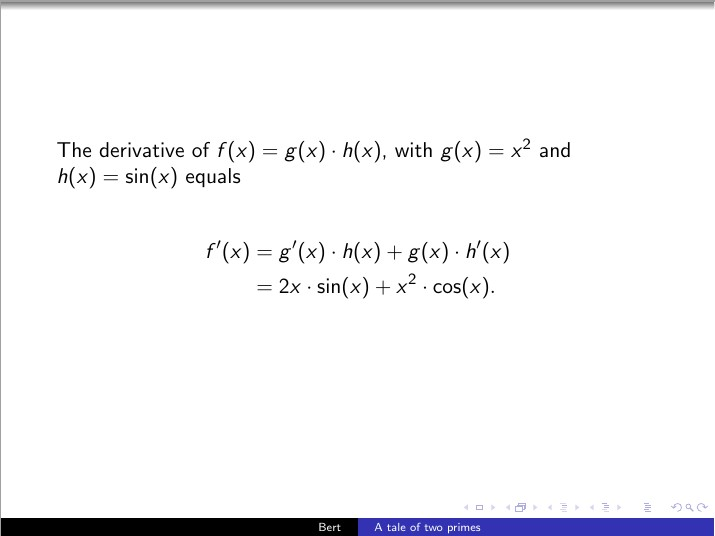
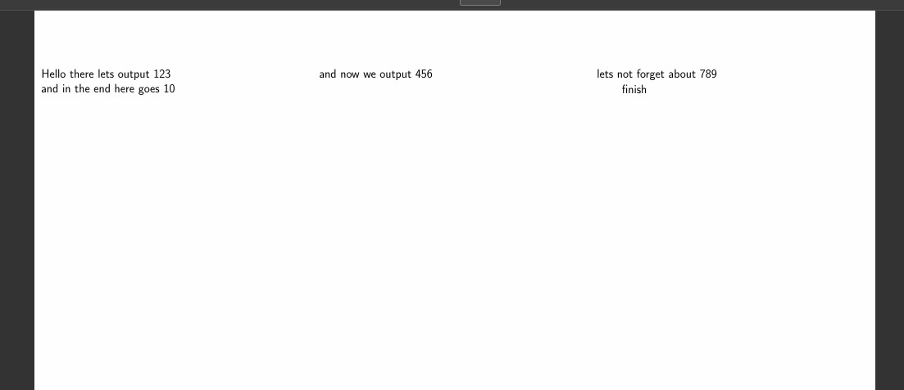
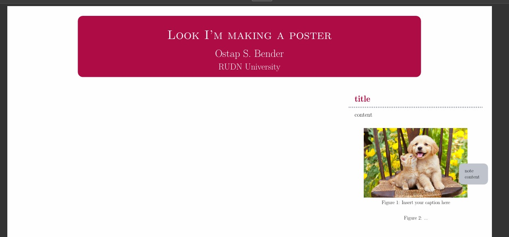

---
## Front matter
title: "Отчет по лабораторной работе №7"
subtitle: "Дисциплина: Computer Skills for Scientific Writing"
author: "Дарижапов Тимур Андреевич"

## Generic otions
lang: ru-RU
toc-title: "Содержание"

## Bibliography
bibliography: cite.bib
csl: pandoc/csl/gost-r-7-0-5-2008-numeric.csl
link-citations: true

## Pdf output format
toc: true # Table of contents
toc-depth: 2
lof: true # List of figures
lot: true # List of tables
fontsize: 12pt
linestretch: 1.5
papersize: a4
documentclass: scrreprt

## I18n babel
babel-lang: russian
babel-otherlangs: english
## Fonts
## Критически важные настройки для русского языка
mainfont: IBM Plex Serif
## I18n polyglossia
## Настройки для русского языка
polyglossia-lang:
  name: russian
  options:
    - spelling=modern
    - babelshorthands=true
polyglossia-otherlangs:
  name: english

romanfont: IBM Plex Serif
sansfont: IBM Plex Sans
monofont: IBM Plex Mono
mathfont: STIX Two Math
romanfontoptions: Ligatures=Common,Ligatures=TeX,Scale=0.94
sansfontoptions: Ligatures=Common,Ligatures=TeX,Scale=MatchLowercase,Scale=0.94
monofontoptions: Scale=MatchLowercase,Scale=0.94,FakeStretch=0.9
mathfontoptions:
## Pandoc-crossref LaTeX customization
figureTitle: "Рис."
tableTitle: "Таблица"
listingTitle: "Листинг"
# lofTitle: "Список иллюстраций"
# lotTitle: "Список таблиц"
# lolTitle: "Листинги"
## Misc options
indent: true
header-includes:
  - \usepackage{indentfirst}
  - \usepackage{float} # keep figures where there are in the text
  - \floatplacement{figure}{H} # keep figures where there are in the text
---

# **Лабораторная работа №7. Презентации и постеры в LaTeX**

## **Тема:**

Создание презентаций и постеров в системе LaTeX с использованием классов `beamer`, `a0poster`, `beamerposter` и `tikzposter`.

## **Цель работы**

Изучить подходы к созданию презентаций и научных постеров в LaTeX на основе главы 7: «LaTeX presentations». Освоить структуру презентаций в классе `beamer` (подразделы 7.1.1–7.1.4) и три способа построения постеров (подразделы 7.2.1–7.2.4).

## **Задачи**

1. Реализовать структуру презентации в классе `beamer` (7.1.1).
2. Применить команду `\pause` для пошагового появления элементов (7.1.2).
3. Освоить управление оверлеями с помощью `\uncover` в обычном тексте, формулах `align` и списках `itemize` (7.1.3).
4. Поменять оформление презентации с помощью темы `\usetheme{Warsaw}` (7.1.4).
5. Реализовать три варианта постеров:

   * класс `a0poster` (7.2.2);
   * пакет `beamerposter` в классе `beamer` (7.2.3);
   * класс `tikzposter` (7.2.4).
6. Кратко сравнить три подхода к постерам в духе раздела 7.2.1.

## **Ход работы**

### **7.1 Презентация с Beamer**

#### **7.1.1 Структура презентации**

В книге сначала показывается «пустой» каркас презентации, затем — слайды с `frame`, заголовком и простым текстом. В работе был реализован этот базовый каркас, но сразу в более развитом виде: с несколькими слайдами и блоками.

Использованный код:

```latex
\documentclass{beamer}
\usetheme{Warsaw}
\author{Bert}
\title{A tale of two primes}
\begin{document}

\begin{frame}
\titlepage
\end{frame}

\begin{frame}{Article}
Some text about the article.
\end{frame}

\begin{frame}{Mathematica}
A helpful tool for mathematicians.
\end{frame}

\begin{frame}{Article}
\begin{block}{Example}
This is an example of a block.
\end{block}

\pause

\begin{block}{Euclid's theorem}
This is a theorem.
\end{block}
\end{frame}
```

**Что здесь отрабатывается по разделу 7.1.1:**

* базовая структура презентации:  
`\documentclass{beamer} ... \begin{document}...\end{document}`;
* отдельные слайды через `\begin{frame}...\end{frame}`;
* заголовки слайдов в фигурных скобках: `\begin{frame}{Article}`;
* использование `\titlepage` для титульного слайда;
* появление логических блоков `\begin{block}{...}`.

**Скриншот:**




#### **7.1.2 Pauses — пошаговое появление (`\pause`)**

В книге `\pause` показывается между блоками и внутри `enumerate`.
В нашем коде эта часть реализована в слайде с двумя блоками:

```latex
\begin{frame}{Article}
\begin{block}{Example}
This is an example of a block.
\end{block}

\pause

\begin{block}{Euclid's theorem}
This is a theorem.
\end{block}
\end{frame}
```

**Что демонстрируется:**

* при первом показе слайда виден только блок *Example*;
* после нажатия (второй шаг) появляется блок *Euclid's theorem*;
* таким образом иллюстрируется использование `\pause` для поэтапного раскрытия информации на одном кадре (соответствует разделу 7.1.2).

**Скриншот:**




#### **7.1.3 Uncover — управление оверлеями**

В разделе 7.1.3 в книге показано, как с помощью `\uncover<...->{...}` управлять тем, на каком шаге появляются части текста, формулы и элементы списка.

В работе реализованы **три примера**, соответствующие примерам из книги:

1. текст + формула с множествами (`Sets`);
2. формула в окружении `align*` (произведение функций);
3. список `itemize` с интервальными обозначениями.

##### **a) Uncover в обычном тексте и формулах (слайд «Sets»)**

```latex
\begin{frame}
\frametitle{Sets}

A \alert{set} is a collection of objects.\uncover<2->{ For example:

\[
Z=\{\text{cow},\text{pig},\text{elephant}\}.
\]
}

\uncover<3->{We call the objects in $Z$ the \alert{elements} of $Z$.}
\uncover<4->{ We write
\[
\text{cow} \in Z
\]
}

\uncover<5->{with ``cow is an element of $Z$''.}
\uncover<6->{ Frequently encountered sets are}

\[
\begin{split}
\uncover<7->{\mathbb{N}} \uncover<8->{= \{1,2,3,\ldots \}}&
\uncover<9->{ \qquad (\text{``natural numbers''})\\}
\uncover<10->{\mathbb{Z}} \uncover<11->{= \{\ldots,-2,-1,0,1,2,\ldots \}}&
\uncover<12->{ \qquad (\text{``integer numbers''})\\}
\uncover<13->{\mathbb{Q}} \uncover<14->{= \{p/q : p,q\in\mathbb{Z} \text{ and } q\neq 0\}}&
\uncover<15->{ \qquad (\text{``rational numbers''})\\}
\uncover<16->{\mathbb{R}} \uncover<17->{= \{\hbox{decimal numbers}\}}&
\uncover<18->{ \qquad (\text{``real numbers''})}
\end{split}
\]

\end{frame}
```

**Что отрабатывается:**

* точный контроль, *когда* появляются определения и примеры;
* постепенное раскрытие множества (Z), затем определения элементов и стандартных множеств `(\mathbb{N},\mathbb{Z},\mathbb{Q},\mathbb{R})`;
* соответствие примерy из раздела 7.1.3 (sets).

**Скриншот:**


##### **b) Uncover в `align*`**

```latex
\begin{frame}
  The derivative of \(f(x) = g(x) \cdot h(x)\),  
  with \(g(x) = x^2\) and \(h(x) = \sin(x)\) equals

  \begin{align*}
    f'(x)
      &\uncover<2->{= g'(x) \cdot h(x)}
       \uncover<3->{+ g(x) \cdot h'(x)} \\
      &\uncover<4->{= 2x \cdot \sin(x)}
       \uncover<5->{+ x^2 \cdot \cos(x).}
  \end{align*}
\end{frame}
```

**Что отрабатывается:**

* показано, что `\uncover` можно использовать **внутри `align*`**, как и в книге;
* на каждом шаге добавляется новый фрагмент формулы (правило произведения).

**Скриншот:**



##### **c) Uncover и номера шагов в списке `itemize`**

```latex
\begin{frame}
 \begin{itemize}
 \item<4-6> $[a,b]\uncover<5-6>{=\{x\in\mathbb{R} : a\leq x\leq b\}$,}
 
 \item<6-> $(a,b)\uncover<7->{=\{x\in\mathbb{R} : a< x< b\}$,}

 \item<8-> $(a,\infty)\uncover<9->{=\{x\in\mathbb{R} : x>a\}$.}

 \end{itemize}
\end{frame}
```

**Что отрабатывается:**

* синтаксис `\item<4->`, `\item<6->` — когда появляется каждый пункт;
* комбинация `\item<4-6>` и `\uncover<5-6>{...}` — пункт появляется на ограниченном диапазоне слайдов, затем исчезает;
* визуальное поэтапное введение интервалов ([a,b]), ((a,b)), ((a,\infty)).

**Скриншот:**


#### **7.1.4 Layout — оформление презентации**

В разделе 7.1.4 авторы предлагают сменить тему оформления, например на `Warsaw` и цветовую схему `beaver`.

В работе:

* в примере презентации сразу использована тема:

  ```latex
  \usetheme{Warsaw}
  ```
* цветовую тему можно добавить при необходимости:

  ```latex
  % \usecolortheme{beaver}
  ```

**Что отрабатывается:**

* привязка к реальному примеру из книги: смена темы оформления;
* понимание, что логика слайдов не меняется, меняется только визуальный стиль.

**Скриншот:**


### **7.2 Постеры**

Секция 7.2 в книге сначала даёт **сравнение трёх методов** (7.2.1), затем отдельные подсекции для каждого: `a0poster`, `beamerposter`, `tikzposter`.

В лабораторной работе были реализованы все три подхода с минимальным, но рабочим кодом.

#### **7.2.1 Основные различия между тремя методами (краткий обзор)**

По книге:

* **`a0poster`**:

  * похож на обычный `article`;
  * используется `multicol` для колонок;
  * фигуры вставляются через `center` + `\captionof`;
  * простой, но макет менее «дизайнерский».

* **`beamerposter`**:

  * строится на базе `beamer`;
  * можно использовать темы beamer;
  * колонки — через `columns`/`column`;
  * макет похож на слайд, но растянутый на формат A0.

* **`tikzposter`**:

  * всё основано на блоках TikZ;
  * есть свои темы и стили;
  * обязательно использование `\block` и можно добавлять `\note`;
  * гибкий, но требует привыкания.

Наши три программы как раз демонстрируют **минимальные рабочие примеры** для каждого подхода.

#### **7.2.2 Документкласс `a0poster`**

Реализация по мотивам примера из книги (заголовок через `minipage`, колонки `multicols`, рисунки через `\captionof`).

Код:

```latex
\documentclass[a0, portrait]{a0poster}
\usepackage{graphicx}
\usepackage{multicol}
\usepackage{caption}
\usepackage{tikz}
\usepackage[svgnames]{xcolor}

\begin{document}
\begin{minipage}{.7\textwidth}
\VeryHuge Look I'm making a poster \\ [0.75cm]
\Large Ostap S. Bender \\
\Large RUDN University
\end{minipage}
%
\begin{minipage}{.3\textwidth}
% здесь можно разместить логотип
\end{minipage}

\begin{center}
\includegraphics{image.jpg}
\captionof{figure}{Insert your caption here}
\end{center}

\begin{center}
\begin{tikzpicture}
...
\end{tikzpicture}
\captionof{figure}{...}
\end{center}

\begin{multicols}{2}
Here follows some regular text, \color{BlueViolet} from now on the text has changed colour, \color{Black} and then we are back to normal.
\end{multicols}

\end{document}
```

**Что именно мы отрабатываем по 7.2.2:**

* старт документа с `\documentclass[a0, portrait]{a0poster}`;
* шапка постера (название, автор, университет) через две `minipage`;
* вставка изображения и TikZ-графики через последовательность:

  ```latex
  \begin{center}
    \includegraphics{...}
    \captionof{figure}{...}
  \end{center}
  ```
* деление содержимого на две колонки с помощью `\begin{multicols}{2} ... \end{multicols}`;
* изменение цвета части текста с помощью `xcolor` (пример из книги: `\color{BlueViolet} ... \color{Black}`).

**Скриншот:**


#### **7.2.3 Пакет `beamerposter` для класса `beamer`**

Здесь мы следуем структуре из 7.2.3: класс `beamer`, опция `xcolor={svgnames}`, подключение `beamerposter`, затем один `frame` с колонками.

Код:

```latex
\documentclass[xcolor={svgnames}]{beamer}
\usepackage{graphicx}
\usepackage{multicol}
\usepackage{caption}
\usepackage{tikz}

\usetheme{default}
\usecolortheme{seahorse}
\usepackage[orientation=portrait,size=a0,scale=1.4]{beamerposter}

\title{Look I'm making a poster}
\author{Ostap S. Bender}
\institute{RUDN University}

\begin{document}
\begin{frame}

\begin{columns}
\begin{column}{.33\textwidth}
Hello there lets output 123
\end{column}

\begin{column}{.33\textwidth}
and now we output 456
\end{column}
 
\begin{column}{.33\textwidth}
lets not forget about 789
\end{column}
\end{columns}

\begin{columns}
\begin{column}{.7\textwidth}
and in the end here goes 10
\end{column}
%
\begin{column}{.3\textwidth}
finish
\end{column}
\end{columns}

\end{frame}
\end{document}
```

**Что здесь по 7.2.3:**

* использование `beamer` + `beamerposter` для постера формата A0;
* определение постера внутри **одного** кадра `\begin{frame}...\end{frame}`;
* имитация примера из книги с тремя колонками по `(.33\textwidth)` и затем двумя колонками `(.7\textwidth)` и `(.3\textwidth)`;
* демонстрация того, как через `columns` можно оформить типичный научный постер (в дальнейшем можно добавить блоки, рисунки и т.п.).

**Скриншот:**



#### **7.2.4 Документкласс `tikzposter`**

Наконец, реализован пример из 7.2.4: класс `tikzposter` с темой, колонками, блоком и заметкой.

Код:

```latex
\documentclass[24pt, a0paper, portrait]{tikzposter}
\usepackage{graphicx}
\usepackage{multicol}
\usepackage{caption}
\usepackage{tikz}

\usetheme{Simple} 

\title{Look I'm making a poster}
\author{Ostap S. Bender}
\institute{RUDN University}

\begin{document}
\maketitle

\begin{columns}
\column{.33}
Hello there lets output 123

\column{.33}
and now we output 456
 
\column{.33}
lets not forget about 789
\end{columns}

\begin{columns}
\column{.7}
and in the end here goes 10

\column{.3}
finish

\block{title}{content \vspace{2cm}

\begin{center}
\includegraphics{image.jpg}
\captionof{figure}{Insert your caption here}
\end{center}

\begin{center}
\begin{tikzpicture}
...
\end{tikzpicture}
\captionof{figure}{...}
\end{center}
}
\note[targetoffsetx=2cm, targetoffsety=-1cm, width=5cm]{note content}

\end{columns}

\end{document}
```

**Что отрабатывается по 7.2.4:**

* старт документа: `\documentclass[24pt,a0paper,portrait]{tikzposter}`;
* выбор темы: `\usetheme{Simple}`;
* автоматическое создание шапки постера через `\maketitle`;
* создание колонок с синтаксисом `\begin{columns} ... \column{.33} ...`;
* обязательное использование `\block{title}{content ...}` для содержимого;
* добавление заметки к блоку через:

  ```latex
  \note[targetoffsetx=..., targetoffsety=..., width=...]{note content}
  ```
* вставка рисунка и TikZ-графики через `center` + `\captionof{figure}{...}` (аналогично a0poster).

**Скриншот:**



## **Результаты**

* Пройден раздел 7.1 («Presentation with Beamer»):

  * реализована базовая структура презентации `beamer`;
  * отработана команда `\pause` для поэтапного появления блоков;
  * показана работа `\uncover` в тексте, формулах (`align*`) и списках (`itemize`);
  * использована тема `Warsaw` для изменения оформления.
* Пройден раздел 7.2 («Posters»):

  * реализован постер в классе `a0poster` с шапкой, колонками и рисунками;
  * создан постер с помощью `beamerposter` в стиле презентации `beamer`;
  * реализован постер в `tikzposter` с блоками, колонками и заметкой;
  * кратко проанализированы отличия трёх подходов, как в пункте 7.2.1.

## **Вывод**

В ходе лабораторной работы №7 были последовательно реализованы примеры из главы 7 учебного пособия по практическому LaTeX. Получены навыки:

* построения презентаций с оверлеями (`\pause`, `\uncover`) и темами оформления;
* создания научных постеров тремя различными методами: `a0poster`, `beamerposter`, `tikzposter`;
* работы с колонками, блоками, заметками и вставкой рисунков на больших форматах.

Все пункты, соответствующие разделам 7.1 и 7.2, были воспроизведены на практике; цель лабораторной работы достигнута.

### Список литературы {.unnumbered}

@book
