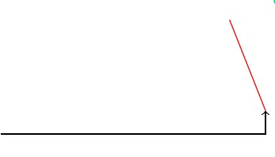
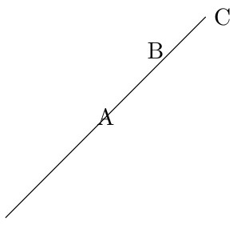

---
## Front matter
lang: ru-RU
title: Отчёт по лабораторной работе №8
author: Дарижапов Тимур Андреевич
institute: 
    - РУДН, Москва, Россия

date: \today

## Formatting
## i18n babel
babel-lang: russian
babel-otherlangs: english

## Formatting pdf
toc: false
toc-title: Содержание
slide_level: 2
aspectratio: 169
section-titles: true
theme: metropolis
header-includes:
 - \metroset{progressbar=frametitle,sectionpage=progressbar,numbering=fraction}

##{:class="img-responsive"}
##{:height="50%" width="50%"}
##{:height="700px" width="400px"}
##{height=25}{width=150}
---

# **Лабораторная работа №8**

## **Тема**

Графика в LaTeX с использованием TikZ:
линии и пути, узлы и подписи, графики функций, циклы и рекурсивные фигуры

## **Цель и задачи**

**Цель:** освоить построение графики в LaTeX с помощью `tikz`, включая стили, узлы, графики функций и рекурсию (`tikzmath`).

**Задачи:**

* `tikzpicture` и базовые пути
* кривые и управление траекторией
* `node` и подписи
* стили линий и стрелки
* графики функций
* цикл `\foreach`
* рекурсивные построения (ковёр Серпинского)
* упражнения раздела 8.2

# **1. Подключение TikZ**

## **Идея**

* Для рисунков используется окружение `tikzpicture`.
* Для рекурсивных алгоритмов подключается библиотека `math`.

## **Ключевой код**

```latex
\documentclass[border=1cm]{standalone}
\usepackage{tikz}
\usetikzlibrary{math}
```

# **2. Прямые линии и ломаные пути**

## **Идея**

* Линии задаются командой `\draw`.
* Путь строится сегментами с помощью `--`.
* Можно смешивать координаты:

  * декартовы: `(x,y)`
  * полярные: `(угол:радиус)`

## **Ключевой код**

```latex
\begin{tikzpicture}
  \draw (-1,0) -- (3,10pt) -- (35:3);
\end{tikzpicture}
```

## **Скриншот**


# **2.2 Угловое соединение и стрелки**

## **Идея**

* `-|` строит путь «сначала по горизонтали, потом по вертикали» (или наоборот в `|-`).
* Стрелки задаются опциями `->`, `<-`, `<->`.
* Цвет и стиль линии задаются опциями, например `[red]`.

## **Ключевой код**

```latex
\begin{tikzpicture}
  \draw[->] (-1,0) -| (3,10pt);
  \draw[red] (3,10pt) -- (35:3);
\end{tikzpicture}
```

## **Скриншот**



# **3. Кривые и управление траекторией**

## **Идея**

* Прямая: `to`.
* Кривая по направлениям: `to[out=...,in=...]`.
* Кривая Безье: `.. controls (...) ..`.

## **Ключевой код**

```latex
\begin{tikzpicture}
  \draw (-1,0) to (5,1);
  \draw[green] (-1,0) to[out=90,in=135] (5,1);
  \draw[cyan] (-1,0) .. controls (0,-2) .. (5,1);
\end{tikzpicture}
```

## **Скриншот**


# **3.2 Две контрольные точки**

## **Идея**

* Сравнение прямой (как опора) и кривой Безье.
* Вариант с двумя контрольными точками позволяет точнее «управлять формой».

## **Ключевой код**

```latex
\begin{tikzpicture}
  \draw[dotted,gray] (-1,0) -- (5,1);
  \draw (-1,0) .. controls (0,-2) and (4,2) .. (5,1);
\end{tikzpicture}
```

## **Скриншот**


# **4. Подписи и узлы**

## **Идея**

* `node {text}` добавляет подпись в точке.
* Узлы можно ставить на концах отрезка и прямо на пути.

## **Ключевой код**

```latex
\begin{tikzpicture}[scale=3]
  \draw (0,0) node {hello} -- (1,1) node {world};
\end{tikzpicture}
```

## **Скриншот**


# **4.2 Позиционирование подписей**

## **Идея**

* `node[midway]{...}` — подпись по центру.
* `node[pos=0.75,above]{...}` — подпись в заданной доле пути и сверху.
* `node[right]{...}` — подпись справа от точки.

## **Ключевой код**

```latex
\begin{tikzpicture}[scale=3]
  \draw (0,0) -- (1,1)
    node[midway]{A}
    node[pos=0.75,above]{B}
    node[right]{C};
\end{tikzpicture}
```

## **Скриншот**



# **5. Узлы с оформлением и математикой**

## **Идея**

* Узел может быть фигурой: `circle`, `rectangle`.
* Внутри узла можно писать формулы: $\sum_{i=1}^{n} n^2$, $\frac{1}{\sqrt{2}}$.

## **Ключевой код**

```latex
\begin{tikzpicture}[scale=3]
  \draw (0,0) node[circle, draw]{$\sum_{i=1}^{n}n^2$}
    -- (1,1) node[rectangle,draw]{$\frac{1}{\sqrt{2}}$};
\end{tikzpicture}
```

## **Скриншот**


# **6. Узлы, стрелки и стили линий**

## **Идея**

* Узлы создаются через `\node ... (name) ...;`, потом используются по именам.
* Разные стили путей: цвет, толщина, пунктир, стрелки.
* На ребре можно ставить подпись через `node[midway,...]{...}`.

## **Ключевой код**

```latex
\begin{tikzpicture}[scale=2]
\node[circle, draw] at (0,0) (a) {A};
\node[rectangle, fill] at (3,0) (b) {};
\node[rectangle,rounded corners, draw] at (5,2) (c) {C};
\draw[->, green] (a) -- (b) node[midway, below,black]{2};
\draw[<->, blue] (a) to[out=45, in=135] (b);
\draw[->>,red] (b)--(c);
\draw[yellow,dotted,very thick] (b) |- (c);
\draw[thick,black] (a).. controls (1,5) .. (c) node[midway, above]{$\frac{1}{2}$};
\end{tikzpicture}
```

## **Скриншот**

{height=280}

# **7. Графики функций**

## **Идея**

* Графики строятся через `plot` на заданном `domain`.
* `samples` увеличивает гладкость.
* Важно: в `cos(...)` используется радианная форма, поэтому стоит `r`.

## **Ключевой код**

```latex
\begin{tikzpicture}[scale=1.5]
\draw[blue, thick] [domain=-2:2, samples=150]
  plot (\x, {cos(pi*\x r)})
  node[right]{$y = \cos(x)$};
\end{tikzpicture}
```

## **Скриншот**


# **8. Циклы `\foreach`**

## **Идея**

* `\foreach` позволяет повторять однотипные элементы.
* Радиус зависит от значения `\x`, поэтому окружности получаются разных размеров.

## **Ключевой код**

```latex
\begin{tikzpicture}[scale=0.75]
\foreach \x in {0,1,2,3}
  \draw[red,thick] (0,\x) circle [radius=\x+1];
\end{tikzpicture}
```

## **Скриншот**


# **Упражнения 8.2**

## **8.2.1 Граф (вершины и рёбра) - Идея**

* Вершины: `\node`.
* Рёбра: `\draw` между вершинами.
* Подписи веса: `node[midway, ...]{...}`.
* Оформление: двойные круги, заливка, разные цвета рёбер.

## **Ключевой код**

```latex
\node[circle,draw, double] (b) at (0,0) {B};
\node[circle,draw, double] (f) at (2,0) {F};
\node[circle,draw, double] (d) at (1,-1.5) {D};
\draw[blue,dotted,very thick] (b) to node[midway, above]{6} (f);
\draw[blue,dotted,very thick] (b) to node[midway, below]{2} (d);
\draw[blue,dotted,very thick] (d) to node[midway, below]{4} (f);
\node[circle,draw,fill=green] (a) at (1,0.5) {A};
...
\draw[red] (a) to[out=200, in=30] node[midway, above]{$\sqrt{2}$} (d);
```

## **Скриншот**


# **8.2.2 Графики $(y=e^x)$ и $(y=\ln(x))$**

## **Идея**

* Две разные функции на одной системе координат.
* Отмечены характерные точки $x=1$, $y=1$.

## **Ключевой код**

```latex
\draw[gray, ->] (-1.2,0) -- (1.6,0) node[right]{$x$};
\draw[gray, ->] (0,-1.2) -- (0,3.9) node[above]{$y$};
\draw[blue, thick] [domain=-1:1.5, samples=150]
  plot (\x, {exp(\x)}) node[right]{$y=e^x$};
\draw[black, thick, domain=0.3:1.6, samples=200]
  plot (\x, {ln(\x)}) node[right]{$y=\ln(x)$};
\fill[gray] (1,0) circle (0.03); \node[gray, below] at (1,0) {$x=1$};
\fill[gray] (0,1) circle (0.03); \node[gray, left]  at (0,1) {$y=1$};
```

## **Скриншот**

{height=260}

# **8.2.3 Ковёр Серпинского (рекурсия)**

## **Идея**

* Используется `\tikzmath` и рекурсивная функция `carpet`.
* При $d=0$ рисуется квадрат.
* Иначе квадрат делится на $3\times 3$ и рекурсивно заполняются 8 областей.

## **Ключевой код**

```latex
\def\S{6}
\def\D{4}
\tikzmath{
function carpet(\x,\y,\s,\d){
  if (\d==0) then {
    { \fill (\x,\y) rectangle ++(\s,\s); };
  } else {
    \ns=\s/3;
    carpet(\x,\y,\ns,\d-1);
...
    carpet(\x+2*\ns,\y+2*\ns,\ns,\d-1);
  };
};
carpet(0,0,\S,\D);
}
```

## **Скриншот**


# **Итоги**

## **Результаты**

* Освоены пути и стили линий: `--`, `to`, `-|`, `.. controls ..`
* Использованы узлы и подписи: `node`, `midway`, `pos`
* Построены графики функций: $y=\cos(x)$, $y=e^x$, $y=\ln(x)$
* Применены циклы: `\foreach`
* Реализована рекурсия в TikZ через `\tikzmath` (ковёр Серпинского)
* Выполнены упражнения раздела 8.2

## **Вывод**

В ходе лабораторной работы №8 изучены основные средства TikZ для построения графики в LaTeX: от базовых линий и узлов до графиков функций, циклов и рекурсивных построений. Реализованные примеры показывают, что TikZ позволяет описывать графику как программную конструкцию и получать воспроизводимые рисунки для отчётов и презентаций.

## **Список литературы**

1. Львовский С.М. *Набор и вёрстка в системе LaTeX*. Москва: МЦНМО, 2014. 400 с.

## {.standout}

Спасибо за внимание!
