---
## Front matter
title: "Отчет по лабораторной работе №8"
subtitle: "Дисциплина: Computer Skills for Scientific Writing "
author: "Дарижапов Тимур Андреевич"

## Generic otions
lang: ru-RU
toc-title: "Содержание"

## Bibliography
bibliography: cite.bib
csl: pandoc/csl/gost-r-7-0-5-2008-numeric.csl
link-citations: true

## Pdf output format
toc: true # Table of contents
toc-depth: 2
lof: true # List of figures
lot: true # List of tables
fontsize: 12pt
linestretch: 1.5
papersize: a4
documentclass: scrreprt

## I18n babel
babel-lang: russian
babel-otherlangs: english
## Fonts
## Критически важные настройки для русского языка
mainfont: IBM Plex Serif
## I18n polyglossia
## Настройки для русского языка
polyglossia-lang:
  name: russian
  options:
    - spelling=modern
    - babelshorthands=true
polyglossia-otherlangs:
  name: english

romanfont: IBM Plex Serif
sansfont: IBM Plex Sans
monofont: IBM Plex Mono
mathfont: STIX Two Math
romanfontoptions: Ligatures=Common,Ligatures=TeX,Scale=0.94
sansfontoptions: Ligatures=Common,Ligatures=TeX,Scale=MatchLowercase,Scale=0.94
monofontoptions: Scale=MatchLowercase,Scale=0.94,FakeStretch=0.9
mathfontoptions:
## Pandoc-crossref LaTeX customization
figureTitle: "Рис."
tableTitle: "Таблица"
listingTitle: "Листинг"
# lofTitle: "Список иллюстраций"
# lotTitle: "Список таблиц"
# lolTitle: "Листинги"
## Misc options
indent: true
header-includes:
  - \usepackage{indentfirst}
  - \usepackage{float} # keep figures where there are in the text
  - \floatplacement{figure}{H} # keep figures where there are in the text
---

# **Лабораторная работа №8. Графика в LaTeX с использованием TikZ**

## **Тема**

Построение графических объектов в системе LaTeX с использованием пакета `tikz`: линии и пути, узлы и подписи, графики функций, циклы и рекурсивные фигуры.

## **Цель работы**

Изучить основы построения графики в LaTeX с помощью пакета `tikz`, освоить задание путей, узлов, подписей и стилей, а также реализовать примеры и упражнения с использованием циклов и рекурсивных функций (`tikzmath`).

## **Задачи**

1. Освоить окружение `tikzpicture` и базовые типы путей.
2. Научиться строить кривые и управлять формой линий.
3. Использовать узлы (`node`) и подписи.
4. Работать с координатами, стилями и стрелками.
5. Построить графики функций.
6. Применить циклы `\foreach`.
7. Реализовать рекурсивные построения (ковёр и треугольник Серпинского).
8. Выполнить упражнения раздела 8.2.


## **Ход работы**

### **1. Подключение TikZ и базовая структура**

Во всех примерах использовался класс `standalone` и пакет `tikz`. Для реализации рекурсивных алгоритмов подключена библиотека `math`.

```latex
\documentclass[border=1cm]{standalone}
\usepackage{tikz}
\usetikzlibrary{math}
```

### **2. Прямые линии и ломаные пути**

#### **2.1 Ломаная линия**

```latex
\begin{tikzpicture}
\draw (-1,0) -- (3,10pt) -- (35:3);
\end{tikzpicture}
```

**Скриншот:**

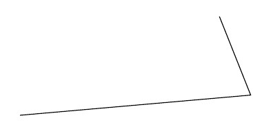

**Результат:** построение ломаной с использованием декартовых и полярных координат.

#### **2.2 Угловое соединение и стрелки**

```latex
\begin{tikzpicture}
\draw[->] (-1,0) -| (3,10pt);
\draw[red] (3,10pt) -- (35:3);
\end{tikzpicture}
```

**Скриншот:**


**Результат:** использование углового соединения `-|` и стрелок.

### **3. Кривые и управление траекторией**

#### **3.1 Кривые с параметрами `out` и `in`**

```latex
\begin{tikzpicture}
\draw (-1,0) to (5,1);
\draw[green] (-1,0) to[out=90,in=135] (5,1);
\draw[cyan] (-1,0) .. controls (0,-2) .. (5,1);
\end{tikzpicture}
```

**Скриншот:**

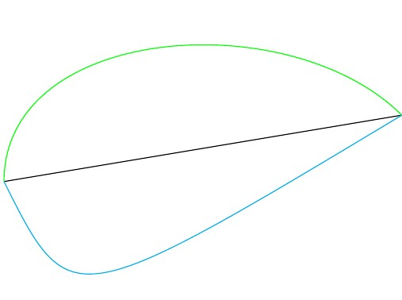

**Результат:** сравнение прямого соединения и кривых Безье.

#### **3.2 Кривая с двумя контрольными точками**

```latex
\begin{tikzpicture}
\draw[dotted,gray] (-1,0) -- (5,1);
\draw (-1,0) .. controls (0,-2) and (4,2) .. (5,1);
\end{tikzpicture}
```

**Скриншот:**

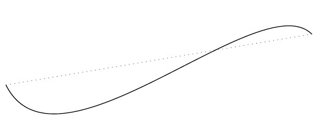

### **4. Подписи и узлы**

#### **4.1 Подписи в начале и конце линии**

```latex
\begin{tikzpicture}[scale=3]
\draw (0,0) node {hello} -- (1,1) node {world};
\end{tikzpicture}
```

**Скриншот:**

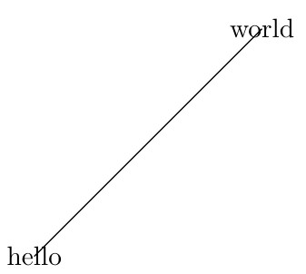

#### **4.2 Позиционирование подписей**

```latex
\begin{tikzpicture}[scale=3]
\draw (0,0) -- (1,1) node[midway]{A} node[pos=0.75,above]{B} node[right]{C};
\end{tikzpicture}
```

**Скриншот:**


### **5. Узлы с оформлением и математикой**

```latex
\begin{tikzpicture}[scale=3]
\draw (0,0) node[circle, draw]{$\sum_{i=1}^{n}n^2$} -- (1,1)
node[rectangle,draw]{$\frac{1}{\sqrt{2}}$};
\end{tikzpicture}
```

**Скриншот:**

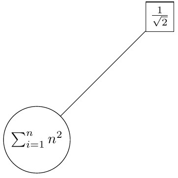

**Результат:** использование математических формул внутри узлов.

### **6. Узлы, стрелки и стили линий**

```latex
\begin{tikzpicture}[scale=2]
\node[circle, draw] at (0,0) (a) {A};
\node[rectangle, fill] at (3,0) (b) {};
\node[rectangle,rounded corners, draw] at (5,2) (c) {C};

\draw[->, green] (a) -- (b) node[midway, below,black]{2};
\draw[<->, blue] (a) to[out=45, in=135] (b);
\draw[->>,red] (b)--(c);
\draw[yellow,dotted,very thick] (b) |- (c);
\draw[thick,black] (a).. controls (1,5) .. (c) node[midway, above]{$\frac{1}{2}$};
\end{tikzpicture}
```

**Скриншот:**

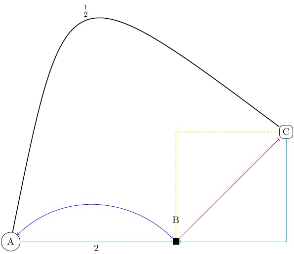

### **7. Построение графиков функций**

#### **7.1 График косинуса**

```latex
\begin{tikzpicture}[scale=1.5]
\draw[blue, thick] [domain=-2:2, samples=150]
plot (\x, {cos(pi*\x r)}) node[right]{$y = \cos(x)$};
\end{tikzpicture}
```

**Скриншот:**

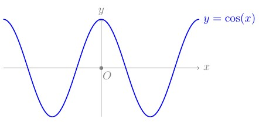

### **8. Использование циклов**

```latex
\begin{tikzpicture}[scale=0.75]
\foreach \x in {0,1,2,3}
\draw[red,thick] (0,\x) circle [radius=\x+1];
\end{tikzpicture}
```

**Скриншот:**

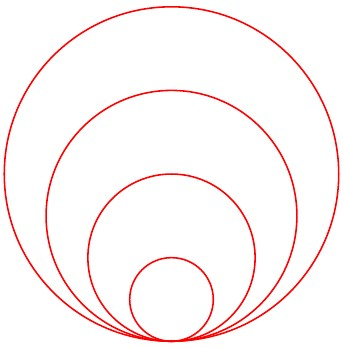

**Результат:** генерация серии окружностей с помощью цикла.

## **Выполнение упражнений (раздел 8.2)**

### **8.2.1 Граф (вершины и рёбра)**

```latex
\begin{tikzpicture}[scale=3]
\node[circle,draw, double] (b) at (0,0) {B};
\node[circle,draw, double] (f) at (2,0) {F};
\node[circle,draw, double] (d) at (1,-1.5) {D};
\draw[blue,dotted,very thick] (b) to node[midway, above]{6} (f);
\draw[blue,dotted,very thick] (b) to node[midway, below]{2}(d);
\draw[blue,dotted,very thick] (d) to node[midway, below]{4}(f);
\node[circle,draw,fill=green] (c) at (0,-1) {C};
\node[circle,draw,fill=green] (a) at (1,0.5) {A};
\node[circle,draw,fill=green] (e) at (2,-1) {E};
\draw[blue] (b) to[out=250, in=100] (c);
\draw[red] (b) to[out=50, in=150] (a);
\draw[red] (a) to[out=200, in=30] node[midway, above]{$\sqrt{2}$} (d);
\draw[red] (a) to[out=350, in=90] (e);
\end{tikzpicture}
```

**Скриншот:**

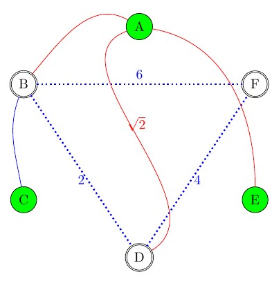

### **8.2.2 Графики $(y=e^x)$ и $(y=\ln(x))$**

```latex
\begin{tikzpicture}[scale=2]
% Draw the x and y axis, label the axes and the origin
\draw[gray, ->] (-1.2,0) -- (1.6,0) node[right]{$x$} node[pos=0.53, below]{$O$};
\draw[gray, ->] (0,-1.2) -- (0,3.9) node[above]{$y$};
\draw[fill,gray] (0,0) circle [radius=1pt];
% Plot the curve
\draw[blue, thick] [domain=-1:1.5, samples=150] plot (\x, {exp(\x)})
node[right]{$y=e^x$};
\draw[black, thick, domain=0.3:1.6, samples=200] plot (\x, {ln(\x)})
node[right]{$y=\ln(x)$};
% Note: the r in the argument of the cosine signifies that we enter \x in radians
% Mark x=1 on x-axis
\fill[gray] (1,0) circle (0.03);
\node[gray, below] at (1,0) {$x=1$};
% Mark y=1 on y-axis
\fill[gray] (0,1) circle (0.03);
\node[gray, left] at (0,1) {$y=1$};
\end{tikzpicture}
```

**Скриншот:**

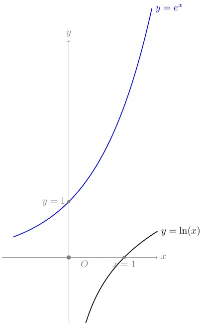

### **8.2.3 Ковёр Серпинского**

```latex
\begin{tikzpicture}
\def\S{6}
\def\D{4}
\tikzmath{
function carpet(\x,\y,\s,\d){
if (\d==0) then {
{ \fill (\x,\y) rectangle ++(\s,\s); };
} else {
\ns=\s/3;
carpet(\x,\y,\ns,\d-1);
carpet(\x+\ns,\y,\ns,\d-1);
carpet(\x+2*\ns,\y,\ns,\d-1);
carpet(\x,\y+\ns,\ns,\d-1);
carpet(\x+2*\ns,\y+\ns,\ns,\d-1);
carpet(\x,\y+2*\ns,\ns,\d-1);
carpet(\x+\ns,\y+2*\ns,\ns,\d-1);
carpet(\x+2*\ns,\y+2*\ns,\ns,\d-1);
};
};
carpet(0,0,\S,\D);
}
\end{tikzpicture}
```

**Скриншот:**

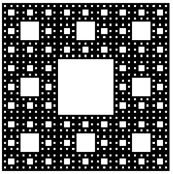

## **Результаты**

* Освоены основные элементы TikZ: пути, кривые, узлы и подписи.
* Реализованы графики функций и геометрические объекты.
* Использованы циклы и рекурсивные функции.
* Выполнены все упражнения раздела 8.2.

## **Вывод**

В ходе лабораторной работы №8 получены практические навыки построения графики в LaTeX с использованием TikZ. Реализованы как простые геометрические примитивы, так и сложные рекурсивные структуры, что подтверждает универсальность подхода «графика как код».

### Список литературы {.unnumbered}

@book
